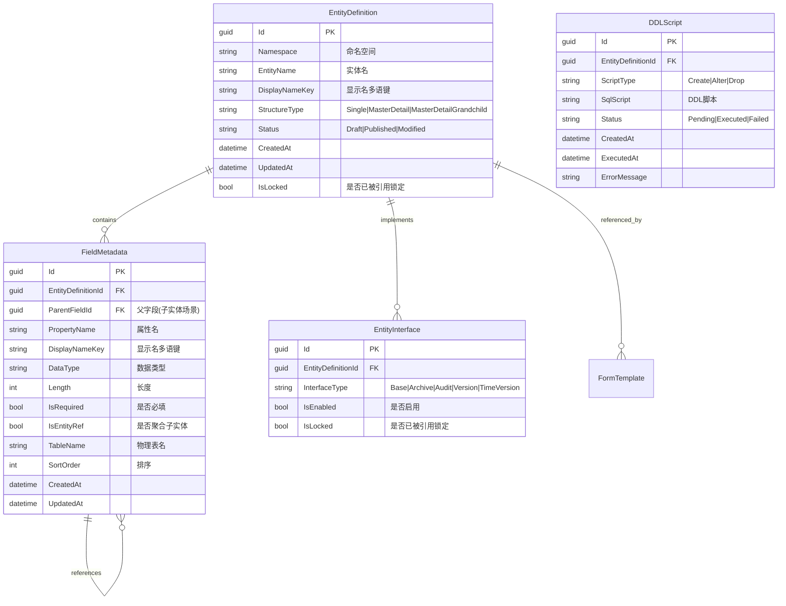
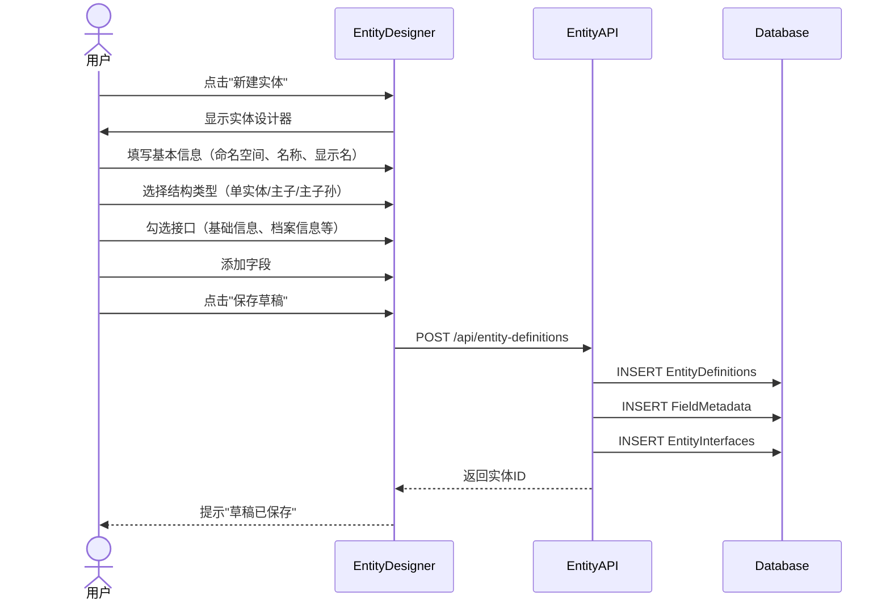
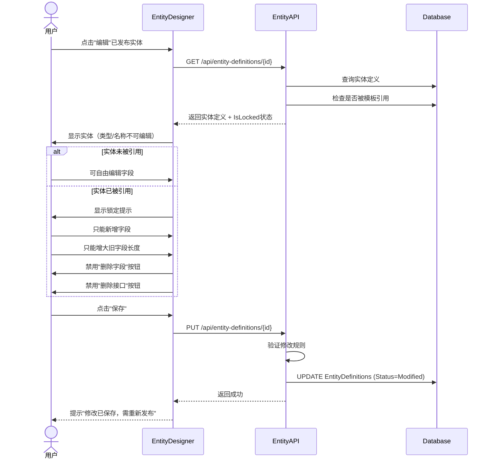
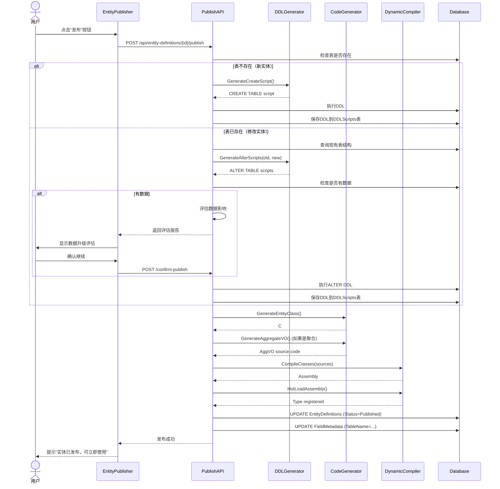
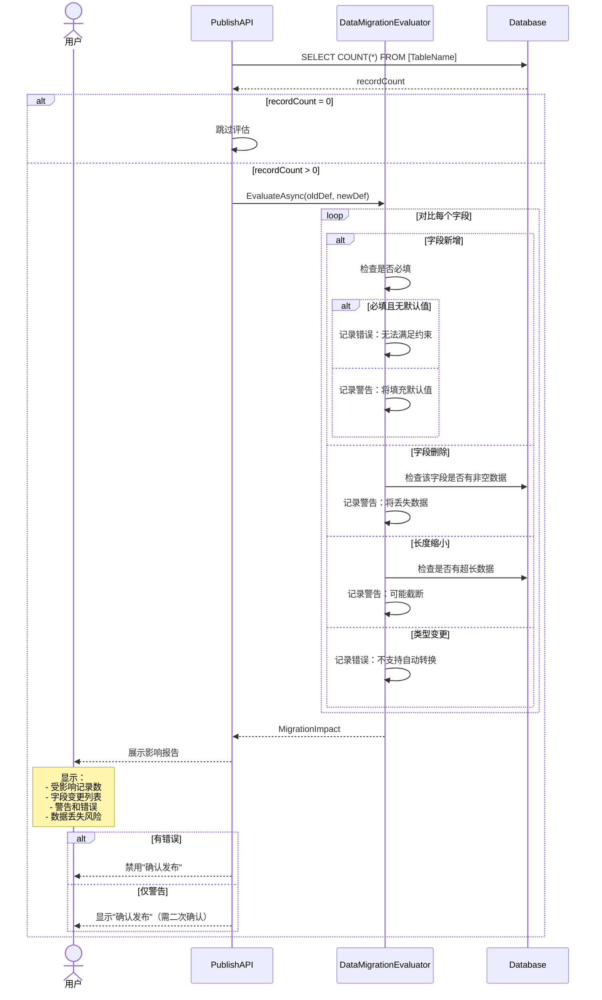

# 实体自定义与发布系统设计文档

> **版本**: v1.0
> **创建日期**: 2025-11-07
> **作者**: BobCRM 开发团队
> **状态**: 设计阶段

---

## 目录

1. [功能概述](#功能概述)
2. [核心概念](#核心概念)
3. [数据模型设计](#数据模型设计)
4. [系统架构](#系统架构)
5. [业务流程](#业务流程)
6. [技术实现方案](#技术实现方案)
7. [分期实现计划](#分期实现计划)
8. [风险与挑战](#风险与挑战)

---

## 功能概述

### 背景

当前系统中的业务实体（如Customer）都是由开发方预先定义的，缺乏灵活性。实体自定义与发布系统旨在让用户能够：

1. **自定义实体** - 全新定义或修改已有实体
2. **动态发布** - 将实体定义发布到数据库并生成代码
3. **热加载** - 无需重启即可使用新实体
4. **安全管理** - 防止破坏性修改，支持数据升级评估

### 核心价值

- **业务敏捷性** - 无需等待开发即可创建新实体
- **低代码能力** - 赋予业务人员自主权
- **系统活性** - 实体可作为类型候选项，实现递归组合
- **数据安全** - 严格的修改限制和升级评估

### 适用场景

- ✅ 快速创建新业务实体（如产品、订单、合同等）
- ✅ 扩展已有实体（添加新字段）
- ✅ 动态构建表单和报表
- ✅ 多租户场景下的实体隔离

---

## 核心概念

### 1. 实体定义 (EntityDefinition)

实体定义是对业务对象的元数据描述，包括：

- **基本信息** - 命名空间、实体名、显示名（多语）
- **结构类型** - 单实体、主子结构、主子孙结构
- **字段列表** - 属性定义的集合
- **接口特性** - 基础信息、档案信息、审计信息等
- **发布状态** - 草稿、已发布、已修改

### 2. 实体结构类型

#### 单实体 (SingleEntity)
```
Customer
├── Id (主键)
├── Code (档案)
├── Name (档案)
├── Email (扩展)
└── Phone (扩展)
```

#### 主子结构 (MasterDetail)
```
Order (主表)
├── Id
├── OrderNo
└── OrderItems[] (子表)
    ├── Id
    ├── OrderId (外键)
    ├── ProductId
    └── Quantity
```

#### 主子孙结构 (MasterDetailGrandchild)
```
Project (主表)
├── Id
├── ProjectName
└── Phases[] (子表)
    ├── Id
    ├── ProjectId (外键)
    ├── PhaseName
    └── Tasks[] (孙表)
        ├── Id
        ├── PhaseId (外键)
        └── TaskName
```

### 3. 字段元数据 (FieldMetadata)

每个字段包含以下元数据：

| 属性 | 说明 | 示例 |
|------|------|------|
| MetadataId | 物理ID（GUID或自增） | `guid-123` |
| PropertyName | 属性名（代码中的名称） | `Email` |
| DisplayName | 显示名（多语键） | `FIELD_EMAIL` |
| DataType | 数据类型 | `String`, `Int32`, `DateTime`, `EntityRef` |
| Length | 数据长度（字符串） | `255` |
| IsRequired | 是否必填 | `true` |
| IsEntityRef | 是否聚合子实体 | `false` |
| TableName | 物理表名（发布后锁定） | `Customers` |

### 4. 接口快速实现 (Interface Templates)

通过勾选快速添加常用字段：

| 接口类型 | 字段 | 说明 |
|----------|------|------|
| **基础信息** | Id | 主键（GUID或自增） |
| **档案信息** | Code, Name | 编码+名称 |
| **审计信息** | CreatedAt, CreatedBy, UpdatedAt, UpdatedBy | 创建/修改时间和人 |
| **版本管理** | Version | 自增版本号（乐观锁） |
| **时间版本** | ValidFrom, ValidTo, VersionNo | 时间敏感的版本管理 |

### 5. 聚合实体 (AggregateVO)

聚合实体不是独立实体，而是组合关系定义：

```csharp
public class OrderAggVO : AggregateVOBase
{
    public Order Master { get; set; }           // 主实体
    public List<OrderItem> Items { get; set; }  // 子实体集合

    // 基类实现通用操作
    // - Save() - 从叶子到根保存
    // - Delete() - 级联删除
    // - Validate() - 跨实体校验
}
```

### 6. 实体关系建模 (Entity Relationships)

BobCRM 通过元数据定义支持三种标准实体关系模式：

#### 1:1 关系 (One-to-One / Lookup)
- **实现方式**：在主体实体的 `FieldMetadata` 中添加一个 `Guid` 类型的字段，设置 `IsLookup = true` 且 `IsRequired = true/false`。
- **配置**：`ReferencedEntityId` 指向目标实体，`ReferenceType = Association`。
- **物理层**：主体表包含一个 GUID 逻辑外键，关联到目标表的主键。
- **UI 渲染**：设计器识别为 `LookupEditor`（异步搜索选择器）。

#### 1:N 关系 (One-to-Many / Composition)
- **实现方式**：采用 **AggVO 模式**。在主实体的 `FieldMetadata` 中添加记录，设置 `IsEntityRef = true`。
- **配置**：`ReferencedEntityId` 指向子实体，`ReferenceType = Composition`。
- **物理层**：子实体表包含一个 `ParentId` (GUID) 逻辑外键。
- **UI 渲染**：设计器识别为 `DetailGrid` (明细表) 或 `TabStrip`。

#### N:N 关系 (Many-to-Many)
- **实现方式**：通过 **中间关联实体 (Link Entity)** 实现。
- **模式**：创建一个专用的中间实体（如 `RoleUserLink`），包含两个 `Lookup` 字段（`RoleId` 和 `UserId`）。
- **优势**：允许在中间表上扩展属性（如：`AssignedAt`, `CreatedBy`）。
- **UI 渲染**：在主实体页面配置 `Transfer` (穿梭框) 组件，通过 API 自动维护中间表记录。

### 7. 发布与生命周期管理 (Publishing & Lifecycle)

#### 7.1 版本化与恢复 (Versioning & Recovery)
- **快照机制**：实体在每次手动发布时，系统自动对当前的 `EntityDefinition` 及其 `Fields` 进行快照存档，并存入 `EntityDefinitionHistory`。
- **差异对比**：用户修改已发布实体后，状态变为 `Modified`。系统支持对比“当前设计版”与“最后发布版”的差异。
- **一键回滚**：支持将设计元数据恢复到历史任一版本，恢复后物理表在下次发布时同步回滚（通过 DDL 分析）。

#### 7.2 级联发布 (AggVO Cascade Publishing)
- **引用闭环**：当发布一个包含子实体引用的 AggVO 时，若其子实体处于 `Draft` (从未发布) 或 `Withdrawn` (已撤回) 状态，系统将自动触发级联发布。
- **模板生成策略**：
    - **独立发布**：触发默认模板（List, Detail, Edit）生成。
    - **随 AggVO 发布**：仅发布元数据与物理表，**不生成** 默认模板。子实体的 UI 由 AggVO 详情页中的明细组件接管。

#### 7.3 撤回发布 (Withdrawal)
- **操作逻辑**：支持逻辑撤回（标记不可见）或物理撤回（DROP TABLE，仅限开发模式）。

### 8. 跨数据库设计元数据 (Abstract Design Metadata)

为了支持未来多数据库环境（如 PostgreSQL, MySQL, SQL Server），元数据存储遵循“设计元 (Design Source)”原则：

- **解耦物理脚本**：系统中存储的是描述性的 **UI 设计元数据**（如：字段类型为 `Text`, 长度为 `50`, 必填），而非特定数据库的 SQL 字符串。
- **动态转换层**：
    - `GeneratorInterface` 定义标准的 DDL 任务描述。
    - 各数据库 Provider (如 `PostgreSQLProvider`) 负责将“设计元”转换为具体的方言脚本。
- **持久化隔离**：物理 DDL 脚本仅存储在 `DDLScript` 记录中供审计，不作为实体的唯一真理来源。

**版本号管理规则**：

1. **保存顺序** - 从叶子实体开始，平级遍历，上层递归到顶层
2. **版本递增** - 每保存一个实例，Version自动+1
3. **版本引用** - 子实体自动引用主实体的Version
4. **一致性更新** - 主Version更新时，同步更新所有子实体的MasterVersion
5. **递归防护** - 引用版本号更新不触发自身版本号递增

---

## 数据模型设计

### ER图



### 表结构设计 (Logical Schema)

元数据管理表的模型设计基于逻辑关系，物理实现由具体的数据库 Provider 负责映射。

#### 1. EntityDefinitions - 实体定义表
| 逻辑字段 | 逻辑类型 | 说明 |
| :--- | :--- | :--- |
| Id | GUID | 逻辑主键 |
| Namespace | String | 命名空间，控制业务域隔离 |
| EntityName | String | 物理表名/代码类名基础 |
| DisplayNameKey | String | 多语键 |
| StructureType | Enum | 结构类型 (Single/MasterDetail/...) |
| Status | Enum | 生命周期状态 (Draft/Published/Modified/Withdrawn) |
| IsLocked | Boolean | 锁定标记，防止破坏性修改 |
| CreatedAt | DateTime | 创建时间 |
| UpdatedAt | DateTime | 最后修改时间 |

#### 2. FieldMetadata - 字段元数据表
| 逻辑字段 | 逻辑类型 | 说明 |
| :--- | :--- | :--- |
| Id | GUID | 逻辑主键 |
| EntityDefinitionId | GUID | 所属实体引用 |
| ParentFieldId | GUID | 明细实体的父级关联字段 (用于 AggVO) |
| PropertyName | String | C# 属性名 |
| DataType | LogicalType| 抽象类型 (String/Int32/DateTime/Lookup/...) |
| Length | Integer | 长度约束 |
| IsRequired | Boolean | 必填约束 |
| IsLookup | Boolean | 是否为外部实体引用 |
| IsEntityRef | Boolean | 是否为聚合子实体组成 |
| ReferencedEntityId | GUID | 引用的目标实体 ID |
| TableName | String | 物理表快照 (发布后锁定) |
| SortOrder | Integer | UI 展示顺序 |

#### 3. DDLScripts - DDL 变更审计表
| 逻辑字段 | 逻辑类型 | 说明 |
| :--- | :--- | :--- |
| Id | GUID | 记录 ID |
| EntityDefinitionId | GUID | 关联实体 |
| ScriptType | Enum | 变更类型 (Create/Alter/Drop) |
| SqlScript | Text | 物理 DDL 脚本 (由生成器产出) |
| TargetDialect | String | 目标数据库方言 (PostgreSQL/MySQL/...) |
| Status | Enum | 执行状态 |
| CreatedAt | DateTime | 生成时间 |

---

## 系统架构

### 核心解耦原则
为了支持多数据库，系统架构在 DDL 生成与执行层面实施严格解耦：

1. **抽象设计元数据 (Abstract Design Source)**：
   应用层仅操作上述逻辑模型。
2. **生成器接口 (IGeneratorService)**：
   定义 `Generate(EntityDefinition)` 接口，不感知具体数据库。
3. **数据库供应商适配器 (DB Provider Adapters)**：
   每个 Provider 实现具体的映射逻辑（如：Logical `DateTime` -> PG `TIMESTAMP` 或 SQLServer `DATETIME2`）。

### 层次结构

```
┌─────────────────────────────────────────────────────────┐
│                     前端层 (Blazor)                      │
├─────────────────────────────────────────────────────────┤
│ EntityDefinitionList.razor    │ 实体定义列表              │
│ EntityDesigner.razor           │ 实体设计器（单/主子/主子孙）│
│ EntityStructureViewer.razor    │ 实体结构树状可视化        │
│ EntityPublisher.razor          │ 实体发布界面              │
└─────────────────────────────────────────────────────────┘
                          ↓ HTTP/API
┌─────────────────────────────────────────────────────────┐
│                    API层 (ASP.NET Core)                  │
├─────────────────────────────────────────────────────────┤
│ EntityDefinitionEndpoints      │ 实体定义CRUD             │
│ EntityPublishEndpoints         │ 实体发布                 │
│ DDLGeneratorService            │ DDL生成                  │
│ CodeGeneratorService           │ C#代码生成               │
│ DynamicCompilerService         │ 动态编译                 │
│ ReflectionPersistenceService   │ 反射持久化               │
│ DataMigrationEvaluator         │ 数据升级评估             │
└─────────────────────────────────────────────────────────┘
                          ↓
┌─────────────────────────────────────────────────────────┐
│                    基础层 (Base)                         │
├─────────────────────────────────────────────────────────┤
│ EntityDefinition               │ 实体定义域模型           │
│ FieldMetadata                  │ 字段元数据               │
│ AggregateVOBase                │ 聚合实体基类             │
│ IPublishable                   │ 可发布接口               │
│ IVersionable                   │ 版本管理接口             │
└─────────────────────────────────────────────────────────┘
                          ↓
┌─────────────────────────────────────────────────────────┐
│                  持久化层 (Persistence)                   │
├─────────────────────────────────────────────────────────┤
│ IEntityDefinitionRepository    │ 实体定义仓储             │
│ IDDLScriptRepository           │ DDL脚本仓储              │
│ IReflectionPersistence         │ 反射持久化接口           │
│ DynamicEntityContext           │ 动态实体上下文           │
└─────────────────────────────────────────────────────────┘
                          ↓
┌─────────────────────────────────────────────────────────┐
│                   数据库层 (PostgreSQL)                   │
├─────────────────────────────────────────────────────────┤
│ EntityDefinitions              │ 元数据表                 │
│ FieldMetadata                  │ 元数据表                 │
│ FieldDataTypes                 │ 字段类型档案             │
│ FieldSources                   │ 字段来源档案             │
│ DDLScripts                     │ 元数据表                 │
│ [动态生成的业务表]              │ 运行时表                 │
└─────────────────────────────────────────────────────────┘
```

> **字段档案补充**
>
> - `FieldDataTypes`：记录 String、Int32、Decimal、EntityRef 等字段类型的 Code、CLR 类型、分类以及多语言说明。所有字段类型下拉与校验逻辑均读取此表，后续需要新增类型时，只需插入档案即可。
> - `FieldSources`：记录字段来源（System、Custom、Interface……）的 Code/Name/Description。实体编辑器和同步器都直接引用此档案，允许未来扩展更多来源类型，而无需修改枚举或代码。

#### 1. DDLGenerator (抽象生成器)

**职责**：基于“设计元 (Design Source)”产出具体的物理变更指令。

**关键抽象**：
- `LogicalToPhysicalMap`：不同方言的类型转换映射。
- `IdentifierQuoting`：处理不同数据库的标识符引用（如 `""` vs `[]` vs ` `` `）。

**主要接口**：
```csharp
public interface IDDLGenerator
{
    // 根据逻辑定义生成创建脚本
    string GenerateCreateScript(EntityDefinition entity);
    
    // 生成变更脚本（基于物理差异分析）
    List<string> GenerateAlterScripts(EntityDefinition entity, TableSchema currentSchema);
}
```

#### 2. CodeGeneratorService - 代码生成器

**职责**：根据实体定义生成C#实体类和聚合VO

**方法**：
```csharp
public class CodeGeneratorService
{
    // 生成实体类代码
    string GenerateEntityClass(EntityDefinition entity);

    // 生成聚合VO代码
    string GenerateAggregateVO(EntityDefinition entity);

    // 生成仓储接口代码
    string GenerateRepository(EntityDefinition entity);
}
```

**示例输出**：
```csharp
// 单实体
namespace BobCrm.Base.Custom
{
    public class Product : IArchiveEntity, IAuditEntity, IVersionEntity
    {
        public Guid Id { get; set; }
        public string Code { get; set; } = string.Empty;
        public string Name { get; set; } = string.Empty;
        public decimal Price { get; set; }

        // IAuditEntity
        public DateTime CreatedAt { get; set; }
        public string? CreatedBy { get; set; }
        public DateTime UpdatedAt { get; set; }
        public string? UpdatedBy { get; set; }

        // IVersionEntity
        public int Version { get; set; }
    }
}

// 主子结构聚合VO
namespace BobCrm.Base.Custom
{
    public class OrderAggVO : AggregateVOBase
    {
        public Order Master { get; set; } = new();
        public List<OrderItem> Items { get; set; } = new();

        public override async Task<SaveResult> SaveAsync()
        {
            // 1. 从叶子开始保存
            foreach (var item in Items)
            {
                item.MasterVersion = Master.Version;
                await _repository.SaveAsync(item);
            }

            // 2. 保存主表并递增版本
            Master.Version++;
            await _repository.SaveAsync(Master);

            // 3. 同步更新子表的MasterVersion
            await _repository.UpdateMasterVersionAsync(Master.Id, Master.Version);

            return SaveResult.Success();
        }
    }
}
```

#### 3. DynamicCompilerService - 动态编译器

**职责**：将生成的C#代码编译为程序集并热加载

**方法**：
```csharp
public class DynamicCompilerService
{
    // 编译单个类
    Assembly CompileClass(string sourceCode);

    // 编译多个类（聚合场景）
    Assembly CompileClasses(List<string> sourceCodes);

    // 热加载程序集
    void HotLoadAssembly(Assembly assembly);

    // 获取已加载的类型
    Type? GetDynamicType(string fullTypeName);
}
```

**技术栈**：
- Roslyn (Microsoft.CodeAnalysis.CSharp)
- AssemblyLoadContext（隔离加载，支持卸载）

#### 4. ReflectionPersistenceService - 反射持久化

**职责**：通用的反射式CRUD操作，支持动态实体

**方法**：
```csharp
public class ReflectionPersistenceService
{
    // 保存实体（新增或更新）
    Task<object> SaveAsync(object entity, Type entityType);

    // 查询实体
    Task<object?> GetByIdAsync(Type entityType, object id);

    // 查询列表
    Task<List<object>> QueryAsync(Type entityType, Expression<Func<object, bool>>? filter = null);

    // 删除实体
    Task<bool> DeleteAsync(Type entityType, object id);
}
```

**实现原理**：
1. 使用反射获取实体属性
2. 动态构建SQL语句
3. 使用Dapper或EF Core动态查询
4. 支持版本号自动递增

#### 5. DataMigrationEvaluator - 数据升级评估器

**职责**：评估实体修改对现有数据的影响

**方法**：
```csharp
public class DataMigrationEvaluator
{
    // 评估影响
    Task<MigrationImpact> EvaluateAsync(EntityDefinition oldDef, EntityDefinition newDef);
}

public class MigrationImpact
{
    public bool HasData { get; set; }                    // 是否有现有数据
    public int AffectedRecords { get; set; }             // 受影响记录数
    public List<FieldChange> FieldChanges { get; set; }  // 字段变更
    public List<string> Warnings { get; set; }           // 警告信息
    public List<string> Errors { get; set; }             // 错误信息
    public bool IsDestructive { get; set; }              // 是否破坏性修改
}

public class FieldChange
{
    public string FieldName { get; set; }
    public string ChangeType { get; set; }  // Added|Removed|TypeChanged|LengthChanged
    public string? OldValue { get; set; }
    public string? NewValue { get; set; }
    public bool DataLossRisk { get; set; }  // 是否有数据丢失风险
}
```

**评估规则**：

| 变更类型 | 数据影响 | 是否允许 |
|----------|----------|----------|
| 新增字段 | 无影响（填充默认值或NULL） | ✅ 允许 |
| 删除字段 | 丢失该字段所有数据 | ⚠️ 警告，需确认 |
| 字符串长度增大 | 无影响 | ✅ 允许 |
| 字符串长度缩小 | 可能截断数据 | ⚠️ 警告，需确认 |
| 数据类型变更 | 可能转换失败 | ❌ 禁止（需先清空数据） |
| 必填字段新增 | 现有记录无法满足约束 | ❌ 禁止（需提供默认值） |

---

## 业务流程

### 流程1：创建新实体



### 流程2：编辑已发布实体



### 流程3：发布实体



### 流程4：数据升级评估



---

## 技术实现方案

### 1. 编辑限制实现

#### 检查实体是否被引用

```csharp
public async Task<bool> IsEntityReferencedAsync(Guid entityId)
{
    // 检查是否被FormTemplate引用
    var templateCount = await _db.FormTemplates
        .Where(t => t.EntityType == entityId.ToString())
        .CountAsync();

    return templateCount > 0;
}
```

#### 验证修改规则

```csharp
public class EntityModificationValidator
{
    public ValidationResult ValidateModification(
        EntityDefinition oldDef,
        EntityDefinition newDef)
    {
        var result = new ValidationResult();

        if (oldDef.IsLocked)
        {
            // 检查实体类型和名称是否修改
            if (newDef.Namespace != oldDef.Namespace ||
                newDef.EntityName != oldDef.EntityName)
            {
                result.AddError("实体类型和名称已锁定，不可修改");
            }

            // 检查字段修改
            foreach (var oldField in oldDef.Fields)
            {
                var newField = newDef.Fields.FirstOrDefault(f => f.Id == oldField.Id);

                if (newField == null)
                {
                    result.AddError($"字段 {oldField.PropertyName} 已被引用，不可删除");
                }
                else
                {
                    // 检查数据类型
                    if (newField.DataType != oldField.DataType)
                    {
                        result.AddError($"字段 {oldField.PropertyName} 数据类型不可修改");
                    }

                    // 检查长度
                    if (newField.Length < oldField.Length)
                    {
                        result.AddError($"字段 {oldField.PropertyName} 长度只能增大，不能缩小");
                    }
                }
            }

            // 检查接口删除
            foreach (var oldInterface in oldDef.Interfaces)
            {
                if (oldInterface.IsLocked &&
                    !newDef.Interfaces.Any(i => i.InterfaceType == oldInterface.InterfaceType))
                {
                    result.AddError($"接口 {oldInterface.InterfaceType} 已被引用，不可删除");
                }
            }
        }

        return result;
    }
}
```

### 2. DDL 生成与演进策略 (Generation Strategy)

系统采用 **逻辑元数据 -> 物理语句** 的两级映射策略：

#### 2.1 生成器模型
系统定义 `IDDLGenerator` 接口，负责核心逻辑映射，不绑定具体数据库：
- **CreateTable**：根据 `EntityDefinition` 的字段集合与关联，生成符合其结构的物理表指令。
- **AlterTable**：对比当前物理 Schema 与逻辑定义的差异（新增字段、长度扩展、约束变更等），生成增量指令。

#### 2.2 核心映射规则 (Abstract Mapping Rules)
1. **标识符规范**：实体名为基础，采用 Provider 约定的命名规范（如加引号或转义）。
2. **字段映射**：
   - 逻辑类型（`String`, `Int`, `Map` 等）映射至 Provider 提供的物理原子类型。
   - 必填约束映射为 `NOT NULL` 或等效物理约束。
3. **主键与默认值**：
   - `Id` 字段自动映射为逻辑 GUID 主键。
   - 默认值由逻辑定义提供，Provider 负责格式化。

#### 2.3 变更检测逻辑 (Change Detection)
- **新增项**：当逻辑定义存在而物理 Schema 缺失时，执行 `AddColumn` 任务。
- **动态演进**：支持 `String` 长度在逻辑层面的安全扩展，随后映射到物理层的类型修改指令。

### 3. 动态编译与热加载

#### Roslyn编译器封装

```csharp
public class RoslynCompiler
{
    public Assembly Compile(string sourceCode, string assemblyName)
    {
        var syntaxTree = CSharpSyntaxTree.ParseText(sourceCode);

        var references = new[]
        {
            MetadataReference.CreateFromFile(typeof(object).Assembly.Location),
            MetadataReference.CreateFromFile(typeof(Console).Assembly.Location),
            MetadataReference.CreateFromFile(typeof(IRepository<>).Assembly.Location),
            // ... 添加所需引用
        };

        var compilation = CSharpCompilation.Create(
            assemblyName,
            new[] { syntaxTree },
            references,
            new CSharpCompilationOptions(OutputKind.DynamicallyLinkedLibrary)
        );

        using var ms = new MemoryStream();
        var result = compilation.Emit(ms);

        if (!result.Success)
        {
            var errors = string.Join("\n", result.Diagnostics
                .Where(d => d.Severity == DiagnosticSeverity.Error)
                .Select(d => d.GetMessage()));
            throw new CompilationException(errors);
        }

        ms.Seek(0, SeekOrigin.Begin);
        return Assembly.Load(ms.ToArray());
    }
}
```

#### AssemblyLoadContext热加载

```csharp
public class DynamicAssemblyLoadContext : AssemblyLoadContext
{
    public DynamicAssemblyLoadContext() : base(isCollectible: true)
    {
    }

    protected override Assembly? Load(AssemblyName assemblyName)
    {
        // 允许卸载
        return null;
    }
}

public class DynamicTypeRegistry
{
    private readonly Dictionary<string, Type> _types = new();
    private DynamicAssemblyLoadContext? _loadContext;

    public void RegisterAssembly(Assembly assembly)
    {
        foreach (var type in assembly.GetExportedTypes())
        {
            _types[type.FullName!] = type;
        }
    }

    public Type? GetType(string fullName)
    {
        return _types.TryGetValue(fullName, out var type) ? type : null;
    }

    public void Unload()
    {
        _types.Clear();
        _loadContext?.Unload();
        _loadContext = null;
    }
}
```

### 4. 反射持久化实现

#### 通用CRUD服务

```csharp
public class ReflectionCRUDService
{
    private readonly IDbConnection _connection;

    public async Task<object> SaveAsync(object entity, Type entityType)
    {
        var tableName = entityType.Name + "s";
        var properties = entityType.GetProperties()
            .Where(p => p.CanRead && p.CanWrite)
            .ToList();

        // 检查是否有Id属性
        var idProp = properties.FirstOrDefault(p => p.Name == "Id");
        var id = idProp?.GetValue(entity);

        bool isUpdate = id != null && !IsDefaultValue(id);

        if (isUpdate)
        {
            // UPDATE
            var setClauses = properties
                .Where(p => p.Name != "Id")
                .Select(p => $"\"{p.Name}\" = @{p.Name}");

            var sql = $"UPDATE \"{tableName}\" SET {string.Join(", ", setClauses)} WHERE \"Id\" = @Id";

            await _connection.ExecuteAsync(sql, entity);
        }
        else
        {
            // INSERT
            var columns = properties.Select(p => $"\"{p.Name}\"");
            var values = properties.Select(p => $"@{p.Name}");

            var sql = $"INSERT INTO \"{tableName}\" ({string.Join(", ", columns)}) VALUES ({string.Join(", ", values)}) RETURNING *";

            var result = await _connection.QueryFirstOrDefaultAsync(sql, entity);
            return result;
        }

        return entity;
    }

    public async Task<object?> GetByIdAsync(Type entityType, object id)
    {
        var tableName = entityType.Name + "s";
        var sql = $"SELECT * FROM \"{tableName}\" WHERE \"Id\" = @Id";

        return await _connection.QueryFirstOrDefaultAsync(entityType, sql, new { Id = id });
    }
}
```

### 5. 聚合实体版本管理

#### AggregateVOBase基类

```csharp
public abstract class AggregateVOBase
{
    protected readonly IReflectionCRUDService _crudService;

    public abstract Task<SaveResult> SaveAsync();

    protected async Task SaveWithVersionAsync<TMaster, TDetail>(
        TMaster master,
        List<TDetail> details,
        string masterIdProperty = "Id",
        string detailMasterIdProperty = "MasterId")
        where TMaster : class, IVersionEntity
        where TDetail : class, IMasterVersionEntity
    {
        // 1. 保存所有子实体
        foreach (var detail in details)
        {
            // 设置子实体的MasterVersion为当前主版本
            detail.MasterVersion = master.Version;
            await _crudService.SaveAsync(detail, typeof(TDetail));
        }

        // 2. 递增主实体版本并保存
        master.Version++;
        await _crudService.SaveAsync(master, typeof(TMaster));

        // 3. 同步更新所有子实体的MasterVersion（防止新增后遗漏）
        var masterIdValue = typeof(TMaster).GetProperty(masterIdProperty)!.GetValue(master);
        await UpdateDetailMasterVersionAsync<TDetail>(
            detailMasterIdProperty,
            masterIdValue!,
            master.Version
        );
    }

    private async Task UpdateDetailMasterVersionAsync<TDetail>(
        string masterIdProperty,
        object masterIdValue,
        int newVersion)
    {
        var tableName = typeof(TDetail).Name + "s";
        var sql = $"UPDATE \"{tableName}\" SET \"MasterVersion\" = @NewVersion WHERE \"{masterIdProperty}\" = @MasterId";

        await _crudService.ExecuteAsync(sql, new { NewVersion = newVersion, MasterId = masterIdValue });
    }
}

// 接口定义
public interface IVersionEntity
{
    int Version { get; set; }
}

public interface IMasterVersionEntity
{
    int MasterVersion { get; set; }
}
```

---

## 分期实现计划

### 阶段1：基础架构（2周）

**目标**：建立实体定义的元数据管理能力

**任务**：
- ✅ 创建数据表（EntityDefinitions, FieldMetadata, EntityInterfaces, DDLScripts）
- ✅ 实现EntityDefinition域模型
- ✅ 实现基础CRUD API
- ✅ 前端实体列表页面
- ✅ 前端基础实体编辑器（单实体）

**验收标准**：
- 可以创建、编辑、删除实体定义
- 实体定义可保存为草稿
- 前端可查看实体列表

### 阶段2：DDL生成与发布（2周）

**目标**：实现DDL生成和数据库表创建

**任务**：
- ✅ 实现PostgreSQL DDL生成器
- ✅ 实现DDL执行服务
- ✅ 实现发布API
- ✅ 前端发布界面
- ✅ 脚本持久化到DDLScripts表

**验收标准**：
- 可以发布单实体到数据库
- 生成的表结构正确
- DDL脚本可追溯

### 阶段3：代码生成与热加载（3周）

**目标**：实现C#代码生成和动态编译

**任务**：
- ✅ 实现C#代码生成器
- ✅ 集成Roslyn编译器
- ✅ 实现AssemblyLoadContext热加载
- ✅ 实现动态类型注册表
- ✅ 测试代码生成和加载

**验收标准**：
- 可以生成C#实体类
- 可以动态编译并加载
- 可以通过反射访问动态类型

### 阶段4：反射持久化（2周）

**目标**：实现通用的反射式CRUD

**任务**：
- ✅ 实现ReflectionCRUDService
- ✅ 支持动态类型的增删改查
- ✅ 支持版本号自动递增
- ✅ 集成到现有仓储体系

**验收标准**：
- 可以对动态实体进行CRUD操作
- 版本号正确递增
- 并发控制正常工作

### 阶段5：主子结构支持（3周）

**目标**：支持主子和主子孙结构

**任务**：
- ✅ 扩展实体设计器（主子结构UI）
- ✅ 实现聚合VO生成
- ✅ 实现AggregateVOBase基类
- ✅ 实现版本号级联管理
- ✅ 前端Tab页签UI

**验收标准**：
- 可以定义主子结构
- 聚合保存正确
- 版本号级联正确

### 阶段6：编辑限制与锁定（1周）

**目标**：实现实体引用检查和修改限制

**任务**：
- ✅ 实现实体引用检查
- ✅ 实现修改规则验证
- ✅ 前端锁定UI提示
- ✅ 接口勾选锁定

**验收标准**：
- 已引用实体类型和名称不可修改
- 字段删除和类型修改受限
- UI正确提示锁定状态

### 阶段7：数据升级评估（2周）

**目标**：实现数据影响评估和安全发布

**任务**：
- ✅ 实现DataMigrationEvaluator
- ✅ 实现字段变更检测
- ✅ 实现数据丢失风险评估
- ✅ 前端评估报告展示
- ✅ 二次确认流程

**验收标准**：
- 修改实体前可看到影响报告
- 破坏性修改需二次确认
- 数据丢失风险清晰提示

### 阶段8：树状可视化（1周）

**目标**：实现实体结构的可视化展示

**任务**：
- ✅ 实现EntityStructureViewer组件
- ✅ 集成树状图库（如AntV G6）
- ✅ 实时预览实体结构
- ✅ 支持节点交互

**验收标准**：
- 可以看到实体树状结构图
- 节点显示字段信息
- 可以点击节点查看详情

### 阶段9：集成测试与文档（1周）

**目标**：完善测试和文档

**任务**：
- ✅ 编写单元测试
- ✅ 编写集成测试
- ✅ 编写用户手册
- ✅ 性能测试和优化

**验收标准**：
- 测试覆盖率 > 80%
- 所有关键流程有文档
- 性能满足要求

---

## 风险与挑战

### 技术风险

| 风险项 | 影响 | 缓解措施 |
|--------|------|----------|
| 动态编译性能问题 | 发布实体时卡顿 | 异步编译、编译结果缓存 |
| AssemblyLoadContext内存泄漏 | 长期运行内存增长 | 定期卸载、引用计数管理 |
| 反射性能开销 | CRUD操作变慢 | 表达式树缓存、IL代码生成 |
| PostgreSQL DDL锁表 | 发布时阻塞查询 | 使用CONCURRENTLY选项、非高峰发布 |
| 多租户隔离 | 数据混淆 | 基于租户的表前缀或Schema |

### 业务风险

| 风险项 | 影响 | 缓解措施 |
|--------|------|----------|
| 用户误删字段 | 数据丢失 | 软删除、回收站机制 |
| 破坏性修改 | 系统崩溃 | 强制备份、回滚机制 |
| 权限管理不足 | 非授权发布 | 基于角色的发布审批流程 |
| 版本冲突 | 并发发布失败 | 乐观锁、发布队列 |

### 性能风险

| 风险项 | 影响 | 缓解措施 |
|--------|------|----------|
| 大量字段的实体 | 编译时间长 | 字段数量限制（如100个） |
| 深层嵌套（主子孙） | 查询复杂 | 限制嵌套层级为3层 |
| 频繁发布 | 数据库压力 | 发布频率限制、批量发布 |

---

## 附录

### A. 物理实现参考 (PostgreSQL Provider Reference)

作为系统的首选实现方案，PostgreSQL Provider 的映射规则如下：

#### 1. 数据类型映射 (Mapping Rules)

| 逻辑类型 | PostgreSQL 类型 | 备注 |
| :--- | :--- | :--- |
| String | VARCHAR / TEXT | 根据 Length 自动选择 |
| Int32 | INT | |
| Int64 | BIGINT | |
| Decimal | DECIMAL(18,2) | |
| DateTime | TIMESTAMP | 默认不带时区 |
| Boolean | BOOLEAN | |
| GUID / Lookup | UUID | 默认使用 `gen_random_uuid()` |
| Map / JSON | JSONB | 复杂对象存储 |

#### 2. DDL 语法示例

```sql
-- 创建表（PostgreSQL 示例）
CREATE TABLE "Products" (
    "Id" UUID PRIMARY KEY DEFAULT gen_random_uuid(),
    "Code" VARCHAR(50) NOT NULL,
    "Name" VARCHAR(255) NOT NULL,
    "Price" DECIMAL(18,2) NOT NULL,
    "CreatedAt" TIMESTAMP NOT NULL DEFAULT NOW()
);
```

### B. 接口模板字段清单

#### Base Interface (基础信息)
```csharp
public interface IBaseEntity
{
    Guid Id { get; set; }
}
```

#### Archive Interface (档案信息)
```csharp
public interface IArchiveEntity : IBaseEntity
{
    string Code { get; set; }
    string Name { get; set; }
}
```

#### Audit Interface (审计信息)
```csharp
public interface IAuditEntity
{
    DateTime CreatedAt { get; set; }
    string? CreatedBy { get; set; }
    DateTime UpdatedAt { get; set; }
    string? UpdatedBy { get; set; }
}
```

#### Version Interface (版本管理)
```csharp
public interface IVersionEntity
{
    int Version { get; set; }
}
```

#### TimeVersion Interface (时间版本)
```csharp
public interface ITimeVersionEntity
{
    DateTime ValidFrom { get; set; }
    DateTime ValidTo { get; set; }
    int VersionNo { get; set; }
}
```

### C. 多语言资源键

| 键 | 中文 | 日文 | 英文 |
|----|------|------|------|
| ENTITY_DEF_LIST | 实体定义 | エンティティ定義 | Entity Definitions |
| ENTITY_DEF_NEW | 新建实体 | 新規エンティティ | New Entity |
| ENTITY_DEF_EDIT | 编辑实体 | エンティティ編集 | Edit Entity |
| ENTITY_DEF_NAMESPACE | 命名空间 | 名前空間 | Namespace |
| ENTITY_DEF_NAME | 实体名 | エンティティ名 | Entity Name |
| ENTITY_DEF_DISPLAY_NAME | 显示名 | 表示名 | Display Name |
| ENTITY_DEF_STRUCTURE_TYPE | 结构类型 | 構造タイプ | Structure Type |
| ENTITY_DEF_STRUCTURE_SINGLE | 单实体 | 単一エンティティ | Single Entity |
| ENTITY_DEF_STRUCTURE_MASTER_DETAIL | 主子结构 | マスター明細 | Master-Detail |
| ENTITY_DEF_STRUCTURE_MASTER_DETAIL_GRANDCHILD | 主子孙结构 | マスター明細孫 | Master-Detail-Grandchild |
| ENTITY_DEF_STATUS_DRAFT | 草稿 | 下書き | Draft |
| ENTITY_DEF_STATUS_PUBLISHED | 已发布 | 公開済み | Published |
| ENTITY_DEF_STATUS_MODIFIED | 已修改 | 変更済み | Modified |
| ENTITY_DEF_LOCKED | 已锁定 | ロック済み | Locked |
| ENTITY_DEF_LOCKED_HINT | 此实体已被模板引用，类型和名称不可修改 | このエンティティはテンプレートで参照されているため、タイプと名前は変更できません | This entity is referenced by templates, type and name cannot be modified |
| ENTITY_FIELD_ADD | 添加字段 | フィールド追加 | Add Field |
| ENTITY_FIELD_PROPERTY_NAME | 属性名 | プロパティ名 | Property Name |
| ENTITY_FIELD_DISPLAY_NAME | 显示名 | 表示名 | Display Name |
| ENTITY_FIELD_DATA_TYPE | 数据类型 | データ型 | Data Type |
| ENTITY_FIELD_LENGTH | 长度 | 長さ | Length |
| ENTITY_FIELD_REQUIRED | 必填 | 必須 | Required |
| ENTITY_FIELD_ENTITY_REF | 子实体引用 | 子エンティティ参照 | Entity Reference |
| ENTITY_INTERFACE_BASE | 基础信息 | 基本情報 | Base Info |
| ENTITY_INTERFACE_ARCHIVE | 档案信息 | アーカイブ情報 | Archive Info |
| ENTITY_INTERFACE_AUDIT | 审计信息 | 監査情報 | Audit Info |
| ENTITY_INTERFACE_VERSION | 版本管理 | バージョン管理 | Version Management |
| ENTITY_INTERFACE_TIME_VERSION | 时间版本 | 時間バージョン | Time Version |
| ENTITY_PUBLISH | 发布实体 | エンティティ公開 | Publish Entity |
| ENTITY_PUBLISH_CONFIRM | 确认发布 | 公開を確認 | Confirm Publish |
| ENTITY_PUBLISH_EVALUATING | 评估数据影响... | データ影響を評価中... | Evaluating data impact... |
| ENTITY_PUBLISH_IMPACT_REPORT | 数据影响报告 | データ影響レポート | Data Impact Report |
| ENTITY_PUBLISH_AFFECTED_RECORDS | 受影响记录数 | 影響を受けるレコード数 | Affected Records |
| ENTITY_PUBLISH_WARNINGS | 警告 | 警告 | Warnings |
| ENTITY_PUBLISH_ERRORS | 错误 | エラー | Errors |
| ENTITY_PUBLISH_DATA_LOSS_RISK | 数据丢失风险 | データ損失リスク | Data Loss Risk |

---

**文档结束**
