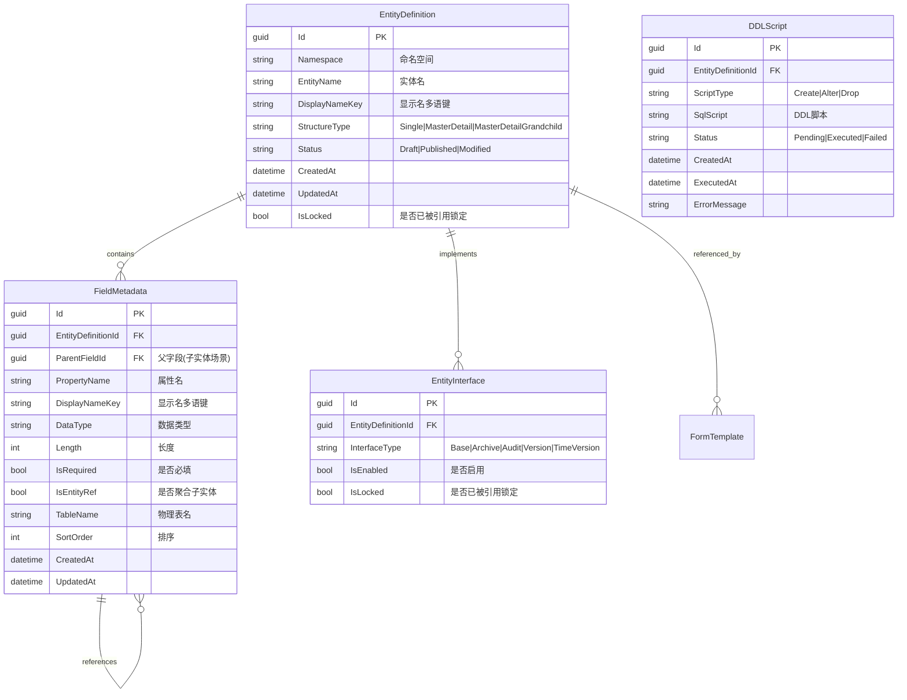
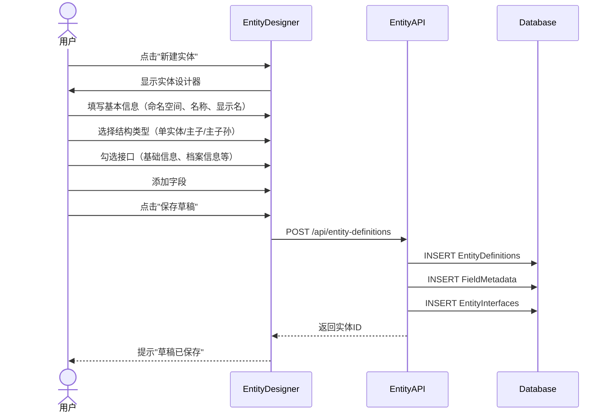
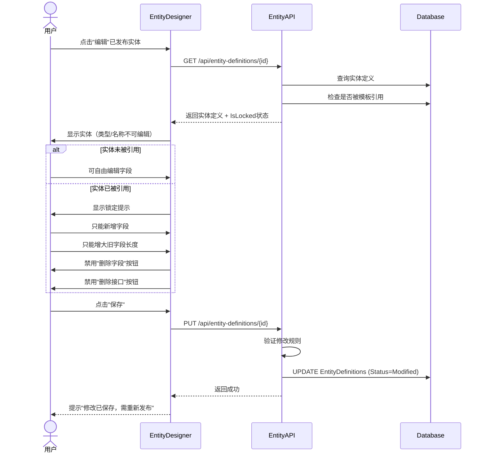
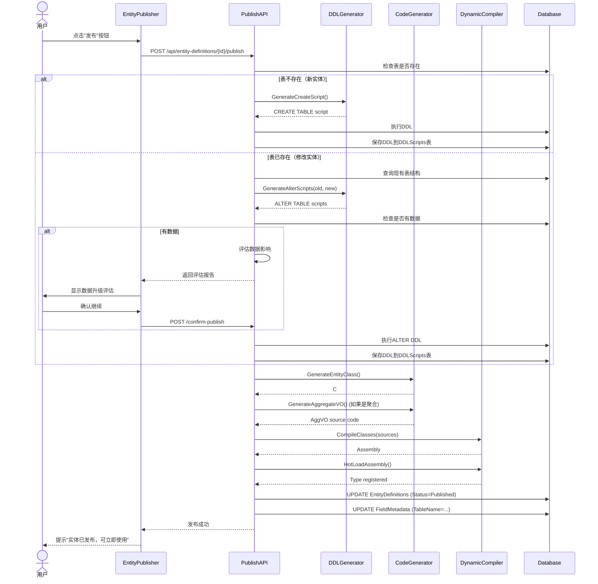
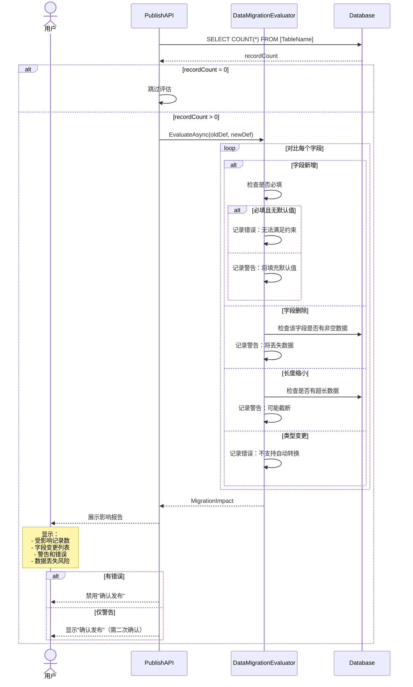

# 实体自定义与发布系统设计文档

> **版本**: v1.0
> **创建日期**: 2025-11-07
> **作者**: BobCRM 开发团队
> **状态**: 设计阶段

---

## 目录

1. [功能概述](#功能概述)
2. [核心概念](#核心概念)
3. [数据模型设计](#数据模型设计)
4. [系统架构](#系统架构)
5. [业务流程](#业务流程)
6. [技术实现方案](#技术实现方案)
7. [分期实现计划](#分期实现计划)
8. [风险与挑战](#风险与挑战)

---

## 功能概述

### 背景

当前系统中的业务实体（如Customer）都是由开发方预先定义的，缺乏灵活性。实体自定义与发布系统旨在让用户能够：

1. **自定义实体** - 全新定义或修改已有实体
2. **动态发布** - 将实体定义发布到数据库并生成代码
3. **热加载** - 无需重启即可使用新实体
4. **安全管理** - 防止破坏性修改，支持数据升级评估

### 核心价值

- **业务敏捷性** - 无需等待开发即可创建新实体
- **低代码能力** - 赋予业务人员自主权
- **系统活性** - 实体可作为类型候选项，实现递归组合
- **数据安全** - 严格的修改限制和升级评估

### 适用场景

- ✅ 快速创建新业务实体（如产品、订单、合同等）
- ✅ 扩展已有实体（添加新字段）
- ✅ 动态构建表单和报表
- ✅ 多租户场景下的实体隔离

---

## 核心概念

### 1. 实体定义 (EntityDefinition)

实体定义是对业务对象的元数据描述，包括：

- **基本信息** - 命名空间、实体名、显示名（多语）
- **结构类型** - 单实体、主子结构、主子孙结构
- **字段列表** - 属性定义的集合
- **接口特性** - 基础信息、档案信息、审计信息等
- **发布状态** - 草稿、已发布、已修改

### 2. 实体结构类型

#### 单实体 (SingleEntity)
```
Customer
├── Id (主键)
├── Code (档案)
├── Name (档案)
├── Email (扩展)
└── Phone (扩展)
```

#### 主子结构 (MasterDetail)
```
Order (主表)
├── Id
├── OrderNo
└── OrderItems[] (子表)
    ├── Id
    ├── OrderId (外键)
    ├── ProductId
    └── Quantity
```

#### 主子孙结构 (MasterDetailGrandchild)
```
Project (主表)
├── Id
├── ProjectName
└── Phases[] (子表)
    ├── Id
    ├── ProjectId (外键)
    ├── PhaseName
    └── Tasks[] (孙表)
        ├── Id
        ├── PhaseId (外键)
        └── TaskName
```

### 3. 字段元数据 (FieldMetadata)

每个字段包含以下元数据：

| 属性 | 说明 | 示例 |
|------|------|------|
| MetadataId | 物理ID（GUID或自增） | `guid-123` |
| PropertyName | 属性名（代码中的名称） | `Email` |
| DisplayName | 显示名（多语键） | `FIELD_EMAIL` |
| DataType | 数据类型 | `String`, `Int32`, `DateTime`, `EntityRef` |
| Length | 数据长度（字符串） | `255` |
| IsRequired | 是否必填 | `true` |
| IsEntityRef | 是否聚合子实体 | `false` |
| TableName | 物理表名（发布后锁定） | `Customers` |

### 4. 接口快速实现 (Interface Templates)

通过勾选快速添加常用字段：

| 接口类型 | 字段 | 说明 |
|----------|------|------|
| **基础信息** | Id | 主键（GUID或自增） |
| **档案信息** | Code, Name | 编码+名称 |
| **审计信息** | CreatedAt, CreatedBy, UpdatedAt, UpdatedBy | 创建/修改时间和人 |
| **版本管理** | Version | 自增版本号（乐观锁） |
| **时间版本** | ValidFrom, ValidTo, VersionNo | 时间敏感的版本管理 |

### 5. 聚合实体 (AggregateVO)

聚合实体不是独立实体，而是组合关系定义：

```csharp
public class OrderAggVO : AggregateVOBase
{
    public Order Master { get; set; }           // 主实体
    public List<OrderItem> Items { get; set; }  // 子实体集合

    // 基类实现通用操作
    // - Save() - 从叶子到根保存
    // - Delete() - 级联删除
    // - Validate() - 跨实体校验
}
```

**版本号管理规则**：

1. **保存顺序** - 从叶子实体开始，平级遍历，上层递归到顶层
2. **版本递增** - 每保存一个实例，Version自动+1
3. **版本引用** - 子实体自动引用主实体的Version
4. **一致性更新** - 主Version更新时，同步更新所有子实体的MasterVersion
5. **递归防护** - 引用版本号更新不触发自身版本号递增

---

## 数据模型设计

### ER图



### 表结构设计

#### 1. EntityDefinitions - 实体定义表

```sql
CREATE TABLE EntityDefinitions (
    Id UUID PRIMARY KEY DEFAULT gen_random_uuid(),
    Namespace VARCHAR(500) NOT NULL,              -- 命名空间 BobCrm.Base.Custom
    EntityName VARCHAR(100) NOT NULL,             -- 实体名 Product
    DisplayNameKey VARCHAR(100) NOT NULL,         -- 多语键 ENTITY_PRODUCT
    StructureType VARCHAR(50) NOT NULL,           -- Single|MasterDetail|MasterDetailGrandchild
    Status VARCHAR(50) NOT NULL DEFAULT 'Draft',  -- Draft|Published|Modified
    IsLocked BOOLEAN NOT NULL DEFAULT FALSE,      -- 是否被模板引用锁定
    CreatedAt TIMESTAMP NOT NULL DEFAULT NOW(),
    UpdatedAt TIMESTAMP NOT NULL DEFAULT NOW(),

    CONSTRAINT UQ_EntityDefinitions_Namespace_EntityName UNIQUE (Namespace, EntityName)
);

CREATE INDEX IX_EntityDefinitions_Status ON EntityDefinitions(Status);
CREATE INDEX IX_EntityDefinitions_IsLocked ON EntityDefinitions(IsLocked);
```

#### 2. FieldMetadata - 字段元数据表

```sql
CREATE TABLE FieldMetadata (
    Id UUID PRIMARY KEY DEFAULT gen_random_uuid(),
    EntityDefinitionId UUID NOT NULL,
    ParentFieldId UUID NULL,                      -- 子实体的父字段引用
    PropertyName VARCHAR(100) NOT NULL,
    DisplayNameKey VARCHAR(100) NOT NULL,
    DataType VARCHAR(50) NOT NULL,                -- String|Int32|DateTime|Decimal|EntityRef
    Length INT NULL,                              -- 字符串长度
    IsRequired BOOLEAN NOT NULL DEFAULT FALSE,
    IsEntityRef BOOLEAN NOT NULL DEFAULT FALSE,   -- 是否引用子实体
    ReferencedEntityId UUID NULL,                 -- 引用的实体ID
    TableName VARCHAR(100) NULL,                  -- 物理表名（发布后填充）
    SortOrder INT NOT NULL DEFAULT 0,
    CreatedAt TIMESTAMP NOT NULL DEFAULT NOW(),
    UpdatedAt TIMESTAMP NOT NULL DEFAULT NOW(),

    CONSTRAINT FK_FieldMetadata_EntityDefinition
        FOREIGN KEY (EntityDefinitionId) REFERENCES EntityDefinitions(Id) ON DELETE CASCADE,
    CONSTRAINT FK_FieldMetadata_ParentField
        FOREIGN KEY (ParentFieldId) REFERENCES FieldMetadata(Id) ON DELETE CASCADE,
    CONSTRAINT FK_FieldMetadata_ReferencedEntity
        FOREIGN KEY (ReferencedEntityId) REFERENCES EntityDefinitions(Id),
    CONSTRAINT UQ_FieldMetadata_EntityProperty
        UNIQUE (EntityDefinitionId, PropertyName)
);

CREATE INDEX IX_FieldMetadata_EntityDefinitionId ON FieldMetadata(EntityDefinitionId);
CREATE INDEX IX_FieldMetadata_ParentFieldId ON FieldMetadata(ParentFieldId);
```

#### 3. EntityInterfaces - 实体接口表

```sql
CREATE TABLE EntityInterfaces (
    Id UUID PRIMARY KEY DEFAULT gen_random_uuid(),
    EntityDefinitionId UUID NOT NULL,
    InterfaceType VARCHAR(50) NOT NULL,           -- Base|Archive|Audit|Version|TimeVersion
    IsEnabled BOOLEAN NOT NULL DEFAULT TRUE,
    IsLocked BOOLEAN NOT NULL DEFAULT FALSE,      -- 已被引用则不可删除
    CreatedAt TIMESTAMP NOT NULL DEFAULT NOW(),

    CONSTRAINT FK_EntityInterfaces_EntityDefinition
        FOREIGN KEY (EntityDefinitionId) REFERENCES EntityDefinitions(Id) ON DELETE CASCADE,
    CONSTRAINT UQ_EntityInterfaces_Entity_Type
        UNIQUE (EntityDefinitionId, InterfaceType)
);
```

#### 4. DDLScripts - DDL脚本表

```sql
CREATE TABLE DDLScripts (
    Id UUID PRIMARY KEY DEFAULT gen_random_uuid(),
    EntityDefinitionId UUID NOT NULL,
    ScriptType VARCHAR(50) NOT NULL,              -- Create|Alter|Drop
    SqlScript TEXT NOT NULL,
    Status VARCHAR(50) NOT NULL DEFAULT 'Pending',-- Pending|Executed|Failed
    CreatedAt TIMESTAMP NOT NULL DEFAULT NOW(),
    ExecutedAt TIMESTAMP NULL,
    ErrorMessage TEXT NULL,

    CONSTRAINT FK_DDLScripts_EntityDefinition
        FOREIGN KEY (EntityDefinitionId) REFERENCES EntityDefinitions(Id) ON DELETE CASCADE
);

CREATE INDEX IX_DDLScripts_EntityDefinitionId ON DDLScripts(EntityDefinitionId);
CREATE INDEX IX_DDLScripts_Status ON DDLScripts(Status);
```

---

## 系统架构

### 层次结构

```
┌─────────────────────────────────────────────────────────┐
│                     前端层 (Blazor)                      │
├─────────────────────────────────────────────────────────┤
│ EntityDefinitionList.razor    │ 实体定义列表              │
│ EntityDesigner.razor           │ 实体设计器（单/主子/主子孙）│
│ EntityStructureViewer.razor    │ 实体结构树状可视化        │
│ EntityPublisher.razor          │ 实体发布界面              │
└─────────────────────────────────────────────────────────┘
                          ↓ HTTP/API
┌─────────────────────────────────────────────────────────┐
│                    API层 (ASP.NET Core)                  │
├─────────────────────────────────────────────────────────┤
│ EntityDefinitionEndpoints      │ 实体定义CRUD             │
│ EntityPublishEndpoints         │ 实体发布                 │
│ DDLGeneratorService            │ DDL生成                  │
│ CodeGeneratorService           │ C#代码生成               │
│ DynamicCompilerService         │ 动态编译                 │
│ ReflectionPersistenceService   │ 反射持久化               │
│ DataMigrationEvaluator         │ 数据升级评估             │
└─────────────────────────────────────────────────────────┘
                          ↓
┌─────────────────────────────────────────────────────────┐
│                    基础层 (Base)                         │
├─────────────────────────────────────────────────────────┤
│ EntityDefinition               │ 实体定义域模型           │
│ FieldMetadata                  │ 字段元数据               │
│ AggregateVOBase                │ 聚合实体基类             │
│ IPublishable                   │ 可发布接口               │
│ IVersionable                   │ 版本管理接口             │
└─────────────────────────────────────────────────────────┘
                          ↓
┌─────────────────────────────────────────────────────────┐
│                  持久化层 (Persistence)                   │
├─────────────────────────────────────────────────────────┤
│ IEntityDefinitionRepository    │ 实体定义仓储             │
│ IDDLScriptRepository           │ DDL脚本仓储              │
│ IReflectionPersistence         │ 反射持久化接口           │
│ DynamicEntityContext           │ 动态实体上下文           │
└─────────────────────────────────────────────────────────┘
                          ↓
┌─────────────────────────────────────────────────────────┐
│                   数据库层 (PostgreSQL)                   │
├─────────────────────────────────────────────────────────┤
│ EntityDefinitions              │ 元数据表                 │
│ FieldMetadata                  │ 元数据表                 │
│ FieldDataTypes                 │ 字段类型档案             │
│ FieldSources                   │ 字段来源档案             │
│ DDLScripts                     │ 元数据表                 │
│ [动态生成的业务表]              │ 运行时表                 │
└─────────────────────────────────────────────────────────┘
```

> **字段档案补充**
>
> - `FieldDataTypes`：记录 String、Int32、Decimal、EntityRef 等字段类型的 Code、CLR 类型、分类以及多语言说明。所有字段类型下拉与校验逻辑均读取此表，后续需要新增类型时，只需插入档案即可。
> - `FieldSources`：记录字段来源（System、Custom、Interface……）的 Code/Name/Description。实体编辑器和同步器都直接引用此档案，允许未来扩展更多来源类型，而无需修改枚举或代码。

### 核心服务

#### 1. DDLGeneratorService - DDL生成器

**职责**：根据实体定义生成PostgreSQL DDL脚本

**方法**：
```csharp
public class DDLGeneratorService
{
    // 生成CREATE TABLE脚本
    string GenerateCreateScript(EntityDefinition entity);

    // 生成ALTER TABLE脚本（对比现有结构）
    List<string> GenerateAlterScripts(EntityDefinition entity, TableSchema currentSchema);

    // 生成DROP TABLE脚本
    string GenerateDropScript(EntityDefinition entity);

    // 生成索引脚本
    List<string> GenerateIndexScripts(EntityDefinition entity);
}
```

**示例输出**：
```sql
-- Single Entity
CREATE TABLE "Products" (
    "Id" UUID PRIMARY KEY DEFAULT gen_random_uuid(),
    "Code" VARCHAR(50) NOT NULL,
    "Name" VARCHAR(255) NOT NULL,
    "Price" DECIMAL(18,2) NOT NULL,
    "CreatedAt" TIMESTAMP NOT NULL DEFAULT NOW(),
    "CreatedBy" VARCHAR(100),
    "UpdatedAt" TIMESTAMP NOT NULL DEFAULT NOW(),
    "UpdatedBy" VARCHAR(100),
    "Version" INT NOT NULL DEFAULT 1
);

CREATE UNIQUE INDEX "IX_Products_Code" ON "Products"("Code");

-- Master-Detail
CREATE TABLE "Orders" (
    "Id" UUID PRIMARY KEY DEFAULT gen_random_uuid(),
    "OrderNo" VARCHAR(50) NOT NULL,
    "OrderDate" TIMESTAMP NOT NULL,
    "Version" INT NOT NULL DEFAULT 1
);

CREATE TABLE "OrderItems" (
    "Id" UUID PRIMARY KEY DEFAULT gen_random_uuid(),
    "OrderId" UUID NOT NULL,
    "ProductId" UUID NOT NULL,
    "Quantity" INT NOT NULL,
    "MasterVersion" INT NOT NULL,  -- 引用主表版本号

    CONSTRAINT "FK_OrderItems_Orders"
        FOREIGN KEY ("OrderId") REFERENCES "Orders"("Id") ON DELETE CASCADE
);
```

#### 2. CodeGeneratorService - 代码生成器

**职责**：根据实体定义生成C#实体类和聚合VO

**方法**：
```csharp
public class CodeGeneratorService
{
    // 生成实体类代码
    string GenerateEntityClass(EntityDefinition entity);

    // 生成聚合VO代码
    string GenerateAggregateVO(EntityDefinition entity);

    // 生成仓储接口代码
    string GenerateRepository(EntityDefinition entity);
}
```

**示例输出**：
```csharp
// 单实体
namespace BobCrm.Base.Custom
{
    public class Product : IArchiveEntity, IAuditEntity, IVersionEntity
    {
        public Guid Id { get; set; }
        public string Code { get; set; } = string.Empty;
        public string Name { get; set; } = string.Empty;
        public decimal Price { get; set; }

        // IAuditEntity
        public DateTime CreatedAt { get; set; }
        public string? CreatedBy { get; set; }
        public DateTime UpdatedAt { get; set; }
        public string? UpdatedBy { get; set; }

        // IVersionEntity
        public int Version { get; set; }
    }
}

// 主子结构聚合VO
namespace BobCrm.Base.Custom
{
    public class OrderAggVO : AggregateVOBase
    {
        public Order Master { get; set; } = new();
        public List<OrderItem> Items { get; set; } = new();

        public override async Task<SaveResult> SaveAsync()
        {
            // 1. 从叶子开始保存
            foreach (var item in Items)
            {
                item.MasterVersion = Master.Version;
                await _repository.SaveAsync(item);
            }

            // 2. 保存主表并递增版本
            Master.Version++;
            await _repository.SaveAsync(Master);

            // 3. 同步更新子表的MasterVersion
            await _repository.UpdateMasterVersionAsync(Master.Id, Master.Version);

            return SaveResult.Success();
        }
    }
}
```

#### 3. DynamicCompilerService - 动态编译器

**职责**：将生成的C#代码编译为程序集并热加载

**方法**：
```csharp
public class DynamicCompilerService
{
    // 编译单个类
    Assembly CompileClass(string sourceCode);

    // 编译多个类（聚合场景）
    Assembly CompileClasses(List<string> sourceCodes);

    // 热加载程序集
    void HotLoadAssembly(Assembly assembly);

    // 获取已加载的类型
    Type? GetDynamicType(string fullTypeName);
}
```

**技术栈**：
- Roslyn (Microsoft.CodeAnalysis.CSharp)
- AssemblyLoadContext（隔离加载，支持卸载）

#### 4. ReflectionPersistenceService - 反射持久化

**职责**：通用的反射式CRUD操作，支持动态实体

**方法**：
```csharp
public class ReflectionPersistenceService
{
    // 保存实体（新增或更新）
    Task<object> SaveAsync(object entity, Type entityType);

    // 查询实体
    Task<object?> GetByIdAsync(Type entityType, object id);

    // 查询列表
    Task<List<object>> QueryAsync(Type entityType, Expression<Func<object, bool>>? filter = null);

    // 删除实体
    Task<bool> DeleteAsync(Type entityType, object id);
}
```

**实现原理**：
1. 使用反射获取实体属性
2. 动态构建SQL语句
3. 使用Dapper或EF Core动态查询
4. 支持版本号自动递增

#### 5. DataMigrationEvaluator - 数据升级评估器

**职责**：评估实体修改对现有数据的影响

**方法**：
```csharp
public class DataMigrationEvaluator
{
    // 评估影响
    Task<MigrationImpact> EvaluateAsync(EntityDefinition oldDef, EntityDefinition newDef);
}

public class MigrationImpact
{
    public bool HasData { get; set; }                    // 是否有现有数据
    public int AffectedRecords { get; set; }             // 受影响记录数
    public List<FieldChange> FieldChanges { get; set; }  // 字段变更
    public List<string> Warnings { get; set; }           // 警告信息
    public List<string> Errors { get; set; }             // 错误信息
    public bool IsDestructive { get; set; }              // 是否破坏性修改
}

public class FieldChange
{
    public string FieldName { get; set; }
    public string ChangeType { get; set; }  // Added|Removed|TypeChanged|LengthChanged
    public string? OldValue { get; set; }
    public string? NewValue { get; set; }
    public bool DataLossRisk { get; set; }  // 是否有数据丢失风险
}
```

**评估规则**：

| 变更类型 | 数据影响 | 是否允许 |
|----------|----------|----------|
| 新增字段 | 无影响（填充默认值或NULL） | ✅ 允许 |
| 删除字段 | 丢失该字段所有数据 | ⚠️ 警告，需确认 |
| 字符串长度增大 | 无影响 | ✅ 允许 |
| 字符串长度缩小 | 可能截断数据 | ⚠️ 警告，需确认 |
| 数据类型变更 | 可能转换失败 | ❌ 禁止（需先清空数据） |
| 必填字段新增 | 现有记录无法满足约束 | ❌ 禁止（需提供默认值） |

---

## 业务流程

### 流程1：创建新实体



### 流程2：编辑已发布实体



### 流程3：发布实体



### 流程4：数据升级评估



---

## 技术实现方案

### 1. 编辑限制实现

#### 检查实体是否被引用

```csharp
public async Task<bool> IsEntityReferencedAsync(Guid entityId)
{
    // 检查是否被FormTemplate引用
    var templateCount = await _db.FormTemplates
        .Where(t => t.EntityType == entityId.ToString())
        .CountAsync();

    return templateCount > 0;
}
```

#### 验证修改规则

```csharp
public class EntityModificationValidator
{
    public ValidationResult ValidateModification(
        EntityDefinition oldDef,
        EntityDefinition newDef)
    {
        var result = new ValidationResult();

        if (oldDef.IsLocked)
        {
            // 检查实体类型和名称是否修改
            if (newDef.Namespace != oldDef.Namespace ||
                newDef.EntityName != oldDef.EntityName)
            {
                result.AddError("实体类型和名称已锁定，不可修改");
            }

            // 检查字段修改
            foreach (var oldField in oldDef.Fields)
            {
                var newField = newDef.Fields.FirstOrDefault(f => f.Id == oldField.Id);

                if (newField == null)
                {
                    result.AddError($"字段 {oldField.PropertyName} 已被引用，不可删除");
                }
                else
                {
                    // 检查数据类型
                    if (newField.DataType != oldField.DataType)
                    {
                        result.AddError($"字段 {oldField.PropertyName} 数据类型不可修改");
                    }

                    // 检查长度
                    if (newField.Length < oldField.Length)
                    {
                        result.AddError($"字段 {oldField.PropertyName} 长度只能增大，不能缩小");
                    }
                }
            }

            // 检查接口删除
            foreach (var oldInterface in oldDef.Interfaces)
            {
                if (oldInterface.IsLocked &&
                    !newDef.Interfaces.Any(i => i.InterfaceType == oldInterface.InterfaceType))
                {
                    result.AddError($"接口 {oldInterface.InterfaceType} 已被引用，不可删除");
                }
            }
        }

        return result;
    }
}
```

### 2. DDL生成策略

#### PostgreSQL DDL生成器

```csharp
public class PostgreSQLDDLGenerator : IDDLGenerator
{
    public string GenerateCreateTable(EntityDefinition entity)
    {
        var sb = new StringBuilder();
        var tableName = entity.EntityName + "s";  // 简单复数

        sb.AppendLine($"CREATE TABLE \"{tableName}\" (");

        // 生成字段
        var fieldSqls = new List<string>();
        foreach (var field in entity.Fields.OrderBy(f => f.SortOrder))
        {
            fieldSqls.Add(GenerateFieldDefinition(field));
        }

        sb.AppendLine(string.Join(",\n", fieldSqls));
        sb.AppendLine(");");

        return sb.ToString();
    }

    private string GenerateFieldDefinition(FieldMetadata field)
    {
        var sql = $"\"{field.PropertyName}\" ";

        // 数据类型映射
        sql += field.DataType switch
        {
            "String" => $"VARCHAR({field.Length ?? 255})",
            "Int32" => "INT",
            "Int64" => "BIGINT",
            "Decimal" => "DECIMAL(18,2)",
            "DateTime" => "TIMESTAMP",
            "Boolean" => "BOOLEAN",
            "Guid" => "UUID",
            _ => "TEXT"
        };

        // 必填约束
        if (field.IsRequired)
            sql += " NOT NULL";

        // 主键
        if (field.PropertyName == "Id")
            sql += " PRIMARY KEY DEFAULT gen_random_uuid()";

        return sql;
    }

    public List<string> GenerateAlterTable(
        EntityDefinition entity,
        TableSchema currentSchema)
    {
        var scripts = new List<string>();
        var tableName = entity.EntityName + "s";

        foreach (var field in entity.Fields)
        {
            var existingColumn = currentSchema.Columns
                .FirstOrDefault(c => c.Name == field.PropertyName);

            if (existingColumn == null)
            {
                // 新增字段
                scripts.Add($"ALTER TABLE \"{tableName}\" ADD COLUMN {GenerateFieldDefinition(field)};");
            }
            else
            {
                // 修改字段（如果长度增大）
                if (field.DataType == "String" &&
                    field.Length > existingColumn.MaxLength)
                {
                    scripts.Add($"ALTER TABLE \"{tableName}\" ALTER COLUMN \"{field.PropertyName}\" TYPE VARCHAR({field.Length});");
                }
            }
        }

        return scripts;
    }
}
```

### 3. 动态编译与热加载

#### Roslyn编译器封装

```csharp
public class RoslynCompiler
{
    public Assembly Compile(string sourceCode, string assemblyName)
    {
        var syntaxTree = CSharpSyntaxTree.ParseText(sourceCode);

        var references = new[]
        {
            MetadataReference.CreateFromFile(typeof(object).Assembly.Location),
            MetadataReference.CreateFromFile(typeof(Console).Assembly.Location),
            MetadataReference.CreateFromFile(typeof(IRepository<>).Assembly.Location),
            // ... 添加所需引用
        };

        var compilation = CSharpCompilation.Create(
            assemblyName,
            new[] { syntaxTree },
            references,
            new CSharpCompilationOptions(OutputKind.DynamicallyLinkedLibrary)
        );

        using var ms = new MemoryStream();
        var result = compilation.Emit(ms);

        if (!result.Success)
        {
            var errors = string.Join("\n", result.Diagnostics
                .Where(d => d.Severity == DiagnosticSeverity.Error)
                .Select(d => d.GetMessage()));
            throw new CompilationException(errors);
        }

        ms.Seek(0, SeekOrigin.Begin);
        return Assembly.Load(ms.ToArray());
    }
}
```

#### AssemblyLoadContext热加载

```csharp
public class DynamicAssemblyLoadContext : AssemblyLoadContext
{
    public DynamicAssemblyLoadContext() : base(isCollectible: true)
    {
    }

    protected override Assembly? Load(AssemblyName assemblyName)
    {
        // 允许卸载
        return null;
    }
}

public class DynamicTypeRegistry
{
    private readonly Dictionary<string, Type> _types = new();
    private DynamicAssemblyLoadContext? _loadContext;

    public void RegisterAssembly(Assembly assembly)
    {
        foreach (var type in assembly.GetExportedTypes())
        {
            _types[type.FullName!] = type;
        }
    }

    public Type? GetType(string fullName)
    {
        return _types.TryGetValue(fullName, out var type) ? type : null;
    }

    public void Unload()
    {
        _types.Clear();
        _loadContext?.Unload();
        _loadContext = null;
    }
}
```

### 4. 反射持久化实现

#### 通用CRUD服务

```csharp
public class ReflectionCRUDService
{
    private readonly IDbConnection _connection;

    public async Task<object> SaveAsync(object entity, Type entityType)
    {
        var tableName = entityType.Name + "s";
        var properties = entityType.GetProperties()
            .Where(p => p.CanRead && p.CanWrite)
            .ToList();

        // 检查是否有Id属性
        var idProp = properties.FirstOrDefault(p => p.Name == "Id");
        var id = idProp?.GetValue(entity);

        bool isUpdate = id != null && !IsDefaultValue(id);

        if (isUpdate)
        {
            // UPDATE
            var setClauses = properties
                .Where(p => p.Name != "Id")
                .Select(p => $"\"{p.Name}\" = @{p.Name}");

            var sql = $"UPDATE \"{tableName}\" SET {string.Join(", ", setClauses)} WHERE \"Id\" = @Id";

            await _connection.ExecuteAsync(sql, entity);
        }
        else
        {
            // INSERT
            var columns = properties.Select(p => $"\"{p.Name}\"");
            var values = properties.Select(p => $"@{p.Name}");

            var sql = $"INSERT INTO \"{tableName}\" ({string.Join(", ", columns)}) VALUES ({string.Join(", ", values)}) RETURNING *";

            var result = await _connection.QueryFirstOrDefaultAsync(sql, entity);
            return result;
        }

        return entity;
    }

    public async Task<object?> GetByIdAsync(Type entityType, object id)
    {
        var tableName = entityType.Name + "s";
        var sql = $"SELECT * FROM \"{tableName}\" WHERE \"Id\" = @Id";

        return await _connection.QueryFirstOrDefaultAsync(entityType, sql, new { Id = id });
    }
}
```

### 5. 聚合实体版本管理

#### AggregateVOBase基类

```csharp
public abstract class AggregateVOBase
{
    protected readonly IReflectionCRUDService _crudService;

    public abstract Task<SaveResult> SaveAsync();

    protected async Task SaveWithVersionAsync<TMaster, TDetail>(
        TMaster master,
        List<TDetail> details,
        string masterIdProperty = "Id",
        string detailMasterIdProperty = "MasterId")
        where TMaster : class, IVersionEntity
        where TDetail : class, IMasterVersionEntity
    {
        // 1. 保存所有子实体
        foreach (var detail in details)
        {
            // 设置子实体的MasterVersion为当前主版本
            detail.MasterVersion = master.Version;
            await _crudService.SaveAsync(detail, typeof(TDetail));
        }

        // 2. 递增主实体版本并保存
        master.Version++;
        await _crudService.SaveAsync(master, typeof(TMaster));

        // 3. 同步更新所有子实体的MasterVersion（防止新增后遗漏）
        var masterIdValue = typeof(TMaster).GetProperty(masterIdProperty)!.GetValue(master);
        await UpdateDetailMasterVersionAsync<TDetail>(
            detailMasterIdProperty,
            masterIdValue!,
            master.Version
        );
    }

    private async Task UpdateDetailMasterVersionAsync<TDetail>(
        string masterIdProperty,
        object masterIdValue,
        int newVersion)
    {
        var tableName = typeof(TDetail).Name + "s";
        var sql = $"UPDATE \"{tableName}\" SET \"MasterVersion\" = @NewVersion WHERE \"{masterIdProperty}\" = @MasterId";

        await _crudService.ExecuteAsync(sql, new { NewVersion = newVersion, MasterId = masterIdValue });
    }
}

// 接口定义
public interface IVersionEntity
{
    int Version { get; set; }
}

public interface IMasterVersionEntity
{
    int MasterVersion { get; set; }
}
```

---

## 分期实现计划

### 阶段1：基础架构（2周）

**目标**：建立实体定义的元数据管理能力

**任务**：
- ✅ 创建数据表（EntityDefinitions, FieldMetadata, EntityInterfaces, DDLScripts）
- ✅ 实现EntityDefinition域模型
- ✅ 实现基础CRUD API
- ✅ 前端实体列表页面
- ✅ 前端基础实体编辑器（单实体）

**验收标准**：
- 可以创建、编辑、删除实体定义
- 实体定义可保存为草稿
- 前端可查看实体列表

### 阶段2：DDL生成与发布（2周）

**目标**：实现DDL生成和数据库表创建

**任务**：
- ✅ 实现PostgreSQL DDL生成器
- ✅ 实现DDL执行服务
- ✅ 实现发布API
- ✅ 前端发布界面
- ✅ 脚本持久化到DDLScripts表

**验收标准**：
- 可以发布单实体到数据库
- 生成的表结构正确
- DDL脚本可追溯

### 阶段3：代码生成与热加载（3周）

**目标**：实现C#代码生成和动态编译

**任务**：
- ✅ 实现C#代码生成器
- ✅ 集成Roslyn编译器
- ✅ 实现AssemblyLoadContext热加载
- ✅ 实现动态类型注册表
- ✅ 测试代码生成和加载

**验收标准**：
- 可以生成C#实体类
- 可以动态编译并加载
- 可以通过反射访问动态类型

### 阶段4：反射持久化（2周）

**目标**：实现通用的反射式CRUD

**任务**：
- ✅ 实现ReflectionCRUDService
- ✅ 支持动态类型的增删改查
- ✅ 支持版本号自动递增
- ✅ 集成到现有仓储体系

**验收标准**：
- 可以对动态实体进行CRUD操作
- 版本号正确递增
- 并发控制正常工作

### 阶段5：主子结构支持（3周）

**目标**：支持主子和主子孙结构

**任务**：
- ✅ 扩展实体设计器（主子结构UI）
- ✅ 实现聚合VO生成
- ✅ 实现AggregateVOBase基类
- ✅ 实现版本号级联管理
- ✅ 前端Tab页签UI

**验收标准**：
- 可以定义主子结构
- 聚合保存正确
- 版本号级联正确

### 阶段6：编辑限制与锁定（1周）

**目标**：实现实体引用检查和修改限制

**任务**：
- ✅ 实现实体引用检查
- ✅ 实现修改规则验证
- ✅ 前端锁定UI提示
- ✅ 接口勾选锁定

**验收标准**：
- 已引用实体类型和名称不可修改
- 字段删除和类型修改受限
- UI正确提示锁定状态

### 阶段7：数据升级评估（2周）

**目标**：实现数据影响评估和安全发布

**任务**：
- ✅ 实现DataMigrationEvaluator
- ✅ 实现字段变更检测
- ✅ 实现数据丢失风险评估
- ✅ 前端评估报告展示
- ✅ 二次确认流程

**验收标准**：
- 修改实体前可看到影响报告
- 破坏性修改需二次确认
- 数据丢失风险清晰提示

### 阶段8：树状可视化（1周）

**目标**：实现实体结构的可视化展示

**任务**：
- ✅ 实现EntityStructureViewer组件
- ✅ 集成树状图库（如AntV G6）
- ✅ 实时预览实体结构
- ✅ 支持节点交互

**验收标准**：
- 可以看到实体树状结构图
- 节点显示字段信息
- 可以点击节点查看详情

### 阶段9：集成测试与文档（1周）

**目标**：完善测试和文档

**任务**：
- ✅ 编写单元测试
- ✅ 编写集成测试
- ✅ 编写用户手册
- ✅ 性能测试和优化

**验收标准**：
- 测试覆盖率 > 80%
- 所有关键流程有文档
- 性能满足要求

---

## 风险与挑战

### 技术风险

| 风险项 | 影响 | 缓解措施 |
|--------|------|----------|
| 动态编译性能问题 | 发布实体时卡顿 | 异步编译、编译结果缓存 |
| AssemblyLoadContext内存泄漏 | 长期运行内存增长 | 定期卸载、引用计数管理 |
| 反射性能开销 | CRUD操作变慢 | 表达式树缓存、IL代码生成 |
| PostgreSQL DDL锁表 | 发布时阻塞查询 | 使用CONCURRENTLY选项、非高峰发布 |
| 多租户隔离 | 数据混淆 | 基于租户的表前缀或Schema |

### 业务风险

| 风险项 | 影响 | 缓解措施 |
|--------|------|----------|
| 用户误删字段 | 数据丢失 | 软删除、回收站机制 |
| 破坏性修改 | 系统崩溃 | 强制备份、回滚机制 |
| 权限管理不足 | 非授权发布 | 基于角色的发布审批流程 |
| 版本冲突 | 并发发布失败 | 乐观锁、发布队列 |

### 性能风险

| 风险项 | 影响 | 缓解措施 |
|--------|------|----------|
| 大量字段的实体 | 编译时间长 | 字段数量限制（如100个） |
| 深层嵌套（主子孙） | 查询复杂 | 限制嵌套层级为3层 |
| 频繁发布 | 数据库压力 | 发布频率限制、批量发布 |

---

## 附录

### A. 数据类型映射表

| C# 类型 | PostgreSQL 类型 | 默认长度 |
|---------|----------------|----------|
| String | VARCHAR | 255 |
| Int32 | INT | - |
| Int64 | BIGINT | - |
| Decimal | DECIMAL | (18,2) |
| DateTime | TIMESTAMP | - |
| Boolean | BOOLEAN | - |
| Guid | UUID | - |
| EntityRef<T> | UUID (FK) | - |

### B. 接口模板字段清单

#### Base Interface (基础信息)
```csharp
public interface IBaseEntity
{
    Guid Id { get; set; }
}
```

#### Archive Interface (档案信息)
```csharp
public interface IArchiveEntity : IBaseEntity
{
    string Code { get; set; }
    string Name { get; set; }
}
```

#### Audit Interface (审计信息)
```csharp
public interface IAuditEntity
{
    DateTime CreatedAt { get; set; }
    string? CreatedBy { get; set; }
    DateTime UpdatedAt { get; set; }
    string? UpdatedBy { get; set; }
}
```

#### Version Interface (版本管理)
```csharp
public interface IVersionEntity
{
    int Version { get; set; }
}
```

#### TimeVersion Interface (时间版本)
```csharp
public interface ITimeVersionEntity
{
    DateTime ValidFrom { get; set; }
    DateTime ValidTo { get; set; }
    int VersionNo { get; set; }
}
```

### C. 多语言资源键

| 键 | 中文 | 日文 | 英文 |
|----|------|------|------|
| ENTITY_DEF_LIST | 实体定义 | エンティティ定義 | Entity Definitions |
| ENTITY_DEF_NEW | 新建实体 | 新規エンティティ | New Entity |
| ENTITY_DEF_EDIT | 编辑实体 | エンティティ編集 | Edit Entity |
| ENTITY_DEF_NAMESPACE | 命名空间 | 名前空間 | Namespace |
| ENTITY_DEF_NAME | 实体名 | エンティティ名 | Entity Name |
| ENTITY_DEF_DISPLAY_NAME | 显示名 | 表示名 | Display Name |
| ENTITY_DEF_STRUCTURE_TYPE | 结构类型 | 構造タイプ | Structure Type |
| ENTITY_DEF_STRUCTURE_SINGLE | 单实体 | 単一エンティティ | Single Entity |
| ENTITY_DEF_STRUCTURE_MASTER_DETAIL | 主子结构 | マスター明細 | Master-Detail |
| ENTITY_DEF_STRUCTURE_MASTER_DETAIL_GRANDCHILD | 主子孙结构 | マスター明細孫 | Master-Detail-Grandchild |
| ENTITY_DEF_STATUS_DRAFT | 草稿 | 下書き | Draft |
| ENTITY_DEF_STATUS_PUBLISHED | 已发布 | 公開済み | Published |
| ENTITY_DEF_STATUS_MODIFIED | 已修改 | 変更済み | Modified |
| ENTITY_DEF_LOCKED | 已锁定 | ロック済み | Locked |
| ENTITY_DEF_LOCKED_HINT | 此实体已被模板引用，类型和名称不可修改 | このエンティティはテンプレートで参照されているため、タイプと名前は変更できません | This entity is referenced by templates, type and name cannot be modified |
| ENTITY_FIELD_ADD | 添加字段 | フィールド追加 | Add Field |
| ENTITY_FIELD_PROPERTY_NAME | 属性名 | プロパティ名 | Property Name |
| ENTITY_FIELD_DISPLAY_NAME | 显示名 | 表示名 | Display Name |
| ENTITY_FIELD_DATA_TYPE | 数据类型 | データ型 | Data Type |
| ENTITY_FIELD_LENGTH | 长度 | 長さ | Length |
| ENTITY_FIELD_REQUIRED | 必填 | 必須 | Required |
| ENTITY_FIELD_ENTITY_REF | 子实体引用 | 子エンティティ参照 | Entity Reference |
| ENTITY_INTERFACE_BASE | 基础信息 | 基本情報 | Base Info |
| ENTITY_INTERFACE_ARCHIVE | 档案信息 | アーカイブ情報 | Archive Info |
| ENTITY_INTERFACE_AUDIT | 审计信息 | 監査情報 | Audit Info |
| ENTITY_INTERFACE_VERSION | 版本管理 | バージョン管理 | Version Management |
| ENTITY_INTERFACE_TIME_VERSION | 时间版本 | 時間バージョン | Time Version |
| ENTITY_PUBLISH | 发布实体 | エンティティ公開 | Publish Entity |
| ENTITY_PUBLISH_CONFIRM | 确认发布 | 公開を確認 | Confirm Publish |
| ENTITY_PUBLISH_EVALUATING | 评估数据影响... | データ影響を評価中... | Evaluating data impact... |
| ENTITY_PUBLISH_IMPACT_REPORT | 数据影响报告 | データ影響レポート | Data Impact Report |
| ENTITY_PUBLISH_AFFECTED_RECORDS | 受影响记录数 | 影響を受けるレコード数 | Affected Records |
| ENTITY_PUBLISH_WARNINGS | 警告 | 警告 | Warnings |
| ENTITY_PUBLISH_ERRORS | 错误 | エラー | Errors |
| ENTITY_PUBLISH_DATA_LOSS_RISK | 数据丢失风险 | データ損失リスク | Data Loss Risk |

---

**文档结束**
