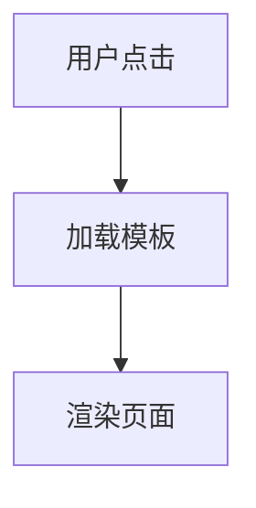

# BobCRM 开发规范

> **版本**: 1.0  
> **最后更新**: 2025-11-27  
> **适用范围**: BobCRM 项目所有开发工作

---

## 1. 架构设计原则

### 1.1 面向对象原则
- ✅ **封装**: 隐藏实现细节，暴露清晰接口
- ✅ **继承**: 合理使用继承，避免过深继承链（≤3层）
- ✅ **多态**: 利用接口和抽象类实现多态
- ✅ **单一职责**: 每个类只负责一个明确的职责

### 1.2 SOLID 原则
- **S** - Single Responsibility Principle（单一职责原则）
- **O** - Open/Closed Principle（开闭原则）
- **L** - Liskov Substitution Principle（里氏替换原则）
- **I** - Interface Segregation Principle（接口隔离原则）
- **D** - Dependency Inversion Principle（依赖倒置原则）

### 1.3 设计模式
优先使用以下设计模式：
- 工厂模式（Factory）
- 策略模式（Strategy）
- 模板方法模式（Template Method）
- 依赖注入（Dependency Injection）

---

## 2. 代码质量标准

### 2.1 编译要求
- ✅ **零警告**: 所有编译警告必须修复
- ✅ **零错误**: 代码必须能够成功编译
- ✅ **CI/CD 通过**: 所有持续集成检查必须通过
- ✅ **代码静态分析**: 通过代码分析工具检查

### 2.2 测试要求
- ✅ **单元测试覆盖率 ≥ 90%**
- ✅ **所有业务逻辑必须有测试**
- ✅ **边界条件和异常情况必须覆盖**
- ✅ **所有测试必须通过**
- ✅ **集成测试覆盖关键流程**

测试命名规范：
```csharp
// 格式：MethodName_Scenario_ExpectedBehavior
[Fact]
public void EnsureTemplatesAsync_WithForce_ShouldCompletelyRegenerate()
{
    // Arrange
    // Act
    // Assert
}
```

### 2.3 文档注释
- ✅ **所有公开方法必须有 XML 文档注释**
- ✅ **复杂逻辑必须有行内注释**
- ✅ **参数和返回值必须说明**

示例：
```csharp
/// <summary>
/// 为实体确保默认模板和状态绑定
/// </summary>
/// <param name="entityDefinition">实体定义</param>
/// <param name="updatedBy">操作人</param>
/// <param name="force">是否强制完全重新生成</param>
/// <param name="ct">取消令牌</param>
/// <returns>模板生成结果</returns>
public async Task<DefaultTemplateGenerationResult> EnsureTemplatesAsync(
    EntityDefinition entityDefinition,
    string? updatedBy,
    bool force = false,
    CancellationToken ct = default)
{
    // 实现
}
```

### 2.4 异步编程
- ✅ **使用 async/await 模式**
- ✅ **方法名后缀 Async**
- ✅ **传递 CancellationToken**
- ✅ **避免 async void**（除事件处理器外）

### 2.5 资源管理
- ✅ **使用 using 语句释放资源**
- ✅ **实现 IDisposable 接口**
- ✅ **避免内存泄漏**

---

## 3. C# 编码规范

### 3.1 命名规范

| 类型 | 规则 | 示例 |
|-----|------|------|
| 类、接口、枚举 | PascalCase | `FormTemplate`, `ITemplateGenerator` |
| 方法、属性 | PascalCase | `EnsureTemplatesAsync`, `EntityType` |
| 局部变量、参数 | camelCase | `entityType`, `updatedBy` |
| 私有字段 | _camelCase | `_db`, `_logger` |
| 常量 | PascalCase | `DefaultPageSize` |
| 接口 | I前缀 | `IDefaultTemplateService` |

### 3.2 代码格式
- ✅ 缩进：4个空格
- ✅ 大括号：独占一行
- ✅ 每行最多120字符
- ✅ 文件编码：UTF-8

### 3.3 代码组织
```csharp
// 1. using 语句（按字母排序）
using System;
using System.Collections.Generic;
using Microsoft.EntityFrameworkCore;

// 2. 命名空间
namespace BobCrm.Api.Services;

// 3. 类定义
/// <summary>类文档</summary>
public class MyService
{
    // 4. 私有字段
    private readonly AppDbContext _db;
    
    // 5. 构造函数
    public MyService(AppDbContext db)
    {
        _db = db;
    }
    
    // 6. 公开方法
    public async Task DoSomethingAsync() { }
    
    // 7. 私有方法
    private void Helper() { }
}
```

---

## 4. 数据库设计规范

### 4.1 项目状态特定规范
> **重要**: 当前项目处于开发阶段，尚未正式发版

- ✅ **无需考虑数据迁移和升级路径**
- ✅ **直接修改数据模型和初始化脚本**
- ✅ **直接修改种子数据生成逻辑**
- ✅ **可以重建数据库**

### 4.2 实体设计
- ✅ 主键使用 `int` 或 `Guid`
- ✅ 必须包含 `CreatedAt`, `UpdatedAt` 时间戳
- ✅ 审计字段：`CreatedBy`, `UpdatedBy`
- ✅ 软删除：使用 `IsDeleted` 标志

### 4.3 索引设计
- ✅ 外键必须有索引
- ✅ 唯一约束使用唯一索引
- ✅ 查询频繁的字段添加索引

---

## 5. 动态枚举系统规范

### 5.1 核心原则
> **关键**: 使用统一的 `EnumDefinition` 系统管理所有枚举类型

- ✅ **不为每个"枚举"创建新的实体类**
- ✅ **通过 EnumDefinition + EnumOption 管理**
- ✅ **用户可通过 UI 扩展枚举值**

### 5.2 数据结构
```
EnumDefinition (Code="view_state")
├── EnumOption (Value="List")
├── EnumOption (Value="DetailView")
├── EnumOption (Value="DetailEdit")
└── EnumOption (Value="Create")
```

### 5.3 引用方式
在其他实体中引用枚举选项：
```csharp
// ✅ 正确：使用字符串引用 EnumOption.Value
public string ViewState { get; set; } = string.Empty;

// ❌ 错误：创建新的枚举实体类
public Guid ViewStateDefinitionId { get; set; }
```

### 5.4 常量定义
为常用枚举值定义常量类：
```csharp
public static class ViewStates
{
    public const string List = "List";
    public const string DetailView = "DetailView";
    public const string DetailEdit = "DetailEdit";
    public const string Create = "Create";
}
```

---

## 6. 多语言规范

### 6.1 核心要求
> **关键**: 所有多语词条必须在种子数据中预置完整，不要后期再补

- ✅ **必须支持的语言**: zh（中文）, en（英文）, ja（日语）
- ✅ **所有 DisplayName 必须包含三种语言**
- ✅ **所有 Description 必须包含三种语言**

### 6.2 种子数据示例
```csharp
new EnumDefinition
{
    Code = "view_state",
    DisplayName = new()
    {
        { "zh", "视图状态" },
        { "en", "View State" },
        { "ja", "ビューステート" }
    },
    Description = new()
    {
        { "zh", "定义实体在不同场景下的视图状态" },
        { "en", "Defines view states for entities in different scenarios" },
        { "ja", "異なるシナリオでのエンティティのビューステートを定義" }
    },
    Options = new()
    {
        new EnumOption 
        { 
            Value = "List",
            DisplayName = new() 
            {
                { "zh", "列表" },
                { "en", "List" },
                { "ja", "リスト" }
            },
            Description = new()
            {
                { "zh", "显示实体列表（数据网格）" },
                { "en", "Display entity list (data grid)" },
                { "ja", "エンティティリストを表示（データグリッド）" }
            },
            SortOrder = 1
        }
        // ... 其他选项
    }
};
```

### 6.3 I18n 资源文件
前端国际化资源：
```json
{
  "VIEW_STATE_LIST": {
    "zh": "列表",
    "en": "List",
    "ja": "リスト"
  }
}
```

---

## 7. 文档规范

### 7.1 文档分类
```
docs/
├── architecture/       # 架构文档
│   ├── diagrams/      # Mermaid 图表
│   └── *.md
├── api/               # API 文档
│   └── *.md
└── development/       # 开发文档
    ├── coding-standards.md  # 本文档
    └── *.md
```

### 7.2 文档格式
- ✅ 使用 Markdown 格式
- ✅ 包含架构图（Mermaid）
- ✅ 包含流程图（Mermaid）
- ✅ 代码示例使用代码块
- ✅ 及时更新 CHANGELOG.md

### 7.3 Mermaid 图表示例


---

## 8. 日志规范

### 8.1 日志级别
- **Trace**: 详细跟踪信息（生产环境关闭）
- **Debug**: 调试信息
- **Information**: 一般信息
- **Warning**: 警告信息
- **Error**: 错误信息
- **Critical**: 严重错误

### 8.2 日志示例
```csharp
_logger.LogInformation(
    "[TemplateGenerator] Force regenerated template {TemplateId} for {Entity} ({State})",
    template.Id, 
    entity.EntityRoute, 
    state);

_logger.LogError(
    ex,
    "[TemplateGenerator] Failed to generate template for {Entity}",
    entity.EntityRoute);
```

---

## 9. 异常处理规范

### 9.1 原则
- ✅ **有意义的异常消息**
- ✅ **记录异常日志**
- ✅ **适当的异常类型**
- ✅ **不吞噬异常**

### 9.2 示例
```csharp
try
{
    await DoSomethingAsync();
}
catch (EntityNotFoundException ex)
{
    _logger.LogWarning(ex, "Entity {EntityId} not found", entityId);
    return Results.NotFound(new { error = "Entity not found" });
}
catch (Exception ex)
{
    _logger.LogError(ex, "Unexpected error processing request");
    return Results.Problem("An unexpected error occurred");
}
```

---

## 10. API 设计规范

### 10.1 RESTful 原则
- GET: 查询资源
- POST: 创建资源
- PUT: 完整更新资源
- PATCH: 部分更新资源
- DELETE: 删除资源

### 10.2 URL 规范
```
GET    /api/templates                    # 列表
GET    /api/templates/{id}               # 详情
POST   /api/templates                    # 创建
PUT    /api/templates/{id}               # 更新
DELETE /api/templates/{id}               # 删除
POST   /api/templates/{id}/regenerate    # 操作
```

### 10.3 响应格式
```csharp
// 成功
return Results.Ok(new { data = result });

// 错误
return Results.BadRequest(new { error = "Invalid input" });
return Results.NotFound(new { error = "Resource not found" });
return Results.Problem("Internal server error");
```

---

## 11. 代码审查清单

### 11.1 提交前检查
- [ ] 所有类和方法有 XML 文档注释
- [ ] 遵循单一职责原则（SRP）
- [ ] 依赖注入正确使用
- [ ] 异步方法正确使用 async/await
- [ ] 资源正确释放（using 语句）
- [ ] 异常处理完善
- [ ] 日志记录充分
- [ ] 单元测试覆盖率 ≥ 90%
- [ ] 所有测试通过
- [ ] 零编译警告和错误
- [ ] 多语言词条完整（zh/en/ja）

### 11.2 代码质量门禁
在合并到主分支前必须满足：
1. ✅ 编译通过，无警告无错误
2. ✅ 单元测试覆盖率 ≥ 90%
3. ✅ 所有测试通过
4. ✅ 代码静态分析通过
5. ✅ 代码审查通过

---

## 12. Git 提交规范

### 12.1 提交消息格式
```
<type>(<scope>): <subject>

<body>

<footer>
```

### 12.2 Type 类型
- `feat`: 新功能
- `fix`: 修复 bug
- `refactor`: 重构
- `docs`: 文档更新
- `test`: 测试相关
- `chore`: 构建/工具相关

### 12.3 示例
```
feat(template): add state-driven template system

- Replace FormTemplateUsageType enum with EnumDefinition
- Add TemplateStateBinding for N:M relationship
- Add WidgetStateConfig for widget state properties

Closes #123
```

---

## 附录：常用工具

### A. 开发工具
- Visual Studio 2022 / VS Code
- SQL Server Management Studio
- Postman (API 测试)

### B. 测试工具
- xUnit
- Moq
- FluentAssertions

### C. 代码质量工具
- StyleCop
- SonarQube
- dotCover (覆盖率)

---

**严格遵守以上规范，确保代码质量和项目可维护性！**
