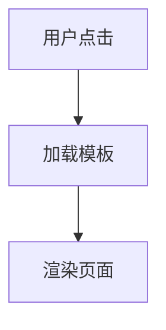

# BobCRM 开发规范

> **版本**: 1.0  
> **最后更新**: 2025-11-27  
> **适用范围**: BobCRM 项目所有开发工作

---

## 1. 架构设计原则

### 1.1 面向对象原则
- ✅ **封装**: 隐藏实现细节，暴露清晰接口
- ✅ **继承**: 合理使用继承，避免过深继承链（≤3层）
- ✅ **多态**: 利用接口和抽象类实现多态
- ✅ **单一职责**: 每个类只负责一个明确的职责

### 1.2 SOLID 原则
- **S** - Single Responsibility Principle（单一职责原则）
- **O** - Open/Closed Principle（开闭原则）
- **L** - Liskov Substitution Principle（里氏替换原则）
- **I** - Interface Segregation Principle（接口隔离原则）
- **D** - Dependency Inversion Principle（依赖倒置原则）

### 1.3 设计模式
优先使用以下设计模式：
- 工厂模式（Factory）
- 策略模式（Strategy）
- 模板方法模式（Template Method）
- 依赖注入（Dependency Injection）

---

## 2. 代码质量标准

### 2.1 编译要求
- ✅ **零警告**: 所有编译警告必须修复
- ✅ **零错误**: 代码必须能够成功编译
- ✅ **CI/CD 通过**: 所有持续集成检查必须通过
- ✅ **代码静态分析**: 通过代码分析工具检查

### 2.2 测试要求
- ✅ **单元测试覆盖率 ≥ 90%**
- ✅ **所有业务逻辑必须有测试**
- ✅ **边界条件和异常情况必须覆盖**
- ✅ **所有测试必须通过**
- ✅ **集成测试覆盖关键流程**

测试命名规范：
```csharp
// 格式：MethodName_Scenario_ExpectedBehavior
[Fact]
public void EnsureTemplatesAsync_WithForce_ShouldCompletelyRegenerate()
{
    // Arrange
    // Act
    // Assert
}
```

### 2.3 文档注释
- ✅ **所有公开方法必须有 XML 文档注释**
- ✅ **复杂逻辑必须有行内注释**
- ✅ **参数和返回值必须说明**

示例：
```csharp
/// <summary>
/// 为实体确保默认模板和状态绑定
/// </summary>
/// <param name="entityDefinition">实体定义</param>
/// <param name="updatedBy">操作人</param>
/// <param name="force">是否强制完全重新生成</param>
/// <param name="ct">取消令牌</param>
/// <returns>模板生成结果</returns>
public async Task<DefaultTemplateGenerationResult> EnsureTemplatesAsync(
    EntityDefinition entityDefinition,
    string? updatedBy,
    bool force = false,
    CancellationToken ct = default)
{
    // 实现
}
```

### 2.4 异步编程
- ✅ **使用 async/await 模式**
- ✅ **方法名后缀 Async**
- ✅ **传递 CancellationToken**
- ✅ **避免 async void**（除事件处理器外）

### 2.5 资源管理
- ✅ **使用 using 语句释放资源**
- ✅ **实现 IDisposable 接口**
- ✅ **避免内存泄漏**

### 2.6 临时文件/产物
- ✅ 允许本地生成临时输出（日志、抓包、扫描结果等），但用毕必须删除或加入 `.gitignore`
- ✅ 仓库内只保留有长期价值的证据（如最终成功截图/录屏），调试中间产物须清理
- ✅ 自动化脚本如生成 artifacts，请在脚本结束时附带清理逻辑或在提交前手工清理

---

## 3. C# 编码规范

### 3.1 命名规范

| 类型 | 规则 | 示例 |
|-----|------|------|
| 类、接口、枚举 | PascalCase | `FormTemplate`, `ITemplateGenerator` |
| 方法、属性 | PascalCase | `EnsureTemplatesAsync`, `EntityType` |
| 局部变量、参数 | camelCase | `entityType`, `updatedBy` |
| 私有字段 | _camelCase | `_db`, `_logger` |
| 常量 | PascalCase | `DefaultPageSize` |
| 接口 | I前缀 | `IDefaultTemplateService` |

### 3.2 代码格式
- ✅ 缩进：4个空格
- ✅ 大括号：独占一行
- ✅ 每行最多120字符
- ✅ 文件编码：UTF-8

### 3.3 代码组织
```csharp
// 1. using 语句（按字母排序）
using System;
using System.Collections.Generic;
using Microsoft.EntityFrameworkCore;

// 2. 命名空间
namespace BobCrm.Api.Services;

// 3. 类定义
/// <summary>类文档</summary>
public class MyService
{
    // 4. 私有字段
    private readonly AppDbContext _db;
    
    // 5. 构造函数
    public MyService(AppDbContext db)
    {
        _db = db;
    }
    
    // 6. 公开方法
    public async Task DoSomethingAsync() { }
    
    // 7. 私有方法
    private void Helper() { }
}
```

### 3.4 单一类型原则 (One Type Per File)

> **重要**: 2025-12-11 新增 - ARCH-30 Task 2.2 代码评审发现

**核心原则**: 每个 `.cs` 文件应该只包含**一个公共类型**（class/record/struct/interface/enum）。

#### 例外情况
以下情况允许多个类型在同一文件：
1. **私有辅助类型** - `private class InternalHelper { }`
2. **文件作用域类型** (C# 11+) - `file class InternalCache { }`
3. **紧密相关的泛型特化** - `SuccessResponse<T>` 和 `SuccessResponse`

#### 错误示例
❌ **违规**：一个文件包含多个公共类型
```csharp
// EnumDefinitionDto.cs (7个公共类型 - 违规)
namespace BobCrm.Api.Contracts.DTOs;

public class EnumDefinitionDto { }          // ❌ 应独立
public class EnumOptionDto { }              // ❌ 应独立
public class CreateEnumDefinitionRequest { } // ❌ 应独立
public class CreateEnumOptionRequest { }     // ❌ 应独立
public class UpdateEnumDefinitionRequest { } // ❌ 应独立
public class UpdateEnumOptionsRequest { }    // ❌ 应独立
public class UpdateEnumOptionRequest { }     // ❌ 应独立
```

#### 正确示例
✅ **正确**：按目录和类型组织
```
Contracts/
├── DTOs/
│   ├── EnumDefinitionDto.cs (1个类型)
│   └── EnumOptionDto.cs (1个类型)
└── Requests/
    └── Enum/
        ├── CreateEnumDefinitionRequest.cs (1个类型)
        ├── UpdateEnumDefinitionRequest.cs (1个类型)
        ├── CreateEnumOptionRequest.cs (1个类型)
        ├── UpdateEnumOptionsRequest.cs (1个类型)
        └── UpdateEnumOptionRequest.cs (1个类型)
```

#### 目录组织规范

**DTOs 目录**: `Contracts/DTOs/`
- 数据传输对象（Data Transfer Objects）
- 命名：`{EntityName}Dto.cs`

**Requests 目录**: `Contracts/Requests/{Domain}/`
- API 请求对象（按领域组织）
- 命名：`Create{EntityName}Request.cs`, `Update{EntityName}Request.cs` 等

**Responses 目录**: `Contracts/Responses/{Domain}/`
- API 响应对象（复杂响应）
- 命名：`{Action}{EntityName}Response.cs`

#### 违规原因
1. **单一职责原则** (SRP) - 每个文件只负责一个类型
2. **代码导航** - 文件名即类型名，易于查找
3. **版本控制** - 减少合并冲突
4. **可维护性** - 修改一个类型不影响其他类型
5. **IDE 支持** - 更好的重构、跳转、搜索体验

#### 检测脚本
使用 PowerShell 检测多类文件：
```powershell
$files = Get-ChildItem -Path src/BobCrm.Api/Contracts -Recurse -Filter "*.cs"
foreach ($file in $files) {
    $content = Get-Content $file.FullName -Raw
    $matches = [regex]::Matches(
        $content, 
        '^\s*(public|internal|private|protected)?\s*(sealed|abstract|static)?\s*(class|record|struct|interface|enum)\s+\w+', 
        [System.Text.RegularExpressions.RegexOptions]::Multiline
    )
    if ($matches.Count -gt 1) {
        Write-Host "$($file.FullName.Replace((Get-Location).Path + '\', '')): $($matches.Count) types"
    }
}
```

#### 技术债追踪
当前项目中发现的多类文件违规详见：`docs/tasks/arch-30/TECH-DEBT.md`

---

## 4. 数据库设计规范

### 4.1 项目状态特定规范
> **重要**: 当前项目处于开发阶段，尚未正式发版

- ✅ **无需考虑数据迁移和升级路径**
- ✅ **直接修改数据模型和初始化脚本**
- ✅ **直接修改种子数据生成逻辑**
- ✅ **可以重建数据库**

### 4.2 实体设计
- ✅ 主键使用 `int` 或 `Guid`
- ✅ 必须包含 `CreatedAt`, `UpdatedAt` 时间戳
- ✅ 审计字段：`CreatedBy`, `UpdatedBy`
- ✅ 软删除：使用 `IsDeleted` 标志

### 4.3 索引设计
- ✅ 外键必须有索引
- ✅ 唯一约束使用唯一索引
- ✅ 查询频繁的字段添加索引

---

## 5. 动态枚举系统规范

### 5.1 核心原则
> **关键**: 使用统一的 `EnumDefinition` 系统管理所有枚举类型

- ✅ **不为每个"枚举"创建新的实体类**
- ✅ **通过 EnumDefinition + EnumOption 管理**
- ✅ **用户可通过 UI 扩展枚举值**

### 5.2 数据结构
```
EnumDefinition (Code="view_state")
├── EnumOption (Value="List")
├── EnumOption (Value="DetailView")
├── EnumOption (Value="DetailEdit")
└── EnumOption (Value="Create")
```

### 5.3 引用方式
在其他实体中引用枚举选项：
```csharp
// ✅ 正确：使用字符串引用 EnumOption.Value
public string ViewState { get; set; } = string.Empty;

// ❌ 错误：创建新的枚举实体类
public Guid ViewStateDefinitionId { get; set; }
```

### 5.4 常量定义
为常用枚举值定义常量类：
```csharp
public static class ViewStates
{
    public const string List = "List";
    public const string DetailView = "DetailView";
    public const string DetailEdit = "DetailEdit";
    public const string Create = "Create";
}
```

---

## 6. 多语言规范

### 6.1 核心要求
> **关键**: 所有多语词条必须在种子数据中预置完整，不要后期再补

- ✅ **必须支持的语言**: zh（中文）, en（英文）, ja（日语）
- ✅ **所有 DisplayName 必须包含三种语言**
- ✅ **所有 Description 必须包含三种语言**

### 6.2 种子数据示例
```csharp
new EnumDefinition
{
    Code = "view_state",
    DisplayName = new()
    {
        { "zh", "视图状态" },
        { "en", "View State" },
        { "ja", "ビューステート" }
    },
    Description = new()
    {
        { "zh", "定义实体在不同场景下的视图状态" },
        { "en", "Defines view states for entities in different scenarios" },
        { "ja", "異なるシナリオでのエンティティのビューステートを定義" }
    },
    Options = new()
    {
        new EnumOption 
        { 
            Value = "List",
            DisplayName = new() 
            {
                { "zh", "列表" },
                { "en", "List" },
                { "ja", "リスト" }
            },
            Description = new()
            {
                { "zh", "显示实体列表（数据网格）" },
                { "en", "Display entity list (data grid)" },
                { "ja", "エンティティリストを表示（データグリッド）" }
            },
            SortOrder = 1
        }
        // ... 其他选项
    }
};
```

### 6.3 I18n 资源文件
前端国际化资源：
```json
{
  "VIEW_STATE_LIST": {
    "zh": "列表",
    "en": "List",
    "ja": "リスト"
  }
}
```

---

## 7. 文档规范

### 7.1 文档分类
```
docs/
├── design/            # 架构与设计文档
│   ├── diagrams/      # Mermaid 图表
│   └── *.md
├── api/               # API 文档
│   └── *.md
└── process/           # 流程与规范文档
    ├── STD-04-开发规范.md  # 本文档
    └── *.md
```

### 7.2 文档格式
- ✅ 使用 Markdown 格式
- ✅ 包含架构图（Mermaid）
- ✅ 包含流程图（Mermaid）
- ✅ 代码示例使用代码块
- ✅ 及时更新 CHANGELOG.md

### 7.3 Mermaid 图表示例


---

## 8. 日志规范

### 8.1 日志级别
- **Trace**: 详细跟踪信息（生产环境关闭）
- **Debug**: 调试信息
- **Information**: 一般信息
- **Warning**: 警告信息
- **Error**: 错误信息
- **Critical**: 严重错误

### 8.2 日志示例
```csharp
_logger.LogInformation(
    "[TemplateGenerator] Force regenerated template {TemplateId} for {Entity} ({State})",
    template.Id, 
    entity.EntityRoute, 
    state);

_logger.LogError(
    ex,
    "[TemplateGenerator] Failed to generate template for {Entity}",
    entity.EntityRoute);
```

---

## 9. 异常处理规范

### 9.1 原则
- ✅ **有意义的异常消息**
- ✅ **记录异常日志**
- ✅ **适当的异常类型**
- ✅ **不吞噬异常**

### 9.2 示例
```csharp
try
{
    await DoSomethingAsync();
}
catch (EntityNotFoundException ex)
{
    _logger.LogWarning(ex, "Entity {EntityId} not found", entityId);
    return Results.NotFound(new { error = "Entity not found" });
}
catch (Exception ex)
{
    _logger.LogError(ex, "Unexpected error processing request");
    return Results.Problem("An unexpected error occurred");
}
```

---

## 10. API 设计规范

### 10.1 RESTful 原则
- GET: 查询资源
- POST: 创建资源
- PUT: 完整更新资源
- PATCH: 部分更新资源
- DELETE: 删除资源

### 10.2 URL 规范
```
GET    /api/templates                    # 列表
GET    /api/templates/{id}               # 详情
POST   /api/templates                    # 创建
PUT    /api/templates/{id}               # 更新
DELETE /api/templates/{id}               # 删除
POST   /api/templates/{id}/regenerate    # 操作
```

### 10.3 响应格式
```csharp
// 成功
return Results.Ok(new { data = result });

// 错误
return Results.BadRequest(new { error = "Invalid input" });
return Results.NotFound(new { error = "Resource not found" });
return Results.Problem("Internal server error");
```

---

## 11. 代码审查清单

### 11.1 提交前检查
- [ ] 所有类和方法有 XML 文档注释
- [ ] 遵循单一职责原则（SRP）
- [ ] 依赖注入正确使用
- [ ] 异步方法正确使用 async/await
- [ ] 资源正确释放（using 语句）
- [ ] 异常处理完善
- [ ] 日志记录充分
- [ ] 单元测试覆盖率 ≥ 90%
- [ ] 所有测试通过
- [ ] 零编译警告和错误
- [ ] 多语言词条完整（zh/en/ja）

### 11.2 代码质量门禁
在合并到主分支前必须满足：
1. ✅ 编译通过，无警告无错误
2. ✅ 单元测试覆盖率 ≥ 90%
3. ✅ 所有测试通过
4. ✅ 代码静态分析通过
5. ✅ 代码审查通过

---

## 12. Git 提交规范

### 12.1 提交消息格式
```
<type>(<scope>): <subject>

<body>

<footer>
```

### 12.2 Type 类型
- `feat`: 新功能
- `fix`: 修复 bug
- `refactor`: 重构
- `docs`: 文档更新
- `test`: 测试相关
- `chore`: 构建/工具相关

### 12.3 示例
```
feat(template): add state-driven template system

- Replace FormTemplateUsageType enum with EnumDefinition
- Add TemplateStateBinding for N:M relationship
- Add WidgetStateConfig for widget state properties

Closes #123
```


---

## 13. 文档命名与组织规范

### 13.1 文档命名格式

所有文档必须遵循以下命名规范：

**格式:** `{类别前缀}-{序号}-{描述}.md`

**示例:**
- `ARCH-01-实体自定义与发布系统设计文档.md`
- `GUIDE-05-动态枚举系统使用指南.md`
- `PHASE2-COMPLETION-REPORT.md`

### 13.2 类别前缀定义

| 前缀 | 含义 | 目录 | 示例 |
|------|------|------|------|
| `ARCH` | 架构设计 | `design/` | `ARCH-01-实体自定义与发布系统设计文档.md` |
| `PROD` | 产品设计 | `design/` | `PROD-01-客户信息管理系统设计文档.md` |
| `UI` | UI/UX 设计 | `design/` | `UI-01-UIUE设计说明书.md` |
| `GUIDE` | 使用指南 | `guides/` | `GUIDE-05-动态枚举系统使用指南.md` |
| `GUIDE` | 开发指南 | `guides/` | `GUIDE-10-Roslyn环境配置.md` |
| `TEST` | 测试文档 | `guides/` | `TEST-01-测试指南.md` |
| `I18N` | 国际化 | `guides/` | `I18N-01-多语机制设计文档.md` |
| `OPS` | 运维文档 | `guides/` | `OPS-01-容器问题-设计说明.md` |
| `EX` | 示例代码 | `examples/` | `EX-01-订单管理示例.md` |
| `PROC` | 流程规范 | `process/` | `PROC-01-PR检查清单.md` |
| `PHASE` | 阶段报告 | `history/` | `PHASE2-COMPLETION-REPORT.md` |
| `AUDIT` | 审计报告 | `history/` | `AUDIT-01-文档代码差距审计报告-2025-11.md` |
| `GAP` | 差距分析 | `history/` | `GAP-01-架构与功能差距记录.md` |
| `MIGRATION` | 迁移记录 | `history/` | `MIGRATION-01-系统实体模板化迁移记录.md` |
| `REVIEW` | 代码审查 | `reviews/` | `REVIEW-01-Phase3代码审查.md` |
| `PLAN` | 实施计划 | `plans/` | `PLAN-01-模板系统重构计划.md` |
| `REF` | 参考文档 | `reference/` | `REF-01-EF-Core最佳实践.md` |

### 13.3 特殊文档例外

以下文档可以不使用前缀编号：
- ✅ `README.md` - 各目录索引文件
- ✅ `CHANGELOG.md` - 变更日志
- ✅ `ROADMAP.md` - 产品路线图
- ✅ `AI_DEVELOPMENT_PROMPT.md` - AI 开发提示

### 13.4 文档目录结构

```
docs/
├── design/           # 架构与设计文档 (ARCH, PROD, UI)
├── guides/           # 使用指南 (GUIDE, DEV, TEST, I18N, OPS)
├── examples/         # 示例代码 (EX)
├── process/          # 流程规范 (PROC, STD)
├── history/          # 历史记录 (PHASE, AUDIT, GAP, MIGRATION)
├── reviews/          # 代码审查 (REVIEW)
├── plans/            # 实施计划 (PLAN)
├── reference/        # 参考文档 (REF)
└── migrations/       # 迁移脚本文档
```

### 13.5 文档内容规范

每个文档必须包含：
- ✅ **标题**: 清晰描述文档主题
- ✅ **元数据**: 版本号、创建/更新日期、作者
- ✅ **目录**: 超过 3 个章节时必须包含
- ✅ **章节结构**: 使用 Markdown 标题层级
- ✅ **代码示例**: 使用代码块并指定语言
- ✅ **架构图**: 使用 Mermaid 图表
- ✅ **更新记录**: 重要修改需在文档末尾记录

**文档模板示例:**
```markdown
# {文档标题}

> **版本**: 1.0  
> **创建日期**: 2025-11-28  
> **最后更新**: 2025-11-28  
> **作者**: BobCRM Team

## 目录
- [概述](#概述)
- [详细说明](#详细说明)
- [示例](#示例)

## 概述
...

## 详细说明
...

## 示例
```csharp
// 代码示例
```

## 更新记录
- 2025-11-28: 创建文档
```

### 13.6 文档维护规范

- ✅ **同步更新**: 代码变更时必须同步更新相关文档
- ✅ **定期审查**: 每季度审查文档准确性
- ✅ **版本管理**: 重大变更时更新版本号
- ✅ **归档过时文档**: 移动到 `history/` 目录并标注废弃

---

## 14. Git 文件管理规范

### 14.1 必须忽略的文件类型

以下类型的文件**必须**加入 `.gitignore`，严禁提交到仓库：

#### 14.1.1 构建产物
```gitignore
# 编译输出
bin/
obj/
[Dd]ebug/
[Rr]elease/

# 包管理
node_modules/
packages/
```

#### 14.1.2 测试产物
```gitignore
# Python 缓存
__pycache__/
*.py[cod]
.pytest_cache/

# E2E 测试输出
tests/e2e/screenshots/
tests/e2e/videos/
tests/e2e/reports/

# 临时调试脚本
tests/e2e/debug_*.py
```

#### 14.1.3 本地配置
```gitignore
# IDE 本地设置
.claude/settings.local.json
*.local.json
.env.local
.env.*.local

# 用户特定文件
*.suo
*.user
```

#### 14.1.4 日志与临时文件
```gitignore
# 日志
*.log
logs/

# 临时文件
tmp/
temp/
*.tmp
```

### 14.2 应该提交的文件

以下文件**应该**提交到仓库：

| 类型 | 示例 | 说明 |
|------|------|------|
| 源代码 | `*.cs`, `*.razor`, `*.ts` | 所有业务逻辑代码 |
| 测试代码 | `*Tests.cs`, `test_*.py` | 单元测试、集成测试、E2E测试代码 |
| 配置模板 | `appsettings.json`, `.env.example` | 配置文件模板（不含敏感信息） |
| 文档 | `docs/**/*.md` | 设计文档、指南、规范 |
| 脚本 | `scripts/*.ps1`, `scripts/*.sh` | 构建、部署、工具脚本 |
| 迁移 | `Migrations/*.cs` | EF Core 数据库迁移 |

### 14.3 敏感信息处理

**严禁**提交以下敏感信息：

| 类型 | 处理方式 |
|------|----------|
| 数据库连接字符串 | 使用环境变量或 `.env.local` |
| API 密钥 | 使用环境变量或密钥管理服务 |
| 密码 | 使用环境变量，模板中使用占位符 |
| 证书文件 | 加入 `.gitignore`，通过安全渠道分发 |

**正确示例**:
```json
// appsettings.json (可提交)
{
  "ConnectionStrings": {
    "Default": "${DB_CONNECTION_STRING}"
  },
  "Jwt": {
    "Key": "${JWT_SECRET_KEY}"
  }
}
```

### 14.4 新增忽略规则流程

当需要添加新的忽略规则时：

1. **评估必要性**: 确认文件确实不应被版本控制
2. **选择忽略范围**:
   - 全局忽略: 添加到根目录 `.gitignore`
   - 目录级忽略: 添加到特定目录的 `.gitignore`
3. **添加注释**: 说明忽略原因
4. **更新文档**: 如有必要，更新本规范

**示例**:
```gitignore
# E2E 测试截图 - 每次运行自动生成，无需版本控制
tests/e2e/screenshots/
```

### 14.5 检查清单

提交代码前，确认：

- [ ] 没有提交编译产物 (`bin/`, `obj/`)
- [ ] 没有提交测试产物 (截图、视频、报告)
- [ ] 没有提交本地配置 (`*.local.json`, `.env.local`)
- [ ] 没有提交敏感信息 (密钥、密码、连接字符串)
- [ ] 没有提交临时/调试文件 (`debug_*.py`, `*.tmp`)
- [ ] 新增的忽略规则已添加注释说明

---

## 附录：常用工具

### A. 开发工具
- Visual Studio 2022 / VS Code
- SQL Server Management Studio
- Postman (API 测试)

### B. 测试工具
- xUnit
- Moq
- FluentAssertions

### C. 代码质量工具
- StyleCop
- SonarQube
- dotCover (覆盖率)

---

**严格遵守以上规范，确保代码质量和项目可维护性！**
