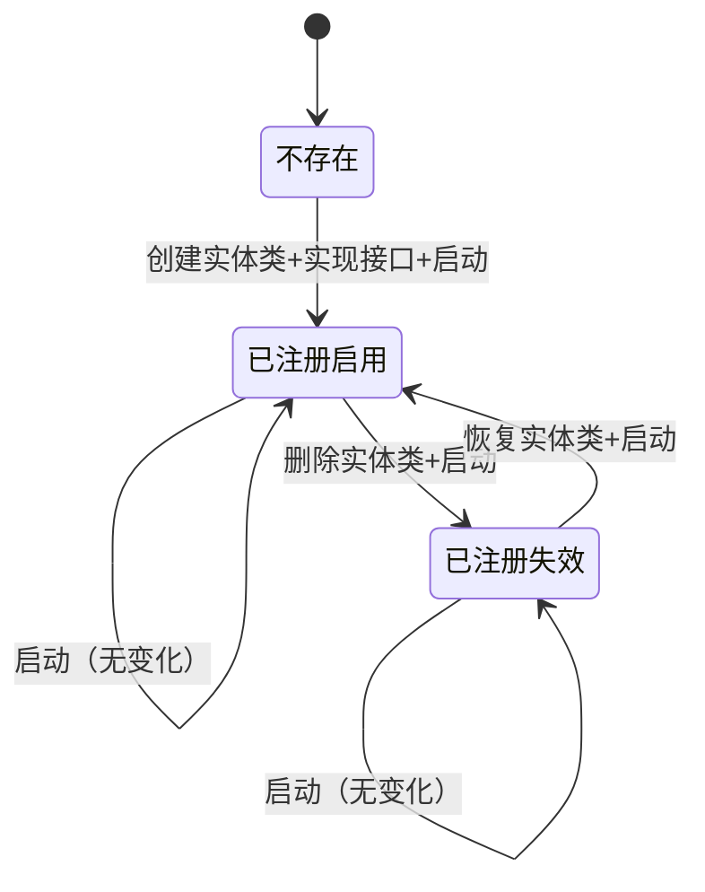

# 实体元数据自动注册机制

## 🎯 设计思想

实体自己声明元数据，系统启动时自动注册，无需手工维护预置脚本。

---

## 🔄 完整生命周期

### 场景1：新增实体（Product）

```csharp
// 1. 创建Product实体类
public class Product : IEntityMetadataProvider
{
    public int Id { get; set; }
    public string Name { get; set; }
    
    // ⭐ 实现静态接口
    public static EntityMetadata GetMetadata()
    {
        return new EntityMetadata
        {
            EntityType = "product",
            DisplayNameKey = "ENTITY_PRODUCT",
            ApiEndpoint = "/api/products",
            IsRootEntity = true,
            IsEnabled = true,
            Order = 2,
            Icon = "shopping",
            Category = "sales"
        };
    }
}

// 2. 系统启动
启动 → AutoRegisterEntityMetadataAsync()
     → 反射扫描：找到Product类
     → 调用Product.GetMetadata()
     → 检查数据库：不存在
     → INSERT INTO EntityMetadata (...)
     → ✅ 输出："✓ Registered: product (ENTITY_PRODUCT)"

// 3. 结果
EntityMetadata表新增1条记录：
| EntityType | IsEnabled | UpdatedAt |
|------------|-----------|-----------|
| product    | true      | NULL      |
```

---

### 场景2：删除实体（移除Product类）

```csharp
// 1. 删除Product.cs文件（或移除IEntityMetadataProvider实现）

// 2. 系统启动
启动 → AutoRegisterEntityMetadataAsync()
     → 步骤1：反射扫描
         只找到Customer类（Product已删除）
         validEntityTypeNames = ["customer"]
     → 步骤2：反向验证
         查询数据库：[customer, product]
         检查product：不在validEntityTypeNames中
         → UPDATE EntityMetadata 
            SET IsEnabled = false, UpdatedAt = NOW()
            WHERE EntityType = 'product'
     → ✅ 输出："✗ Disabled (entity not found): product"

// 3. 结果
EntityMetadata表：
| EntityType | IsEnabled | UpdatedAt        |
|------------|-----------|------------------|
| customer   | true      | NULL             |
| product    | false     | 2025-11-05 19:30 | ← 自动失效
```

---

### 场景3：恢复实体（重新添加Product类）

```csharp
// 1. 恢复Product.cs（实现IEntityMetadataProvider）

// 2. 系统启动
启动 → AutoRegisterEntityMetadataAsync()
     → 步骤1：反射扫描
         找到Customer和Product类
         调用Product.GetMetadata()
         检查数据库：已存在但IsEnabled=false
         → UPDATE EntityMetadata 
            SET IsEnabled = true, UpdatedAt = NOW()
            WHERE EntityType = 'product'
     → ✅ 输出："✓ Re-enabled: product"

// 3. 结果
EntityMetadata表：
| EntityType | IsEnabled | UpdatedAt        |
|------------|-----------|------------------|
| customer   | true      | NULL             |
| product    | true      | 2025-11-05 19:35 | ← 重新启用
```

---

### 场景4：手动禁用实体

```sql
-- 管理员手动禁用customer（如：维护中）
UPDATE "EntityMetadata" 
SET "IsEnabled" = false, "UpdatedAt" = NOW()
WHERE "EntityType" = 'customer';

-- 系统启动后
启动 → AutoRegisterEntityMetadataAsync()
     → 步骤1：扫描到Customer类
         检查数据库：已存在但IsEnabled=false
         → UPDATE EntityMetadata 
            SET IsEnabled = true, UpdatedAt = NOW()
     → ✅ 输出："✓ Re-enabled: customer"

-- 结果：自动重新启用
-- 如果管理员想持久禁用，应该在代码中设置：
public static EntityMetadata GetMetadata()
{
    return new EntityMetadata
    {
        EntityType = "customer",
        IsEnabled = false,  // ⭐ 在代码中控制
        ...
    };
}
```

---

## 🏗️ 三种状态转换

```
┌─────────────────────────────────────────────────┐
│                EntityMetadata状态                │
└─────────────────────────────────────────────────┘

状态1: 不存在
  ↓ 创建实体类并实现IEntityMetadataProvider
状态2: 已注册且启用（IsEnabled=true）
  ↓ 删除实体类或移除接口实现
状态3: 已注册但失效（IsEnabled=false）
  ↓ 恢复实体类并实现接口
状态2: 已注册且启用（IsEnabled=true）
```

**关键原则**：
- ✅ **不删除记录** - 保留历史，便于追溯
- ✅ **失效而非删除** - IsEnabled=false
- ✅ **自动恢复** - 实体类恢复后自动重新启用
- ✅ **保持用户修改** - 已存在的记录不更新（Order、Icon等用户可能修改的字段）

---

## 📊 双向同步流程

### 正向注册（代码 → 数据库）

```
扫描程序集
  → 找到实现IEntityMetadataProvider的类
  → 调用GetMetadata()
  → 检查数据库
     ├─ 不存在 → INSERT（新增）
     ├─ 已存在但禁用 → UPDATE IsEnabled=true（重新启用）
     └─ 已存在且启用 → SKIP（保持）
```

### 反向验证（数据库 → 代码）

```
查询数据库所有记录
  → 检查每条记录的EntityType
     ├─ 对应实体类存在且实现接口 → SKIP（有效）
     └─ 对应实体类不存在或未实现接口 → UPDATE IsEnabled=false（失效）
```

---

## 🧪 测试场景

### 测试1：完整生命周期

```bash
# 初始状态
EntityMetadata表：空

# 启动1：自动注册customer
dotnet run --project src/BobCrm.Api
# 输出：
# [EntityMetadata] Found 1 entity types
# [EntityMetadata] ✓ Registered: customer
# 
# 数据库：
# | customer | true | NULL |

# 创建Product.cs并实现接口，重启
dotnet run --project src/BobCrm.Api
# 输出：
# [EntityMetadata] Found 2 entity types
# [EntityMetadata] - Already exists: customer
# [EntityMetadata] ✓ Registered: product
# 
# 数据库：
# | customer | true  | NULL |
# | product  | true  | NULL |

# 删除Product.cs，重启
dotnet run --project src/BobCrm.Api
# 输出：
# [EntityMetadata] Found 1 entity types
# [EntityMetadata] - Already exists: customer
# [EntityMetadata] ✗ Disabled (entity not found): product
# 
# 数据库：
# | customer | true  | NULL           |
# | product  | false | 2025-11-05 ... | ← 自动失效

# 恢复Product.cs，重启
dotnet run --project src/BobCrm.Api
# 输出：
# [EntityMetadata] Found 2 entity types
# [EntityMetadata] - Already exists: customer
# [EntityMetadata] ✓ Re-enabled: product
# 
# 数据库：
# | customer | true | NULL           |
# | product  | true | 2025-11-05 ... | ← 重新启用
```

---

## 💡 关键代码

### 正向注册逻辑（第686-707行）

```csharp
var existing = await db.Set<EntityMetadata>()
    .FirstOrDefaultAsync(e => e.EntityType == metadata.EntityType);

if (existing == null)
{
    // 情况1：不存在 → 新增
    db.Set<EntityMetadata>().Add(metadata);
    Console.WriteLine($"✓ Registered: {metadata.EntityType}");
}
else if (!existing.IsEnabled)
{
    // 情况2：已存在但失效 → 重新启用 ⭐ 这就是您说的逻辑
    existing.IsEnabled = true;
    existing.UpdatedAt = DateTime.UtcNow;
    Console.WriteLine($"✓ Re-enabled: {existing.EntityType}");
}
else
{
    // 情况3：已存在且启用 → 跳过
    Console.WriteLine($"- Already exists: {metadata.EntityType}");
}
```

### 反向验证逻辑（第726-741行）

```csharp
foreach (var registered in allRegistered)
{
    if (!validEntityTypeNames.Contains(registered.EntityType))
    {
        // 实体类不存在或未实现接口
        if (registered.IsEnabled)
        {
            // 从启用 → 失效
            registered.IsEnabled = false;
            registered.UpdatedAt = DateTime.UtcNow;
            Console.WriteLine($"✗ Disabled: {registered.EntityType}");
        }
    }
}
```

---

## 🎯 设计优势

| 场景 | 传统方式 | 自动注册方式 |
|------|---------|-------------|
| **添加新实体** | 手写SQL插入元数据 | 实现接口，自动注册 ✅ |
| **删除实体** | 手动禁用或删除记录 | 自动失效，保留记录 ✅ |
| **恢复实体** | 手写SQL重新启用 | 自动重新启用 ✅ |
| **同步检查** | 手工对比 | 每次启动自动验证 ✅ |
| **可追溯性** | 记录可能丢失 | UpdatedAt时间戳 ✅ |

---

## 📋 状态机图



---

## ✅ 总结

您的建议已完整实现！

**正向注册**：
- ✅ 新实体 → 自动INSERT
- ✅ 失效实体恢复 → 自动UPDATE IsEnabled=true ⭐

**反向验证**：
- ✅ 实体类删除 → 自动UPDATE IsEnabled=false
- ✅ 保留记录不删除

**完整的双向同步机制，零手工维护！** 🚀

