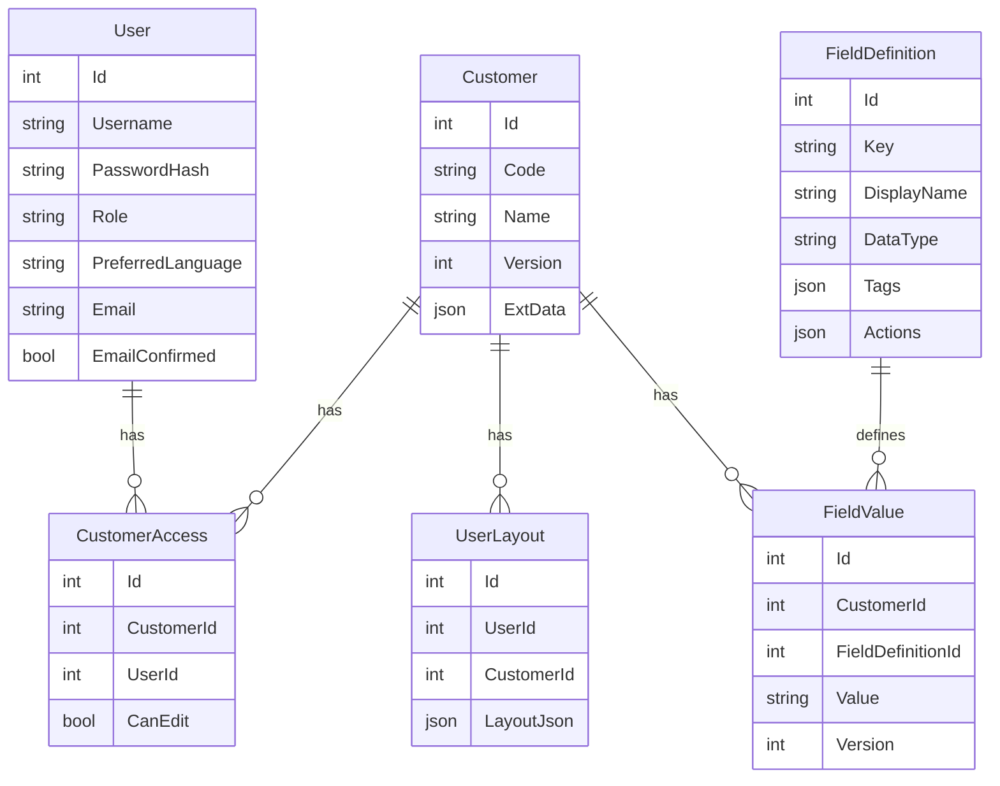

# 客户信息管理系统设计文档（核心需求）

> 本文件为核心需求文档，作为唯一权威来源。任何需求变更请先更新本文件，再据此调整开发与测试。

## 版本与决策（v0.2）

- 表单设计器（由简至难）
  - 所有可见组件可拖拽；提供组件工具栏（容器 Frame/Grid、ListBox、标签、文本框、表格等）。
  - 明确自由布局与流式布局在不同容器中的支持；除严格结构化数据外尽量避免表格布局。
  - 输出 LayoutJson（兼容 UserLayout/模板），运行态按 LayoutJson 渲染 Ant Design 组件。
- 认证从最小 JWT 迁移到 Identity + JWT
  - 支持注册、邮件激活、登录、登出、刷新令牌、会话重连（服务器重启不掉线）。
  - 采用 ASP.NET Identity + JWT（Access/Refresh）；DataProtection Key 持久化；SMTP 可配置。
- 数据库：以 PostgreSQL 为主，保留 SQLite 最小模式
  - Provider：`postgres`（JSONB 原生支持）/`sqlite`（本地开发）。
  - 支持通过配置切换 Provider 与连接串；后续提供管理员页面进行连接管理与校验。
  - 分层：持久化层（EF Core 多 Provider）/通用业务实体层/商用业务实体层；动态字段 JSONB + 反射式映射。

---

## 目标与范围

- 目标：构建一套以“前端可用性为中心”的客户信息管理系统，支持动态字段、布局设计、权限与国际化，逐步迭代。
- 运行模式：最小可运行（任何时刻可启动）、严格按文档实现，不越权扩展。

### 页面架构与职责分离（v0.5 重构，2025-11-05）

**❌ 错误的旧设计（已废弃）**：
- ~~将设计器、数据浏览、数据编辑混在一个组件中~~
- ~~通过ViewMode枚举在三种模式间切换~~
- ~~CustomerDetail.razor承担所有职责（2500+行）~~

**✅ 正确的新架构（单一职责原则）**：

#### 1. **FormDesigner.razor** - 通用表单设计器（452行）
- **职责**：纯粹的布局设计，不依赖任何实体
- **功能**：拖拽Widget、编辑属性、保存布局JSON
- **数据源**：从FieldDefinitions API加载可用字段（不依赖具体实体数据）
- **路由**：`/designer` 或 `/designer/{templateId}`
- **用户**：管理员/表单设计师

#### 2. **PageLoader.razor** - 通用页面加载器（430行）
- **职责**：根据模板动态加载和渲染实体数据
- **功能**：
  - 加载实体数据（从 `/api/{entityType}s/{id}`）
  - 加载布局模板（从 `/api/layout/...`）
  - 渲染运行态表单（Browse模式：只读，Edit模式：可编辑）
- **路由**：`/{entityType}/{id}` (如 `/customer/1`, `/product/2`)
- **用户**：普通用户

#### 3. **Profile.razor** - 个人中心页面（318行，v0.5.4新增）
- **职责**：用户个人信息管理
- **功能**：
  - 显示用户信息（用户名、邮箱、角色）
  - 渐变色圆形头像显示（默认图标，支持未来上传）
  - 密码修改表单（带前端验证）
  - 状态消息提示（成功/警告/错误）
- **路由**：`/profile`
- **用户**：所有已登录用户
- **特点**：与系统设置分离，专注用户个人相关功能

#### 4. **AppHeader.razor** - 应用头部组件（改进，v0.5.4）
- **职责**：顶部导航栏和用户区域
- **功能**：
  - 导航菜单（系统设置、模板管理）
  - 用户区域（已登录）：头像 + 用户名（可点击跳转个人中心）+ 退出按钮
  - 用户区域（未登录）：登录按钮
  - 响应式悬停效果和动画
- **特点**：根据登录状态动态渲染UI

#### 5. **模板元数据（FormTemplate模型）**
```csharp
class FormTemplate {
    string TemplateId;      // 模板ID
    string EntityType;      // 声明针对哪个实体（customer/product/order）
    string EntityApi;       // 数据API端点
    string? SiderComponent; // 侧边栏组件名（可选）
    string? LayoutJson;     // Widget布局
}
```

#### 6. **容器设计态渲染器（v0.5.5 重构，2025-11-06）**

**❌ 重构前的问题**：
- 所有容器的设计态渲染逻辑都集中在 `FormDesigner.razor` 中
- 160+ 行的 `if-else` 判断容器类型
- 违反开闭原则（添加新容器需修改 FormDesigner）
- 职责不清（设计器逻辑 + 渲染细节混在一起）

**✅ 重构后的架构**：
- **目录结构**：`Components/Designer/ContainerRenderers/`
  - `GridDesignRenderer.razor` - Grid 容器渲染器
  - `PanelDesignRenderer.razor` - Panel 容器渲染器
  - `SectionDesignRenderer.razor` - Section 容器渲染器
  - `FrameDesignRenderer.razor` - Frame 容器渲染器
  - `TabContainerDesignRenderer.razor` - TabContainer 容器渲染器
  - `GenericContainerDesignRenderer.razor` - 通用容器渲染器

- **设计原则**：
  - ✅ **职责分离** - 每个容器的设计态渲染逻辑独立在自己的 Razor 组件中
  - ✅ **开闭原则** - 添加新容器只需创建新文件，无需修改 FormDesigner
  - ✅ **单一职责** - FormDesigner 负责协调，渲染器组件负责视觉呈现
  - ✅ **可测试性** - 每个渲染器可独立测试

- **统一接口**：所有渲染器组件都遵循相同的参数模式
  ```csharp
  [Parameter] public XXXWidget Container { get; set; }
  [Parameter] public RenderFragment<DraggableWidget> RenderChild { get; set; }
  [Parameter] public EventCallback<DragEventArgs> OnDrop { get; set; }
  [Parameter] public EventCallback<DragEventArgs> OnDragOver { get; set; }
  ```

- **调用方式**：在 FormDesigner 中使用 `switch` 语句
  ```csharp
  switch (container) {
      case GridWidget grid:
          <GridDesignRenderer Grid="@grid" RenderChild="@RenderDesignWidget" ... />
          break;
      // ... 其他容器类型 ...
  }
  ```

- **重构成果**：
  - FormDesigner.razor 减少 ~150 行代码
  - 每个容器类型的渲染逻辑独立维护
  - 架构与运行态渲染器保持一致（都是组件化）

**核心原则**：
- ✅ **设计器与实体解耦** - FormDesigner不知道设计的是什么实体
- ✅ **渲染器与实体解耦** - PageLoader通过EntityType参数动态加载任何实体
- ✅ **单一职责** - 设计是设计，渲染是渲染，完全分离
- ✅ **高度复用** - 一个FormDesigner、一个PageLoader支持所有实体类型
- ✅ **组件化渲染** - 设计态和运行态都采用组件化架构，职责清晰

## 架构与技术栈

- 前端：Blazor Server + Ant Design Blazor（组件、消息、布局）。
- 后端：ASP.NET Core、Minimal API/Controller 混合；ASP.NET Identity + JWT。
- 数据库：PostgreSQL（主）/SQLite（最小）；EF Core。
- 国际化：资源表 `LocalizationResource` + UI 语言切换。

## 平台一致性原则（v0.3 更新）

为避免“各自实现各自的行为”造成的长期分叉，平台在交互、布局、数据持久化与鉴权等方面制定以下强约束：

- 单一渲染宿主：所有可视控件统一由 `WidgetHost` 渲染，页面不得手写 wrapper/句柄/样式拼装/原生拖拽处理。
- 分层继承模型：控件能力通过接口与基类抽象（`IResizable`/`IFlowSized`/`IAbsolutePositioned` → `DraggableWidget` → 具体控件/容器）。
- 页面即容器：空画布被视为“根容器”，其宽度用于百分比换算基准；获取失败按“画布引用 → 合理选择器 → 1200px”多级兜底。
- 容器即分块（Block）：支持多个自定义块（容器），块具备独立样式与布局属性（背景/边距/对齐/宽高单位等），并通过 `ContainerLayoutOptions` 统一承载，避免下层控件重复。
- 读写一致：布局数据只通过 `LayoutMapper` 读写，强制输出/解析 `Width/WidthUnit/Height/HeightUnit`，为旧数据保留 `w` 兼容。
- 实时交互：调整大小在拖动过程中实时变更尺寸（非 mouseup 才生效）；右侧手柄仅改变 X 方向，锁定 Y。
- 全局鉴权处理：统一订阅 `AuthService.OnUnauthorized`，触发后导航到 `/login` 并清理本地令牌；各页面首渲染主动 `EnsureAuthenticatedAsync()` 降低并发 401 竞态。

## 分层实体模型与职责边界

- 目标：实体按职能分三层，解耦业务、通用能力与持久化，所有 CRUD 仅由持久化层执行。
- 层次划分：
  1) 通用持久化实体层（Persistence）
     - 内容：MDD 映射、仓储接口与实现（IRepository/ISpecification/IQueryService）、Unit of Work、多 Provider 屏蔽、JSONB 映射与反射型字段处理。
     - 边界：唯一接触数据库；对上仅暴露接口与 DTO；可实现审计落盘策略与并发控制。
  2) 公共业务实体层（Domain.Common）
     - 内容：通用属性与行为（CreatedAt/UpdatedAt/CreatedBy/Version/ConcurrencyStamp/IsDeleted 等），领域基类与校验；不直接访问 Db，依赖持久化接口。
  3) 业务实体层（Domain.Business）
     - 内容：Customer/FieldDefinition/FieldValue/UserLayout/CustomerAccess/LocalizationResource 等业务属性与动作；不关心存储细节，仅通过接口完成 CRUD。
- 设计规则：
  - API 层不引用 EF Core；通过仓储接口访问数据。
  - 动态字段：在持久化层完成 JSON(B) <-> 领域对象的转换；PostgreSQL 下使用 jsonb 列与路径索引。
  - 审计与版本：Domain.Common 提供行为；持久化层通过拦截器/SaveChanges 钩子自动赋值；版本用于乐观并发。

### 校验分层与状态机
- 校验分层：
  - 业务层（Domain.Business）校验领域不变式、场景规则；
  - 通用层（Domain.Common）校验通用约束（必填/长度/版本/并发/软删等）；
  - 持久化层（Persistence）校验存储约束（唯一/存在/外键/Provider 限制）。
- 校验顺序与短路：Business → Common → Persistence；任何一层失败即中断并返回统一错误结果。
- 统一错误模型：`{ code, message, details?: [{ field, code, message }] }`，便于前端呈现与自动化测试。
- 状态机：实体可声明状态与迁移图；
  - 钩子：BeforeTransition/AfterTransition（业务层）、BeforePersist/AfterPersist（通用/持久化层）。
  - 事件：AfterCommit 发布领域事件（支持订阅异步处理）；演进方向为 Outbox 保证一致性。

### 乐观并发与版本
- `Customer.Version` 代表聚合版本，每次成功写入递增 1。
- 客户端可在写入时携带 `expectedVersion` 实现乐观并发；当与当前版本不一致时返回 409（`ConcurrencyConflict`）。
- 错误细节包含字段 `version`，便于前端提示“数据已变更，请刷新后重试或合并”。

## 元数据管理与扩展策略（统一）

- 元数据存储：`FieldDefinition` 作为唯一权威，字段 Key、显示名、数据类型、标签、动作，以及（建议扩展）校验与默认值等以 JSON 保存：
  - 扩展字段（建议）：`Required`、`DefaultValue`、`Validation`（如 Regex/Min/Max）、`Group`、`Order`、`Deprecated`、`SchemaVersion`。
  - 定义演进遵循“前向兼容”：
    - 新增字段：不影响既有数据，按默认值/空值处理；前端按定义渲染控件并校验。
    - 修改字段（同类型）：按新规则校验渲染；必要时提供后台“回填/规范化”任务。
    - 修改数据类型：需定义迁移策略（如 string→email 仅校验；string→number 提供转换规则）；无策略时不允许直接变更。
    - 废弃字段：定义 `Deprecated=true`，前端隐藏编辑入口但保留读取；后续可提供清理任务。
- 读写一致性：
  - 读：由 FieldDefinition + 最新 FieldValue 合成视图；未知字段保持透传（不丢弃）。
  - 写：根据 FieldDefinition 执行分层校验（Business→Common→Persistence），通过后才写入 JSONB。
- 索引与查询：
  - JSONB 路径索引用于典型查询（如 email、rds.ip）；提供模板与自动建索引脚本（开发阶段已在启动时 best‑effort 创建）。

## 开发期数据库初始化

- 不使用复杂迁移，开发阶段采用“可重建”的初始化逻辑：
  - 启动时自动 Ensure/Migrate + 种子数据 + JSONB 索引（幂等）。
  - 管理端点（开发期）：
    - GET `/api/admin/db/health`：返回 provider、连接可用性与各表记录数。
    - POST `/api/admin/db/recreate`：删除并重建数据库，重新种子与索引。
  - 生产阶段再转向标准迁移脚本与升级策略。

### 推进细化（D3.x）
- D3.1：定义接口 IValidatable、IStateful、IDomainEvent、IRepository、IUnitOfWork；落地基础抽象与校验结果模型。
- D3.2：把查询改用仓储/查询器；接入分层校验管道，API 统一错误输出。
- D3.3：写入路径走 UoW，启用版本/并发与典型状态机（如 UserLayout Draft/Published）。
- D3.4：领域事件 AfterCommit + 事件聚合器；必要时加入 Outbox。

### 推进与阶段
- D3.1 分层脚手架与契约：抽象仓储/查询/UoW 接口，引入基础实体（审计/版本），API 通过接口访问（适配现有实现）。
- D3.2 读路径迁移：Customers/Fields/Layout 的查询走查询器/规格模式；提供 JSONB 路径索引脚本与示例。
- D3.3 写路径迁移：PUT/POST 改为 UoW+仓储提交；完善审计与版本；增加并发检测。
- D3.4 清理直连：移除 DbContext 直连，完善测试与文档。

## 表单设计器（v0.5 架构重构）

### 架构设计原则

**核心思想**：设计器是通用的工具，不依赖具体实体。

#### **FormDesigner.razor** - 通用表单设计器

**文件位置**：`src/BobCrm.App/Components/Pages/FormDesigner.razor`

**三大区域**：
1. **左侧工具箱（Toolbox）** - 显示所有可用Widget，支持拖拽
2. **中央画布（Canvas）** - 拖放Widget、调整布局、预览效果
3. **右侧属性面板（Properties）** - 编辑选中Widget的属性

**数据流**：
```
启动 → 加载FieldDefinitions (/api/fields)
     → 显示可用字段列表（不依赖具体实体数据）
     → 用户拖拽Widget并绑定DataField
     → 保存布局JSON到UserLayouts表
```

**与旧设计的区别**：
- ❌ 旧：在CustomerDetail中切换到Design模式，耦合客户数据
- ✅ 新：独立的FormDesigner页面，从FieldDefinitions加载字段

### 组件与工具栏

**当前支持的Widget（v0.5.2，2025-11-05）**：

**基础组件（10个）**：
1. ✅ **TextBox** - 文本框（单行输入）
2. ✅ **Number** - 数字框（支持步长、小数、千分位）
3. ✅ **Select** - 下拉选择（单选、支持搜索）
4. ✅ **Checkbox** - 复选框（单个或复选框组，支持按钮样式） ⭐ v0.5.2新增
5. ✅ **Radio** - 单选按钮组（支持按钮样式） ⭐ v0.5.2新增
6. ✅ **Textarea** - 多行文本（支持自动高度）
7. ✅ **Calendar** - 日期选择器
8. ✅ **Listbox** - 列表框（多选支持）
9. ✅ **Button** - 按钮（支持动作绑定）
10. ✅ **Label** - 标签（纯文本显示）

**布局组件（5个）**：
11. ✅ **Section** - 分组容器（可折叠、有标题）
12. ✅ **Panel** - 面板容器（支持标题和边框）
13. ✅ **Grid** - 网格布局（N列等分）
14. ✅ **Frame** - 框架容器（自由/流式布局）
15. ✅ **TabContainer** - 标签页容器（包含多个Tab）

**内部组件（1个）**：
16. ✅ **Tab** - 单个标签页（TabContainer的子项）

**工具栏功能**：
- ✅ 组件分类（基础组件/布局组件）
- ✅ 拖拽添加到画布
- ✅ 属性编辑（通用属性 + 组件特性）
- ✅ 删除/复制组件
- ✅ 模板属性编辑（名称、实体类型）⭐ v0.5.2新增

**通用UI组件（Shared Components，v0.5.3新增）**：
- ✅ **EntitySelector** - 通用实体选择器
  - **功能**：输入框 + 放大镜图标，点击打开Modal选择实体
  - **特性**：泛型支持、懒加载、搜索过滤、自定义渲染（图标/标题/描述/元数据）
  - **接口约束**：`ISelectableEntity`（确保实体提供 Value/DisplayName/Description/Icon）
  - **使用场景**：FormDesigner选择实体类型、未来可用于选择客户/产品等任何实体
  - **优势**：避免 AntDesign Select 组件的动态选项渲染问题，提供更美观的选择界面

### 布局模式与支持矩阵（简）
- 自由布局：绝对定位（x,y,w,h）；对齐/吸附/网格线。
- 流式布局：Flex/Grid 响应式；跨列/顺序。
- 示意：Frame 支持自由/流式；Grid 仅流式；输入类遵循容器模式。

### 数据结构（LayoutJson）
```
{
  "version": 1,
  "nodes": [
    { "id": "n1", "type": "Frame", "layout": { "mode": "free", "x":10, "y":10, "w":400, "h":200 }, "props": { "title":"基本信息" }, "children": [
      { "id":"n2", "type":"TextBox", "props": { "label":"名称", "field":"name" }, "layout": { "mode":"free", "x":20, "y":20, "w":200, "h":32 } }
    ]}
  ],
  "metadata": { "owner": 1, "tags": ["customer"] }
}
```

### 设计与运行闭环
- 设计态：拖拽 → 属性编辑 → 生成并保存 LayoutJson（模板或 UserLayout）。
- 运行态：按 LayoutJson 渲染；字段绑定依据 `FieldDefinition` + `FieldValue`；动作由 `actions` 驱动。

## 认证与会话

### 能力
- 注册（邮件激活）、登录/登出、刷新令牌、会话重连（服务器重启不丢状态）。

### 方案
- ASP.NET Identity + JWT（Access/Refresh）。
- RefreshToken 持久化表（支持撤销/轮换）；DataProtection Key 持久化。
- SMTP 配置：服务器、端口、凭据、发件人；模板化邮件。

## 数据库与持久化

### Provider 与配置
- 主推：PostgreSQL（JSONB 查询/索引、并发控制）。
- 最小：SQLite（开发与本地验证）。
- 切换（API）：`Db:Provider=postgres|sqlite`，`ConnectionStrings:Default=...`。
- 本地测试建议：使用 `docker-compose.yml` 启动 `postgres:16-alpine`（默认暴露 5432），一次配置多端复用。
- `AppSettings:Db:ConnectionString`：对应连接串
- 管理页（后续）：管理员可更新并校验连接；写入安全配置存储。

### 动态字段与查询
- `FieldValue.Value` 使用 JSON/JSONB 存储；
- PostgreSQL：JSONB 索引 + 路径查询；
- 通用实体层提供“属性映射器”以反射生成常用字段映射（可选）。

## ER 模型（Mermaid）



## 用户偏好设置与持久化

### 设计目标
确保用户的个性化设置（主题色、语言、布局等）在会话间保持一致，避免每次操作后重置。

### 持久化策略

#### 1. 客户端持久化（LocalStorage）
- **用途**: 快速应用、离线可用、减少API调用
- **存储内容**:
  - `theme`: 主题模式（light/dark）
  - `primary`: 主题色（#3f7cff等）
  - `lang`: 语言（zh/ja/en）
- **生命周期**: 浏览器本地永久保存，除非用户清除
- **应用时机**:
  - 页面加载立即应用（HTML解析前）
  - 用户修改后立即保存并应用
  - 避免在Blazor重渲染时重置

#### 2. 服务端持久化（UserPreferences表）
- **用途**: 跨设备同步、权威数据源
- **数据模型**:
```csharp
public class UserPreferences
{
    public int Id { get; set; }
    public string UserId { get; set; }
    public string? Theme { get; set; } = "light";
    public string? PrimaryColor { get; set; } = "#3f7cff";
    public string? Language { get; set; } = "ja";
    public DateTime? UpdatedAt { get; set; }
}
```

- **接口设计**:
  - `GET /api/user/preferences` - 获取当前用户偏好
  - `PUT /api/user/preferences` - 更新用户偏好
  - Body: `{ theme?, primaryColor?, language? }`

#### 3. 同步策略
- **读取优先级**: LocalStorage > API > 默认值
- **写入流程**:
  1. 用户修改设置
  2. 立即写入LocalStorage（快速响应）
  3. 异步调用API保存到服务端
  4. API保存失败不影响用户体验（已写入LocalStorage）
- **登录时同步**:
  1. 用户登录后从API获取偏好
  2. 合并到LocalStorage（服务端优先）
  3. 应用最终设置

### 主题应用时机控制

**避免频繁重置的关键措施**:
1. **立即执行脚本**: 在HTML解析前从LocalStorage读取并应用
2. **单次初始化**: DOMContentLoaded时仅初始化一次
3. **移除MutationObserver**: 不再监听DOM变化触发重置
4. **工具栏初始化**: 使用interval轮询，成功后立即停止
5. **Blazor渲染隔离**: 主题设置在document.documentElement级别，不受组件重渲染影响

### 布局模板持久化（后续完善）
- **UserLayout表**: 保存用户自定义布局
- **作用域**:
  - user: 个人布局
  - default: 默认模板（管理员设置）
- **加载优先级**: 用户布局 > 默认模板 > 自动生成布局

## 非功能性
- 可运行性：任何提交可最小配置启动；未完成模块以最小实现/Mock 保活。
- 质量：每次修改均需构建与测试（如适用）通过后提交；`main` 随时可运行。
- 安全：生产密钥与连接串管理；最小权限；审计基本操作日志（后续）。
 - Mock 策略：前端可用性优先，允许只读 Mock 兜底；目标接口完成并有测试数据后删除 Mock，避免多源导致缺陷。
 - 端口与配置：后端可自定端口；默认 API 端口 8080；前端通过配置 `Api:BaseUrl` 指向 API。

---

## 标签驱动的快速布局（新增）

- 背景：为提升布局设计效率，允许通过“标签”快速生成布局初稿，再由人工微调排序/宽度/位置并保存为用户或默认模板。
- 标签来源：`FieldDefinition.Tags`（JSON 数组）。为空或非法 JSON 的字段不参与匹配。后续可扩展 AI 自动打标。
- 生成规则：
  - 输入：一组标签（取并集）与布局模式（`flow|free`）。
  - 输出：布局 JSON。
    - 流式：匹配标签的字段排在前方，未匹配的字段排在后方；默认宽度 `w=6`，`{ mode: "flow", items: { key:{order,w} } }`。
    - 自由：按 12 列网格顺序铺排，默认 `w=3,h=1`；`{ mode: "free", items: { key:{x,y,w,h} } }`。
  - 保存：同一接口支持仅返回布局，或保存为“用户/默认模板”（默认模板需管理员权限）。
- 后端接口：
  - 标签列表：`GET /api/fields/tags` → `[{ tag, count }]`（统计含该标签的字段数量）。
  - 生成布局：`POST /api/layout/generate`，Body：`{ tags:[], mode:"flow|free", save?:true, scope?:"user|default" }`。
- 前端交互（现状）：
  - 设计态提供“标签候选区”，支持拖入画布或点击应用，自动生成流式布局并可继续人工调整与保存。

---

## 前端控件体系与宿主模式（新增，v0.3）

为避免“各页面各自实现交互”导致的行为分叉，前端控件体系采用分层继承 + 宿主渲染的统一模式：

- 能力抽象（接口）
  - `IResizable`：调整大小（Start/Drag/End）
  - `IFlowSized`：流式布局的 Width/WidthUnit/Height/HeightUnit/NewLine
  - `IAbsolutePositioned`：自由布局的 X/Y/W/H/ZIndex
  -（可选）`ISelectable`/`IVisibility`：选中/可见标记（字段）

- 基类实现
  - `DraggableWidget : IResizable, IFlowSized, IAbsolutePositioned`
    - 在 `OnResize` 内实现百分比/像素的宽度计算；当容器宽度为 0 时使用 1200px 兜底，确保“拖得动”。
    - 不在页面层重复实现 resize 逻辑。

- 容器与子项
  - `ContainerWidget : DraggableWidget` 仅增加 `Children` 与 `ContainerLayoutOptions`（容器内布局：direction/wrap/gap/justify/alignItems）。
  - 所有子项与根画布下一致地由宿主渲染（见下），放入任何容器后天然拥有与根下一致的“选中/调整大小/样式”能力。

- 页面与容器（Block）
  - 页面空画布被视为根容器，参与“就近容器宽度”计算；百分比模式基于根容器宽度进行换算。
  - 自定义块（Section/Block）采用容器控件表达：
    - 样式：`background/color/border/shadow/borderRadius/padding/margin`
    - 对齐：`alignSelf/justifySelf`（对块本身在父容器内），`textAlign`/`contentAlign`（块内容）
    - 尺寸单位：支持 `px/%`，与 `Width/Height` 一并持久化。
  - 以上样式均归属于 `ContainerLayoutOptions` 或容器 Props，而非散落在子控件。

- 宿主组件（统一渲染入口）
  - 引入 `WidgetHost` 组件（Blazor）：
    - 负责统一的包裹结构（wrapper）、点击选中命中、样式拼装（来自 `LayoutOptions.GetCssStyle()`）、右侧 resize 句柄与 `dragManager` 的事件对接。
    - 统一关闭原生 Drag 干扰：
      - 句柄：`draggable=false`、`@onmousedown:preventDefault`、`@onmousedown:stopPropagation`、`@ondragstart:preventDefault`；
      - resize 会话中暂时关闭 wrapper 的 `draggable`；
      - 内层“演示内容”统一 `pointer-events:none`，保证点击命中 wrapper。
    - 选中命中规则：点击优先命中宿主 wrapper，避免命中子元素（如标签/图标）；组合控件整体被视为一个“可选中单元”。
    - 轴向约束：右侧手柄为横向调整（X 变化），锁定 Y 坐标不变；必要时提供底边/四角句柄，遵循相同约束策略。
    - `OnResizeDrag` 中直接修改 `Widget.Width/Height` 后 `StateHasChanged()`，确保拖动即实时变化（非 mouseup 后才变化）。
  - 页面层（FormDesigner）通过统一的渲染服务（DesignRenderer/RuntimeRenderer）渲染Widget，避免手写样式拼装。

- 样式与布局结算
  - “项级样式”统一由 `LayoutOptions.GetCssStyle()` 生成；页面/宿主只叠加 UI 增量（选中态边框、阴影、z-index）。

- DropZone 与就近容器宽度
  - 容器组件暴露 `<DropZone>`：负责获取插入索引（`getInsertIndex`）并提供“就近父容器宽度”给宿主作为百分比换算基准（失败回退 canvasRef/selector/1200）。

### 布局 JSON 读写约定（抽象收敛）

- 序列化（保存）：一律同时输出 `Width/WidthUnit/Height/HeightUnit`；为兼容旧数据保留 `w`（1–12 列）。
- 反序列化（加载）：`LayoutMapper` 优先读取新字段，缺失时使用 `w` 推导；如果存在 `Width` 但缺 `WidthUnit`，默认 `px`；仅 legacy `w` 路径默认 `%`。
- 扩展属性：统一落在 `ExtendedProperties`，属性面板按类型对其进行编辑。

#### 持久化快照策略（v0.3.2）

- 保存为“全量快照”，不做增量合并：每次保存重建整棵树（顶层 + 任意层 `children`），服务器端直接覆盖旧 JSON；避免部分调整无法回放。
- 键与标识：
  - 顶层 `items` 仍采用对象形式以兼容历史；键值 `key = DataField | Id`（字段控件优先使用字段键；非字段控件使用 Id）；
  - 每个节点必须同时写入 `id` 与 `dataField`（如有），加载优先使用节点内的 `dataField`，否则回退为 `key`；
  - 运行时选择以 `id` 作为稳定标识；`key` 仅用于历史兼容与排序。
- 字段完整性（每节点必写）：`Type, Label, Visible, Width, WidthUnit, Height, HeightUnit, NewLine, id, dataField? (如有)`；容器额外写 `children`（递归）。
- 读取兼容：
  - 若存在 `Width` 但缺 `WidthUnit`，默认 `px`；仅 legacy `w` 路径默认 `%`；
  - 若缺 `dataField` 且 `key` 恰好是字段名，则赋值给 `DataField`；否则保持为空。
- 保存后回放校验：
  - 客户端保存成功后立即重新 GET 并渲染（一次 Round-Trip 验证），如不一致打印摘要日志（不阻断用户）。

#### 容器子项持久化（Children，补充 v0.3.1）

- 目标：保证容器型控件（Frame/Section/Tabs/Grid 等）内的子控件结构可完整保存与回放，避免“设计器能看到，运行页空白”。
- JSON 结构：
  - 顶层 `items.{key}` 内可选 `children: []` 数组；每个元素与顶层项同构（可递归），字段遵循相同映射规则（`Width/WidthUnit/…/Visible/NewLine/extended`）。
  - 读取：`LayoutMapper` 已支持 `Children/children` 的解析为 `FrameWidget`/`SectionWidget` 的 `Children` 列表（递归）。
  - 写入：设计器保存时应对容器执行递归写入，确保所有子项被包含在 `children` 中。
- 设计器与页面：
- 设计器页面的保存逻辑与运行页的保存逻辑保持一致（递归 children）；
- 页面回放时按 `children` 还原容器内容；缺省无 `children` 时容器为空但仍渲染外框（如有），不应报错。
- 设计态渲染由统一的 Renderer 层负责（`DesignWidgetContentRenderer` 处理叶子控件、`DesignContainerRenderer` 负责容器与 Tab 结构），页面仅负责传入事件与上下文，便于在运行态沿用同一套渲染逻辑。
- 客户详情页面的设计模式已复用上述渲染管线，并通过 `WidgetRegistry` 提供一致的工具栏配置。
- 运行态渲染引入 `RuntimeWidgetRenderer`，负责浏览/编辑模式下的控件呈现，页面仅负责布局与数据绑定，保持设计与运行体验一致。

#### 端点与作用域（仅两级：系统默认/用户，v0.3.1）

- 仅保留“系统默认（全局唯一）/用户自定义（每用户一份）”两级模板；不再提供客户维度的模板。
- 读：`GET /api/layout?scope=effective|user|default`
  - `effective`（默认）：优先返回用户模板；若无则回退系统默认
- 写：`POST /api/layout?scope=user|default`（`default` 仅管理员）
- 兼容与迁移：
  - 旧端点 `/api/layout/customer` 可作为兼容别名保留一段时间；
  - 数据层将历史 `UserLayouts` 中 `CustomerId != 0` 的记录迁移为 `CustomerId = 0`；系统默认模板使用 `UserId="__default__"`。

### 容器嵌套与递归渲染（v0.3.1）

- 目标：容器可无限嵌套，所有层级的子容器/子控件拥有与根层一致的“选择/拖拽/调整大小/换行/样式/单位/可见性”等能力。
- JSON：
  - `items.{key}` 支持 `children: []`，数组元素与父项同构；任意深度递归。
  - 每个节点遵循相同字段：`Type/Label/Visible/Width/WidthUnit/Height/HeightUnit/NewLine/extended/children`。
- 运行时渲染：
  - 由 `WidgetHost` 递归渲染：
    - 非容器：渲染具体控件内容；
    - 容器（`ContainerWidget`）：先渲染容器自身外观（背景/边框/内边距等），然后渲染一个 `DropZone`，再对 `Children` 调用 `<WidgetHost>` 递归渲染；
    - 选中态与句柄、命中策略、pointer-events、拖拽/缩放锁轴等规则在所有层级一致。
  - “就近容器宽度”：
    - 百分比换算基于最近一层容器宽度；失败回退画布引用→选择器 `.layout-widgets-container`→1200px 基线。
- 设计器交互：
  - 拖入/移动：从工具箱或任意层级容器拖入到任意层级容器的 `DropZone`，通过 `getInsertIndex` 计算插入位置；
  - 调整大小：同一套 `dragManager` 事件流；容器内与根下一致；
  - 选择：点击命中 `WidgetHost` wrapper；不命中内部演示内容；子容器与叶子控件行为一致。
- 保存/加载：
  - 保存：对 `ContainerWidget` 递归序列化 `children`；
  - 加载：`LayoutMapper` 已支持 `Children/children` 的递归解析；新增容器类型时添加对应 `MapXXXProperties` 并兼容大小写。

#### 流式布局的换行能力（NewLine，补充）

- 目标：在 `flow` 模式下，某些控件需要“强制在新行开始”，独立于自动换行和当前宽度剩余空间。
- 数据模型：
  - `IFlowSized`/`LayoutOptions` 增加 `NewLine`（或 `NewLineBefore`）布尔字段。
  - JSON 字段名大小写不敏感，兼容 `newLine/newline/NewLine`；缺省为 `false`。
- 渲染规则：
  - 容器 `ContainerLayoutOptions` 必须开启 `flex-wrap: wrap`。
  - 若 `NewLine=true`，则在该项前插入一个“换行占位”元素（由宿主渲染）：`<div class="flow-break"></div>`。
  - `.flow-break` 样式：`flex-basis: 100%; height: 0; padding: 0; margin: 0;`，从而强制后续项换到下一行开始。
  - 该占位元素仅在设计/运行渲染树存在，不参与数据模型计数。
- 设计器行为：
  - 属性栏提供开关：`换行（强制在新行开始）`，修改后立即触发重渲染并持久化。
  - 拖动调整宽度时不改变 `NewLine`；若用户需要取消强制换行需显式关闭开关。
  - 选中命中仍由宿主 wrapper 负责，换行占位不可选中、不可拖动。
- LayoutMapper：
  - 保存：写出 `NewLine` 字段；
  - 加载：解析 `newLine/newline/NewLine`，缺省 `false`；可兼容历史 `nl`（如存在）。
- 兼容性与退化：
  - 若容器临时处于 `wrap:nowrap`（例如某些只读视图），`NewLine` 不生效但不破坏布局；
  - 旧模板无此字段时行为保持不变。

#### 尺寸单位规范与持久化（WidthUnit/HeightUnit，补充）

- 目标：所有控件的宽/高单位在设计、运行与持久化路径保持一致，避免因缺省导致回放为错误的单位（默认成百分比）。

- 单位枚举：
  - `px`、`%` 两种；字段名：`WidthUnit`、`HeightUnit`（大小写不敏感）。

- 读写规则：
  - 保存：始终写出 `Width/WidthUnit` 与（如设置了固定高）`Height/HeightUnit`，绝不依赖默认值推断；
  - 加载（优先级）：
    1) 若存在 `WidthUnit/HeightUnit` → 直接采用；
    2) 若存在 `Width`/`Height` 但缺对应 Unit → 默认 `px`；
    3) 仅 legacy `w`（1–12）存在时 → 宽度默认为 `%`（栅格→百分比），高度仍按缺省处理（通常为空或 `px`）。
  - 字段大小写：`widthUnit/widthunit/WidthUnit` 等皆可被解析。

- 设计器 UI（属性面板）：
  - 宽度：数字输入 + 单位下拉（`px`、`%`）；
  - 高度：数字输入 + 单位下拉（`px`、`%`）；未设置固定高时可留空（不显示或禁用数字框），避免在 Flow 场景强制高度；
  - 下拉选项必须固定提供，不得出现空列表；默认选中基于加载规则（上文）；
  - 切换单位时即刻应用：
    - 简化策略（默认）：仅切换解释单位，不自动换算数值；
    - 可选策略：提示是否按当前容器宽/高进行换算（`px↔%`），若确认则依“就近容器宽度/高度”换算数值。

- 渲染与交互：
  - Flow 模式：
    - 宽度：`px/%` 皆支持；百分比相对“就近容器宽度”计算（失败回退 1200px 基线）；
    - 高度：默认不固定；若显式设置则按单位输出样式；
  - 绝对模式（Free）：
    - X/Y/W/H：推荐 `px`；若 W/H 为 `%` 则相对“就近容器”计算；
  - 调整大小：
    - `px`：增量按像素累加；
    - `%`：使用 `totalDelta / containerWidth * 100`（容器宽度 0 时以 1200px 兜底）换算；
  - 样式输出：统一由 `LayoutOptions.GetCssStyle()` 负责将 `Width/Height + Unit` 拼装为内联样式或类名。

- LayoutMapper：
  - 保存：统一写入 `Width/WidthUnit/Height/HeightUnit`；与 `w` 并存（如存在）；
  - 加载：按“读写规则/优先级”解析；兼容大小写与 `w`；
  - 若遇到非法单位值，回退为 `px` 并记录一次告警日志（可选）。

- 兼容与迁移：
  - 旧模板缺少单位时，不做数据迁移也能按默认 `px` 渲染；
  - 可选提供一次性后台迁移脚本，为所有存在 `Width/Height` 且缺 Unit 的节点写入 `px` 单位，避免未来依赖默认。

#### 文本样式规范（字体/字号/颜色，补充）

- 目标：所有“文本型控件”（Label/TextBox/TextArea/Button/TextBlock 等）统一支持字体、字号、字体颜色的选择与持久化，避免各控件分散实现。

- 能力抽象：
  - 增加可选接口 `ITextStyled`（或在通用 `StyleOptions` 中定义）：
    - `FontFamily?: string`
    - `FontSize?: string | number`（示例：`14` 或 `"14px"`；保存时规范化为 `px` 数字 + 单位字符串）
    - `FontColor?: string`（支持 `#rrggbb`/`#rgba`/`rgb()/rgba()/hsl()`/CSS 变量 `var(--xxx)`）
  - 存储位置：默认写入到控件 `ExtendedProperties`（样式域），避免污染布局域；宿主在渲染时统一读取并输出。

- 设计器 UI：
  - 字体：下拉（内置 + 自定义）；可配置白名单，如：`Inter, Roboto, Segoe UI, Microsoft YaHei, PingFang SC`；
  - 字号：数字输入（单位固定 `px`）、常用快捷：12/14/16/18/20/24/28/32；
  - 字体颜色：颜色选择器（支持透明度），允许直接输入字符串；
  - 默认值：不设置即继承父级/主题；属性面板显示“继承”状态；
  - 切换实时生效，由 `WidgetHost` 触发重渲染。

- 样式输出：
  - 由 `LayoutOptions.GetCssStyle()`（或扩展 `GetTextCss()`）统一拼装：
    - `font-family: {FontFamily}`（如设置）；
    - `font-size: {FontSize}px`（或保留单位字符串）；
    - `color: {FontColor}`；
  - 页面或控件自身不直接拼接内联样式，避免分叉。

- 持久化规则：
  - 保存：若属性显式设置，则写入 `ExtendedProperties`（大小写不敏感：`fontFamily/fontfamily/FontFamily` 等）；
  - 加载：解析并写入到控件实例的 `StyleOptions`/`ExtendedProperties`；非法值忽略并记录一次告警（可选）。

- 主题与令牌（可选增强）：
  - 颜色允许使用主题令牌（如 `var(--ant-primary-color)` 或内部 `token.primary` → 运行时映射为 CSS 变量），便于全局换肤；
  - 字体集可由配置端点下发，前端缓存至 LocalStorage 并在属性面板使用。

#### 容器背景样式规范（背景色，补充）

- 目标：所有“容器型控件”（Frame/Panel/Grid/Tabs/Block 等）统一支持背景色设置与持久化，并由容器层而非子项负责。

- 属性与位置：
  - `ContainerLayoutOptions.BackgroundColor?: string`（推荐）；或写入容器 `ExtendedProperties["BackgroundColor"]`；
  - 字段大小写不敏感；颜色值同上支持 `#rrggbb/rgb()/rgba()/var(--xxx)`。

- 设计器 UI：
  - 背景色选择器（支持透明度）；提供“继承/透明/主题色”快捷项；
  - 当容器为“根画布”时，背景与网格线、吸附线样式互不影响；属性面板明确提示作用范围。

- 渲染与层级：
  - 由宿主/容器渲染处统一设置 `background-color`；
  - 块（Block）样式归属于容器，禁止在叶子控件重复设置背景色；
  - 选中框/悬浮句柄为 UI 增量样式，不覆盖背景色。

- 持久化：
  - 保存：若设置则写入 `ContainerLayoutOptions` 或容器 `ExtendedProperties`；
  - 加载：解析并应用；非法值忽略并记录一次告警（可选）。

- 主题令牌：
  - 同文本颜色策略，允许 `var(--xxx)` 或 `token.xxx` → 运行时映射 CSS 变量，支持换肤。

### 认证全局处理（统一行为）

- 客户端 `AuthService`：
  - 使用 `SemaphoreSlim`/共享任务实现 Single‑Flight 刷新；统一的 401 → 刷新 → 重试流程。
  - 刷新失败时清理令牌并触发 `OnUnauthorized`。
- 应用层订阅（建议位置：`App.razor` 或启动引导组件）：
  - 订阅 `AuthService.OnUnauthorized += () => Nav.NavigateTo("/login", true)`；
  - 首次渲染/进入受保护页面前执行 `await Auth.EnsureAuthenticatedAsync()`，减少初次并发 401。
- 页面禁止自处理 401 重定向，避免分叉。

## 认证与令牌刷新（平台一致性，v0.3）

- 单飞刷新（Single-Flight）
  - 客户端 `AuthService` 使用 `SemaphoreSlim`/共享任务，确保同一时刻仅一次 `/api/auth/refresh`；其它请求等待该刷新完成后复用结果。
  - 刷新失败：清理本地 token，触发全局 `OnUnauthorized` 事件；顶层订阅统一跳转登录页。
  - 竞态重试：在 401→刷新路径中，增加一次短暂延时后“读取新 token 再重试”的兜底，消除并发竞态导致的间歇性 401。

  - 最小 API 模块化
    - 端点分组：`MapAuthEndpoints/MapI18nEndpoints/MapCustomerEndpoints/MapLayoutEndpoints/MapUserEndpoints/MapAdminEndpoints/MapSetupEndpoints`；
    - 组级 `RequireAuthorization/WithTags/WithOpenApi` 与路由前缀，减少重复属性；
    - DTO 集中在 `Contracts/DTOs`，返回统一的 `ApiResponse<T>`。

## 文档约束（强制）

- 页面不得手写 wrapper/句柄/样式计算/原生 drag 处理；一律通过 `WidgetHost` 与 `LayoutOptions/ContainerLayoutOptions` 输出。
- 新增控件类型：继承 `DraggableWidget` 即自动拥有“选中/调整大小/布局/可见性/换行”等能力；属性面板根据类型匹配编辑。
- 容器只负责 `Children` 与容器内布局（direction/wrap/gap/align/justify），不重复实现子项行为。
- 读写布局只经 `LayoutMapper`；页面不得自行拼 JSON。
 - 分块（Block）样式归属容器层，页面仅组合与编排；严禁在叶子控件重复声明块样式。

## 实施安排（迭代记录，用于保持文档与实现一致）

### ✅ 已完成的架构重构（v0.5，2025-11-05）

**重大架构重构**：彻底解决职责混乱问题

**问题诊断**：
- ❌ CustomerDetail.razor (2524行) 混合了设计器+渲染器+数据管理
- ❌ TemplateDesigner.razor (1594行) 也是混合体
- ❌ 每增加一个实体需要复制2500行代码
- ❌ 违反单一职责原则

**重构方案**：
1. ✅ 创建 **FormDesigner.razor** (452行) - 通用表单设计器
   - 不依赖任何实体
   - 从FieldDefinitions API加载可用字段
   - 路由：`/designer` 或 `/designer/{templateId}`

2. ✅ 创建 **PageLoader.razor** (430行) - 通用页面加载器
   - 根据EntityType参数动态加载任何实体
   - 路由：`/{entityType}/{id}` (如 `/customer/1`, `/product/2`)
   - 支持Browse/Edit模式切换

3. ✅ 创建 **FormTemplate模型** (38行) - 模板元数据
   - 声明EntityType、EntityApi、SiderComponent等
   - 解耦模板与实体

4. ✅ **重构成果**：
   - 删除CustomerDetail.razor（2524行 → 0行，-100%）
   - 简化TemplateDesigner.razor（1594行 → 7行，-99.6%）
   - 总代码量：4118行 → 927行（-77.5%）
   - 所有测试通过（64/64）

**扩展性提升**：
- ❌ 旧：添加Product实体需复制2524行
- ✅ 新：添加Product实体只需在PageLoader添加1行路由

---

- **阶段 1：设计器控件矩阵扩充**（已完成）
  - ✅ 补齐 Panel/Grid/Tabs 及 Number/Select/Textarea/Button 控件
  - ✅ 实现 WidgetSerializationHelper 统一序列化逻辑
  - ✅ 创建 RuntimeWidgetRenderer 统一运行态渲染
  
- **阶段 2：拖拽吸附与对齐线**（已完成）
  - 在 `wwwroot/app.js` 中实现吸附/对齐算法，满足本节“平台一致性原则”关于实时交互的约束。
  - 如需新增交互参数或开关，请在此处登记，并同步 README 子任务。
- **阶段 3：字段动作与 RDP/文件流程**
  - 依据“特殊字段类型支持”章节完成 API + 前端联动，所有新增端点与动作需在 `docs/客户系统开发任务与接口文档.md` 记录。

> 详细执行清单及责任文件请以 README“TODO（按设计文档拆分的执行计划）”为准，本节用于在设计层面标记阶段性目标。
