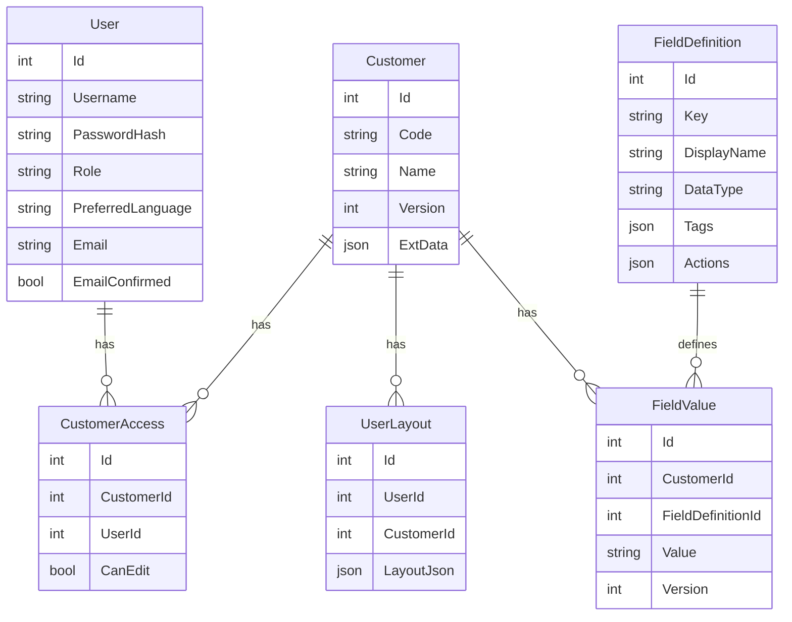

# 客户信息管理系统设计文档（核心需求）

> 本文件为核心需求文档，作为唯一权威来源。任何需求变更请先更新本文件，再据此调整开发与测试。

## 版本与决策（v0.2）

- 表单设计器（由简至难）
  - 所有可见组件可拖拽；提供组件工具栏（容器 Frame/Grid、ListBox、标签、文本框、表格等）。
  - 明确自由布局与流式布局在不同容器中的支持；除严格结构化数据外尽量避免表格布局。
  - 输出 LayoutJson（兼容 UserLayout/模板），运行态按 LayoutJson 渲染 Ant Design 组件。
- 认证从最小 JWT 迁移到 Identity + JWT
  - 支持注册、邮件激活、登录、登出、刷新令牌、会话重连（服务器重启不掉线）。
  - 采用 ASP.NET Identity + JWT（Access/Refresh）；DataProtection Key 持久化；SMTP 可配置。
- 数据库：以 PostgreSQL 为主，保留 SQLite 最小模式
  - Provider：`postgres`（JSONB 原生支持）/`sqlite`（本地开发）。
  - 支持通过配置切换 Provider 与连接串；后续提供管理员页面进行连接管理与校验。
  - 分层：持久化层（EF Core 多 Provider）/通用业务实体层/商用业务实体层；动态字段 JSONB + 反射式映射。

---

## 目标与范围

- 目标：构建一套以“前端可用性为中心”的客户信息管理系统，支持动态字段、布局设计、权限与国际化，逐步迭代。
- 运行模式：最小可运行（任何时刻可启动）、严格按文档实现，不越权扩展。

## 架构与技术栈

- 前端：Blazor Server + Ant Design Blazor（组件、消息、布局）。
- 后端：ASP.NET Core、Minimal API/Controller 混合；ASP.NET Identity + JWT。
- 数据库：PostgreSQL（主）/SQLite（最小）；EF Core。
- 国际化：资源表 `LocalizationResource` + UI 语言切换。

## 分层实体模型与职责边界

- 目标：实体按职能分三层，解耦业务、通用能力与持久化，所有 CRUD 仅由持久化层执行。
- 层次划分：
  1) 通用持久化实体层（Persistence）
     - 内容：MDD 映射、仓储接口与实现（IRepository/ISpecification/IQueryService）、Unit of Work、多 Provider 屏蔽、JSONB 映射与反射型字段处理。
     - 边界：唯一接触数据库；对上仅暴露接口与 DTO；可实现审计落盘策略与并发控制。
  2) 公共业务实体层（Domain.Common）
     - 内容：通用属性与行为（CreatedAt/UpdatedAt/CreatedBy/Version/ConcurrencyStamp/IsDeleted 等），领域基类与校验；不直接访问 Db，依赖持久化接口。
  3) 业务实体层（Domain.Business）
     - 内容：Customer/FieldDefinition/FieldValue/UserLayout/CustomerAccess/LocalizationResource 等业务属性与动作；不关心存储细节，仅通过接口完成 CRUD。
- 设计规则：
  - API 层不引用 EF Core；通过仓储接口访问数据。
  - 动态字段：在持久化层完成 JSON(B) <-> 领域对象的转换；PostgreSQL 下使用 jsonb 列与路径索引。
  - 审计与版本：Domain.Common 提供行为；持久化层通过拦截器/SaveChanges 钩子自动赋值；版本用于乐观并发。

### 校验分层与状态机
- 校验分层：
  - 业务层（Domain.Business）校验领域不变式、场景规则；
  - 通用层（Domain.Common）校验通用约束（必填/长度/版本/并发/软删等）；
  - 持久化层（Persistence）校验存储约束（唯一/存在/外键/Provider 限制）。
- 校验顺序与短路：Business → Common → Persistence；任何一层失败即中断并返回统一错误结果。
- 统一错误模型：`{ code, message, details?: [{ field, code, message }] }`，便于前端呈现与自动化测试。
- 状态机：实体可声明状态与迁移图；
  - 钩子：BeforeTransition/AfterTransition（业务层）、BeforePersist/AfterPersist（通用/持久化层）。
  - 事件：AfterCommit 发布领域事件（支持订阅异步处理）；演进方向为 Outbox 保证一致性。

### 推进细化（D3.x）
- D3.1：定义接口 IValidatable、IStateful、IDomainEvent、IRepository、IUnitOfWork；落地基础抽象与校验结果模型。
- D3.2：把查询改用仓储/查询器；接入分层校验管道，API 统一错误输出。
- D3.3：写入路径走 UoW，启用版本/并发与典型状态机（如 UserLayout Draft/Published）。
- D3.4：领域事件 AfterCommit + 事件聚合器；必要时加入 Outbox。

### 推进与阶段
- D3.1 分层脚手架与契约：抽象仓储/查询/UoW 接口，引入基础实体（审计/版本），API 通过接口访问（适配现有实现）。
- D3.2 读路径迁移：Customers/Fields/Layout 的查询走查询器/规格模式；提供 JSONB 路径索引脚本与示例。
- D3.3 写路径迁移：PUT/POST 改为 UoW+仓储提交；完善审计与版本；增加并发检测。
- D3.4 清理直连：移除 DbContext 直连，完善测试与文档。

## 表单设计器

### 组件与工具栏
- 组件：
  - 容器：Frame/Panel（自由/流式）、Grid（结构化数据）、Tabs。
  - 输入：TextBox、Number、Date、Select、Textarea、ListBox、Button、Label。
- 工具栏：组件搜索/分类、拖拽放置、删除/复制、属性编辑（通用 + 组件特性）。

### 布局模式与支持矩阵（简）
- 自由布局：绝对定位（x,y,w,h）；对齐/吸附/网格线。
- 流式布局：Flex/Grid 响应式；跨列/顺序。
- 示意：Frame 支持自由/流式；Grid 仅流式；输入类遵循容器模式。

### 数据结构（LayoutJson）
```
{
  "version": 1,
  "nodes": [
    { "id": "n1", "type": "Frame", "layout": { "mode": "free", "x":10, "y":10, "w":400, "h":200 }, "props": { "title":"基本信息" }, "children": [
      { "id":"n2", "type":"TextBox", "props": { "label":"名称", "field":"name" }, "layout": { "mode":"free", "x":20, "y":20, "w":200, "h":32 } }
    ]}
  ],
  "metadata": { "owner": 1, "tags": ["customer"] }
}
```

### 设计与运行闭环
- 设计态：拖拽 → 属性编辑 → 生成并保存 LayoutJson（模板或 UserLayout）。
- 运行态：按 LayoutJson 渲染；字段绑定依据 `FieldDefinition` + `FieldValue`；动作由 `actions` 驱动。

## 认证与会话

### 能力
- 注册（邮件激活）、登录/登出、刷新令牌、会话重连（服务器重启不丢状态）。

### 方案
- ASP.NET Identity + JWT（Access/Refresh）。
- RefreshToken 持久化表（支持撤销/轮换）；DataProtection Key 持久化。
- SMTP 配置：服务器、端口、凭据、发件人；模板化邮件。

## 数据库与持久化

### Provider 与配置
- 主推：PostgreSQL（JSONB 查询/索引、并发控制）。
- 最小：SQLite（开发与本地验证）。
- 切换（API）：`Db:Provider=postgres|sqlite`，`ConnectionStrings:Default=...`。
- 本地测试建议：使用 `docker-compose.yml` 启动 `postgres:16-alpine`（默认暴露 5432），一次配置多端复用。
- `AppSettings:Db:ConnectionString`：对应连接串
- 管理页（后续）：管理员可更新并校验连接；写入安全配置存储。

### 动态字段与查询
- `FieldValue.Value` 使用 JSON/JSONB 存储；
- PostgreSQL：JSONB 索引 + 路径查询；
- 通用实体层提供“属性映射器”以反射生成常用字段映射（可选）。

## ER 模型（Mermaid）



## 非功能性
- 可运行性：任何提交可最小配置启动；未完成模块以最小实现/Mock 保活。
- 质量：每次修改均需构建与测试（如适用）通过后提交；`main` 随时可运行。
- 安全：生产密钥与连接串管理；最小权限；审计基本操作日志（后续）。
 - Mock 策略：前端可用性优先，允许只读 Mock 兜底；目标接口完成并有测试数据后删除 Mock，避免多源导致缺陷。
 - 端口与配置：后端可自定端口；默认 API 端口 8080；前端通过配置 `Api:BaseUrl` 指向 API。
