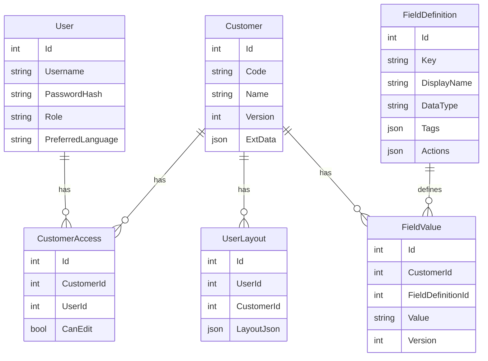

## 客户信息管理系统开发任务清单（前后端拆解）

---

### ✅ 第一阶段：项目初始化（前端优先）

#### 前端任务：
- [ ] 创建 Blazor WASM 或 Blazor Server 项目，搭建基础项目结构
- [ ] 集成 Ant Design Blazor 组件库
- [ ] 实现国际化语言切换组件（中/日/英）
- [ ] 编写登录页、空白主页面（无数据）
- [ ] 集成前后端 Token 认证机制（准备前端调用接口的 Token 注入逻辑）

#### 后端任务：
- [ ] 创建 .NET Web API 项目，搭建微服务结构（可先单体）
- [ ] 引入 EF Core + SQLite，配置数据库连接
- [ ] 配置 ASP.NET Identity，实现基本注册、登录、用户角色模型（管理员、普通用户）
- [ ] 提供登录/注册 API，返回 JWT

---

### ✅ 第二阶段：客户主数据管理

#### 前端任务：
- [ ] 客户列表页面（展示 Code、Name）
- [ ] 实现客户搜索（前端或后端过滤）
- [ ] 点击客户进入详情页（初始静态布局）

#### 后端任务：
- [ ] 创建 Customer 表（Id, Code, Name, Version, ExtData）
- [ ] 实现获取客户列表、客户详情、客户新增、更新 API
- [ ] 验证权限：用户只能访问自己有权限的客户（先默认全部可见）

---

### ✅ 第三阶段：字段定义与扩展模型支持

#### 前端任务：
- [ ] 动态渲染字段区域：根据后端返回字段定义 + 客户字段值渲染控件
- [ ] 实现简单的字段表单（文本、数字、日期）展示和编辑

#### 后端任务：
- [ ] 创建 FieldDefinition 表：字段Id、Key、显示名、标签、类型、图标、动作JSON等
- [ ] 返回字段定义 API
- [ ] 更新 Customer 接口支持字段数据与 ExtData 联动
- [ ] 为客户记录分配 Version

---

### ✅ 第四阶段：前端设计模式与布局定制

#### 前端任务：
- [ ] 添加“设计模式”开关
- [ ] 设计模式下支持字段块拖拽排序、宽度调整、显示/隐藏
- [ ] 拖拽吸附对齐线辅助
- [ ] 保存布局到后端（UserLayout 表）
- [ ] 加载用户定制布局，运行模式下固定显示

#### 后端任务：
- [ ] 创建 UserLayout 表，存储每个用户的字段布局JSON
- [ ] 布局读取与保存 API（按UserId + CustomerId）

---

### ✅ 第五阶段：特殊字段类型支持（Email/RDS/文件/链接）

#### 前端任务：
- [ ] Email 字段添加图标+下拉菜单
- [ ] Link 字段可点击打开新标签页
- [ ] File 字段可点击复制路径/打开文件（file://）
- [ ] RDS 字段点击生成并下载 .rdp 文件

#### 后端任务：
- [ ] 字段动作配置支持图标、事件、下级动作（接口 IFieldAction 定义）
- [ ] 提供 RDP 文件生成 API（含密码加密）
- [ ] 提供 File 路径验证或重定向处理

---

### ✅ 第六阶段：多用户权限 + 多语言

#### 前端任务：
- [ ] 登录后根据权限加载客户列表
- [ ] 切换语言后刷新语言包，页面内容动态更新

#### 后端任务：
- [ ] 创建 CustomerAccess 表（CustomerId, UserId, CanEdit）
- [ ] 创建 LocalizationResource 表（Key, ZH, JA, EN）
- [ ] 多语言接口，支持前端按语言加载词典资源


---

## ER 图（Markdown 表达）



---

## API 接口文档（Markdown 格式）

### 🔐 登录 API
- URL: `POST /api/auth/login`
- Body:
```json
{
  "username": "admin",
  "password": "123456"
}
```
- Response:
```json
{
  "accessToken": "{JWT Token}",
  "refreshToken": "{Refresh Token}",
  "user": { "id": "00000000-0000-0000-0000-000000000000", "username": "admin", "role": "user" }
}
```

### 🆕 用户注册
- URL: `POST /api/auth/register`
- Body:
```json
{
  "username": "user1",
  "password": "P@ssw0rd!",
  "email": "user1@example.com"
}
```
- Response:
```json
{ "success": true, "message": "注册成功，请查收邮件激活账户" }
```

### ✉️ 邮件激活
- URL: `GET /api/auth/activate?userId={id}&code={token}`
- Response:
```json
{ "success": true, "message": "账户激活成功" }
```

### ♻️ 刷新令牌
- URL: `POST /api/auth/refresh`
- Body:
```json
{ "refreshToken": "{Refresh Token}" }
```
- Response:
```json
{ "accessToken": "{JWT Token}", "refreshToken": "{New Refresh Token}" }
```

### 🚪 登出
- URL: `POST /api/auth/logout`
- Body:
```json
{ "refreshToken": "{Refresh Token}" }
```
- Response:
```json
{ "success": true, "message": "登出成功" }
```

### 👤 会话验证
- URL: `GET /api/auth/session`
- Header: `Authorization: Bearer {token}`
- Response:
```json
{ "valid": true, "user": { "id": "00000000-0000-0000-0000-000000000000", "username": "admin" } }
```

### 🙋 当前用户信息
- URL: `GET /api/auth/me`
- Header: `Authorization: Bearer {token}`
- Response:
```json
{
  "id": "00000000-0000-0000-0000-000000000000",
  "username": "admin",
  "email": "admin@local",
  "emailConfirmed": true,
  "roles": ["admin"]
}
```

---

### 📋 获取客户列表
- URL: `GET /api/customers`
- Header: `Authorization: Bearer {token}`
- Response:
```json
[
  { "id": 1, "code": "C001", "name": "客户A" },
  { "id": 2, "code": "C002", "name": "客户B" }
]
```

---

### ➕ 创建客户
- URL: `POST /api/customers`
- Header: `Authorization: Bearer {token}`
- Body:
```json
{ "code": "C100", "name": "客户Z" }
```
- Response:
```json
{ "id": 10, "code": "C100", "name": "客户Z" }
```

---

### 📄 获取客户详情（含字段值）
- URL: `GET /api/customers/{id}`
- Header: `Authorization: Bearer {token}`
- Response:
```json
{
  "id": 1,
  "code": "C001",
  "name": "客户A",
  "version": 2,
  "fields": [
    { "key": "email", "label": "邮箱", "type": "email", "value": "a@b.com" },
    { "key": "rds", "label": "RDS服务器", "type": "rds", "value": { "ip": "10.0.0.1", "user": "admin" } }
  ]
}
```

---

### 🛡️ 管理客户访问权限（管理员）
- URL: `GET /api/customers/{id}/access`
- Header: `Authorization: Bearer {token}`
- Response:
```json
[
  { "userId": "00000000-0000-0000-0000-000000000000", "canEdit": true }
]
```

- URL: `POST /api/customers/{id}/access`
- Body:
```json
{ "userId": "00000000-0000-0000-0000-000000000001", "canEdit": false }
```
- Response:
```json
{ "success": true, "message": "权限设置成功" }
```

---

### 🧩 获取字段定义列表
- URL: `GET /api/fields`
- Header: `Authorization: Bearer {token}`
- Response:
```json
[
  {
    "key": "email",
    "label": "邮箱",
    "type": "email",
    "tags": ["联系"],
    "actions": [
      { "icon": "mail", "title": "写邮件", "type": "click", "action": "mailto" }
    ]
  }
]
```

---

### 🏷️ 获取字段标签
- URL: `GET /api/fields/tags`
- Header: `Authorization: Bearer {token}`
- Response:
```json
[
  { "tag": "联系", "count": 3 }
]
```

---

### 💾 保存客户数据（含字段）
- URL: `PUT /api/customers/{id}`
- Header: `Authorization: Bearer {token}`
- Body:
```json
{
  "fields": [
    { "key": "email", "value": "test@test.com" },
    { "key": "rds", "value": { "ip": "10.1.1.1", "user": "admin" } }
  ]
}
```
- Response:
```json
{ "status": "success", "newVersion": 3 }
```

---

### 🎨 获取/保存用户布局（仅两级：系统默认/用户）
- GET: `/api/layout?scope=effective|user|default`
- POST: `/api/layout?scope=user|default`
```json
// POST Body 示例
{
  "layout": {
    "email": { "x": 0, "y": 0, "w": 6, "h": 1 },
    "rds": { "x": 0, "y": 1, "w": 12, "h": 2 }
  }
}
```

---

### ⚙️ 标签生成布局
- URL: `POST /api/layout/{customerId}/generate`
- Header: `Authorization: Bearer {token}`
- Body:
```json
{
  "tags": ["联系"],
  "mode": "flow",
  "save": true,
  "scope": "user"
}
```
- Response:
```json
{
  "mode": "flow",
  "items": {
    "email": { "order": 0, "w": 6 }
  }
}
```

---

### 🎛️ 用户偏好设置
- URL: `GET /api/user/preferences`
- Header: `Authorization: Bearer {token}`
- Response:
```json
{ "theme": "light", "language": "ja", "udfColor": "#1890ff" }
```

- URL: `PUT /api/user/preferences`
- Body:
```json
{ "theme": "dark", "language": "zh", "udfColor": "#ff5722" }
```
- Response:
```json
{ "success": true, "message": "偏好已保存" }
```

---

### 🌐 获取多语言资源
- URL: `GET /api/i18n/{lang}`
- Response:
```json
{
  "LBL_CUSTOMER": "Customer",
  "BTN_SAVE": "保存",
  "LBL_EMAIL": "邮箱"
}
```

---

如果你还需要字段新增、字段标签设置、权限分配、RDP生成等更完整接口，我可以继续补充。
